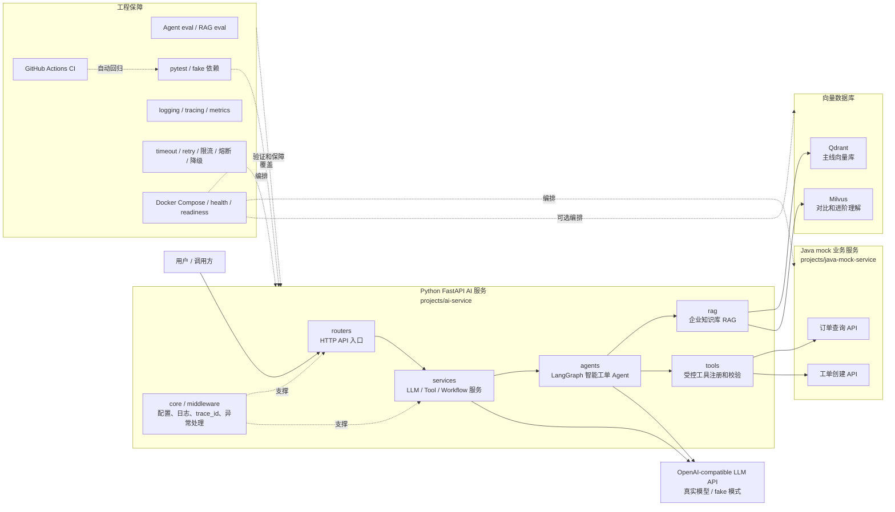
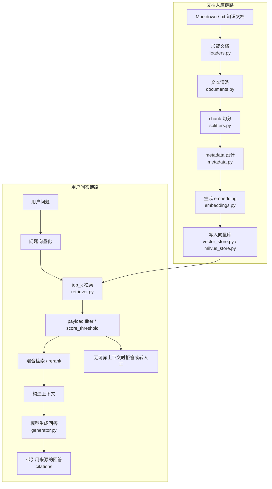
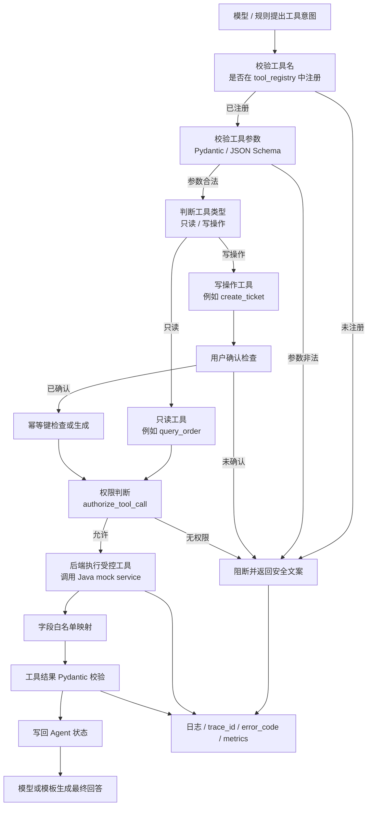

# 项目架构图和核心流程图

本文档是当前 AI 客服工单系统学习项目的图文入口。

当前项目定位：

```text
Java + Python 的 AI 客服工单系统学习项目
核心是企业知识库 RAG + LangGraph 智能工单 Agent
当前是 AI 应用工程学习项目和作品原型，不是完整生产上线系统
```

本页图用于说明：

```text
系统整体怎么组成
RAG 问答怎么流转
智能工单 Agent 怎么决策
工具调用为什么有安全边界
```

## 1. 整体架构图

这张图回答：

```text
这个项目整体由哪些部分组成？
Python AI 服务、Java mock 服务、RAG、Agent、向量库、模型 API 和工程保障是什么关系？
```



阅读重点：

```text
Python AI 服务是核心入口。
Java mock service 模拟业务系统。
RAG 连接向量数据库。
LangGraph Agent 连接 RAG、工具和模型。
工程保障围绕测试、评测、可观测性、稳定性、编排和 CI 展开。
```

## 2. RAG 问答流程图

这张图回答：

```text
企业知识库文档如何变成可检索知识？
用户问题如何通过检索和模型生成带出处回答？
```

RAG 有两条链路：

```text
文档入库链路
用户问答链路
```



阅读重点：

```text
RAG 不是模型直接回答。
RAG 先把企业文档变成可检索数据。
用户提问时先检索相关 chunk，再把上下文交给模型回答。
如果检索不到可靠内容，系统应该拒答或转人工，而不是让模型编答案。
```

## 3. 智能工单 Agent 流程图

这张图回答：

```text
用户输入进入 Agent 后，系统如何判断走知识库回答、订单查询、创建工单或安全兜底？
```

```mermaid
flowchart TB
    start["用户输入"]
    normalize["输入归一化 / 初始化状态"]
    intent["意图识别<br/>规则 / fake LLM / real LLM"]

    rag_route["知识库问题"]
    order_route["订单查询"]
    ticket_route["创建工单"]
    fallback_route["闲聊 / 无法处理 / 安全兜底"]

    rag_answer["RAG 检索并回答<br/>带引用来源或拒答"]

    query_order["query_order 工具节点<br/>校验订单号并调用 Java API"]
    order_result["订单结果写回 Agent 状态"]

    extract_fields["提取工单字段"]
    missing["缺字段判断"]
    ask_more["追问缺失字段"]
    confirm["请求用户确认"]
    confirmed["确认结果判断"]
    create_ticket["create_ticket 工具节点<br/>确认后创建工单"]
    ticket_result["工单结果写回 Agent 状态"]

    final["生成最终中文回答"]
    end["流程结束"]

    start --> normalize --> intent
    intent --> rag_route --> rag_answer --> final
    intent --> order_route --> query_order --> order_result --> final
    intent --> ticket_route --> extract_fields --> missing
    missing -->|字段缺失| ask_more --> end
    missing -->|字段完整| confirm --> confirmed
    confirmed -->|未确认| end
    confirmed -->|已确认| create_ticket --> ticket_result --> final
    intent --> fallback_route --> final
    final --> end
```

阅读重点：

```text
Agent 不是单轮聊天。
Agent 是多步骤、有状态、有分支的业务流程。
创建工单不是模型一句话决定的，必须经过字段提取、缺字段追问和用户确认。
```

## 4. 工具调用安全流程图

这张图回答：

```text
AI 为什么不能直接操作业务系统？
模型提出工具调用后，后端如何保证安全？
```



阅读重点：

```text
模型可以提出工具意图，但不能直接执行工具。
真正的工具执行权在后端。
后端必须做工具名校验、参数校验、权限判断、用户确认、幂等控制、结果校验和日志追踪。
```

## 5. 面试时怎么按图讲项目

如果只有 1 分钟：

```text
先讲整体架构图。
说明 Python FastAPI 是 AI 服务入口，Java mock service 模拟业务后端，RAG 负责知识库问答，LangGraph Agent 负责编排订单查询和工单流程，工程保障包括评测、日志、稳定性、Compose 和 CI。
```

如果有 3 分钟：

```text
先讲整体架构图。
再讲 RAG 问答流程图。
再讲智能工单 Agent 流程图。
最后补一句工具调用安全边界。
```

如果被追问安全：

```text
重点讲工具调用安全流程图。
说明模型不能直接写业务系统，写操作必须经过后端校验、权限判断、用户确认和幂等控制。
```

如果被追问 RAG：

```text
重点讲 RAG 问答流程图。
说明文档入库和用户问答是两条链路，回答必须基于检索上下文，并带引用来源或拒答。
```

## 6. 当前边界

这些图表达的是当前学习项目和原型系统的架构。

它们不表示项目已经完成完整生产能力。

当前仍然缺：

```text
真实 Spring Boot 业务服务
真实数据库
Redis
完整认证授权
前端工作台
线上部署
生产监控告警
压测和运维
```

后续阶段会继续补真实化能力。
