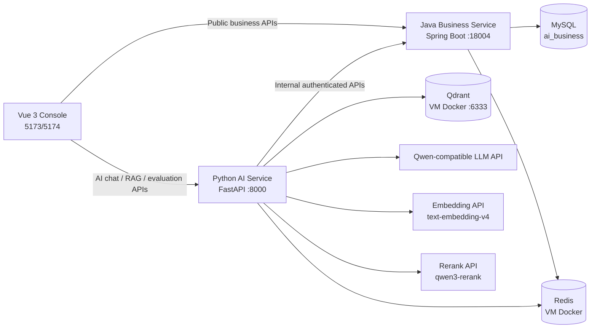

# 智能客服与工单系统：Vibe Coding 交接文档

最后更新：2026-08-05

这是一份交给新的 AI 编程助手的项目交接文档。目标是让新的助手在不丢失现有成果、不泄露密钥、不破坏多服务边界的前提下，继续补充、优化和开发项目。

## 1. 先读这一节

### 工作区与项目位置

```text
D:\wendang\java+python+ai\
├── projects\
│   ├── java-business-service\       Java 业务服务，真实业务主服务
│   ├── ai-service\                  Python AI 服务，真实 AI 主服务
│   ├── customer-service-console\    Vue 3 前端
│   ├── java-mock-service\           早期学习和模拟服务，不是当前主链路
│   └── python-basics\               Python 基础学习项目，不是当前产品代码
└── docs\                            架构、契约、运行与学习资料
```

当前真实项目由前三个服务组成。不要把 `java-mock-service` 当作当前业务服务，也不要为了“统一风格”删除学习项目。

### 当前 Git 状态

工作区存在大量**未提交**的真实项目改动，其中包含 Stage 11 项目化、前端、Java 业务服务、AI 服务、用户反馈、Bad Case 与正式回归评测实现。

新助手开始工作时必须先执行：

```powershell
git status --short
git log -5 --oneline
```

规则：

- 必须保留现有未提交改动；它们不是可随意清理的临时文件。
- 不要执行 `git reset --hard`、`git checkout --` 或大范围删除。
- 只有用户明确说“上传 GitHub / 提交 / 推送”才进行暂存、提交、推送。
- 只有准备上传 GitHub 时才做敏感信息扫描；平时不需要扫描。

### 用户协作偏好

- 当前优先级是：项目代码完整性、可运行性、真实前后端联调、高质量设计。
- 这个阶段不要求每个小功能都写长篇学习笔记、README 或手动任务文档；只有接口契约、数据库变更、运行部署、安全边界等重要内容才补简短文档。
- 用户已要求助手负责运行测试，不再把测试默认交给用户。
- 用户允许助手启动、停止和重启 Java 服务；Python 服务也可以为联调正常重启。
- 不要自动推送 GitHub。
- PowerShell 输出中的中文乱码，先怀疑终端输出编码，不要据此大范围修改 UTF-8 源文件。

## 2. 项目目标与当前定位

项目是一个本地可联调、可持久化的 AI 客服与智能工单系统。它不是单纯的 LLM Demo。

核心业务目标：

1. 客户登录后可通过 AI 对话咨询政策、查询订单、提交工单需求。
2. AI 根据意图进入 RAG、受控工具调用、工单草稿与人工确认等不同路径。
3. Java 服务拥有订单、工单、用户、权限、反馈等业务事实与写操作权。
4. Python 服务拥有 Agent、RAG、模型调用、流式输出、评测与 Bad Case 能力。
5. 主管能从线上负反馈审核并形成可执行回归案例。

当前是“本地真实项目形态”，不是已完成公网生产部署。MySQL、Redis、Qdrant 和模型 API 可以使用真实服务；CI/CD、云部署、HTTPS、统一监控平台、Kubernetes 尚未接入。

## 3. 总体架构



关键边界：

- 浏览器不直接访问 MySQL、Redis、Qdrant、模型 API，也不持有内部调用 token。
- Python AI 服务不能绕过 Java 直接写订单或工单数据库。
- Python 调用 Java 内部 API 时，必须携带内部调用认证、trace_id、用户和租户上下文。
- 涉及工单创建等写操作必须先进入确认流程，并使用幂等键保护。
- 前端传来的用户、租户、角色、答案上下文都不能直接被信任；后端必须自行验证。

## 4. 三个服务的职责与重要目录

### 4.1 Java 业务服务

位置：`projects/java-business-service`

技术：Java 17、Spring Boot 3.3、Spring MVC、Validation、MyBatis XML、MySQL、Redis、JUnit/Spring Test。

重要目录：

```text
src/main/java/com/panpan/aibusinessservice/
├── controller/       对外 REST API 与 internal API
├── service/          业务接口
├── service/impl/     业务实现
├── mapper/           MyBatis Mapper 接口
├── entity/           数据库实体
├── dto/              请求与响应 DTO
├── common/           认证、trace、缓存、限流、Redis、统一响应
├── exception/        错误码、业务异常、全局异常处理
└── config/           MyBatis、Redis、CORS、反馈表迁移等配置

src/main/resources/
├── application.yml
├── schema.sql
└── mapper/*.xml
```

已实现的核心能力：

- 登录、当前用户获取、角色与租户边界。
- 订单查询、订单归属校验。
- 工单创建、查询、分配、状态流转、消息、解决、重新打开。
- MySQL 持久化与 MyBatis XML 映射。
- Redis 订单缓存、幂等控制、限流等能力。
- 面向 AI 服务的 `/internal/...` 接口：订单查询、工单创建、AI 反馈读取和状态更新。
- AI 回答反馈表、主管可查看的反馈概览、反馈审核状态、Bad Case 回写状态。
- `trace_id` 日志和 CORS。

注意：内部 API 和公开 API 是不同信任边界。新增 AI 能力时，优先扩展 Java 的 internal API，而不是让 AI 服务访问数据库。

### 4.2 Python AI 服务

位置：`projects/ai-service`

技术：Python 3.12、uv、FastAPI、Pydantic、HTTPX、OpenAI-compatible SDK、LangGraph、Redis Checkpoint、Qdrant、pytest。

重要目录：

```text
app/
├── routers/          chat、rag、knowledge_base、evaluation、tickets、tools
├── agents/           LangGraph 工单 Agent、评测、观测与韧性策略
├── rag/              文档处理、embedding、检索、重排、生成、Qdrant 访问
├── services/         Java 客户端、LLM 客户端、会话、Agent 门面
├── tools/            工具注册、参数校验、确认、幂等控制
├── schemas/          Pydantic 请求/响应/业务模型
├── evaluation/       Bad Case 注册、正式回归执行与历史
├── core/             配置、异常、trace、安全边界、业务上下文
├── middleware/       限流和追踪
└── mcp_servers/      MCP 学习型服务，不是当前客服主链路

data/
├── knowledge_base/   知识库原始资料
├── agent_eval/       确定性 Agent 评测样例
├── rag_eval/         RAG 评测样例
└── evaluation/       数据集注册、正式 Bad Case、回归运行历史
```

已实现的核心能力：

- FastAPI 路由、统一异常、CORS、trace、限流和环境配置。
- OpenAI 兼容模型调用、超时、重试、fallback、多模型路由、成本预算保护。
- Pydantic 校验的结构化模型输出。
- LangGraph 工单 Agent：意图识别、政策检索、订单工具调用、工单字段提取、确认中断和恢复。
- SSE 流式 AI 对话与会话过程状态。
- Redis 保存 Agent Checkpoint 和前端会话上下文。
- RAG：真实 Embedding、Qdrant 检索、Rerank、带引用回答、无上下文拒答/转人工逻辑。
- 通过 Java 内部 API 获取订单、创建工单和记录 AI 反馈。
- 评测数据集、评测看板、负反馈到 Bad Case、正式 Bad Case 回归评测。

### 4.3 Vue 前端

位置：`projects/customer-service-console`

技术：Vue 3、TypeScript、Vite、Element Plus、Pinia、Vue Router、Axios。

重要目录：

```text
src/
├── views/            登录、AI 对话、工单、工单工作台、知识库、评测等页面
├── services/         javaApi、aiApi 与领域 API 封装
├── stores/           登录会话和用户状态
├── router/           路由与权限页面
├── layouts/           主布局
└── components/        通用 UI 组件
```

前端有两个 Axios 客户端：

- `javaApi`：访问 Java 服务，默认 `http://127.0.0.1:18004`。
- `aiApi`：访问 Python 服务，默认 `http://127.0.0.1:8000`。

认证 token、trace_id 必须同时同步给两个客户端。若 Vite 使用了新端口，例如 5174，Java 和 Python 的 CORS 仍需允许该来源；项目已配置 localhost/127.0.0.1 的本地端口正则规则。

## 5. 已完成的关键用户流程

### 登录与权限

1. 前端登录 Java 服务。
2. 前端保存 token 和当前用户信息。
3. 调用 AI 服务时，Python 通过 Java `/api/auth/me` 验证 token，不信任浏览器声称的身份和角色。
4. 主管或管理员才可处理 AI 评测和线上负反馈。

### AI 客服、RAG、工具与工单

1. 用户在 `AiChatView.vue` 发起或继续会话。
2. Python AI 服务解析意图并执行 LangGraph 工作流。
3. 政策问题走 Qdrant 检索、Rerank、回答生成和引用返回。
4. 订单查询通过受控 `query_order` 工具调用 Java internal API；Java 校验用户、租户、订单归属。
5. 工单请求由 Agent 提取字段，缺字段则追问，完整后展示确认；只有确认后才创建工单。
6. 前端展示最终回答、引用、工单确认状态和流式进度。

### 线上反馈与 AI 质量闭环

1. 用户可对一次 AI 最终回答提交 helpful/unhelpful 反馈。
2. Python 只能从 Redis 会话中找到该用户拥有的真实回答，抽取安全的提问、回答、引用摘要后提交给 Java。
3. Java 在 MySQL 持久化反馈，并在主管页提供负反馈候选。
4. 主管可审核、暂存或关闭候选。
5. 主管登记正式 Bad Case 时，要补充失败层级、严重度、预期行为、建议动作和一个可执行断言。
6. 主管可以运行正式 Bad Case 回归评测，结果按 `passed`、`failed`、`not_ready`、`error` 保存和展示。

当前支持的自动断言是：

- `intent`：当前 Agent 意图必须等于主管指定意图。
- `citation_present`：当前 Agent 必须输出至少一条 RAG 引用。
- `ticket_confirmation_required`：当前 Agent 必须进入工单确认。

自然语言期望不能被可靠自动判断时，不能伪造“通过”。这类历史 Bad Case 应显示 `not_ready`，由主管补充可执行断言或人工复核。

## 6. 真实运行依赖与本地启动

### 外部依赖

```text
Windows 本机
├── MySQL: 127.0.0.1:3306，数据库名 ai_business
├── Java 服务: 18004
├── Python 服务: 8000
└── Vue 开发服务器: 常见为 5173 或 5174

VMware Ubuntu
├── Redis Docker: 192.168.88.10:6379
└── Qdrant Docker: 192.168.88.10:6333
```

`192.168.88.10` 是当前 VMware NAT 网络中的地址，若虚拟机网络变化，应在 Ubuntu 中运行 `hostname -I` 后更新本机 `.env`。开始涉及 Redis 或 Qdrant 的联调前，应提醒用户打开 VMware Ubuntu 并启动相应容器。

### 启动顺序

先确认 MySQL、Redis、Qdrant 可用；再分别启动三个项目：

```powershell
# 终端 1：Java
Set-Location D:\wendang\java+python+ai\projects\java-business-service
mvn spring-boot:run

# 终端 2：Python
Set-Location D:\wendang\java+python+ai\projects\ai-service
uv run uvicorn app.main:app --host 127.0.0.1 --port 8000

# 终端 3：Vue
Set-Location D:\wendang\java+python+ai\projects\customer-service-console
npm run dev
```

健康检查：

```powershell
curl.exe http://127.0.0.1:18004/health
curl.exe http://127.0.0.1:8000/health
```

Windows PowerShell 中 `curl` 是 `Invoke-WebRequest` 的别名。需要原生 curl 行为时使用 `curl.exe`；复杂 JSON 请求建议优先使用 `Invoke-RestMethod` 或先用 `ConvertTo-Json` 构造请求体，避免转义错误。

### 配置与密钥

- Python 实际配置：`projects/ai-service/.env`，该文件已被 Git 忽略。
- 模板：`projects/ai-service/.env.example`，只能包含占位符，不能填真实 API Key。
- Java 使用环境变量和 `application.yml` 的默认本地开发配置。
- 不要在源码、测试、日志、README、提交信息或交接文档中写入 API Key、Bearer token、数据库密码或内部 token。

真实模型相关环境变量包括但不限于：

```text
LLM_MODEL / LLM_BASE_URL / LLM_API_KEY
EMBEDDING_MODEL / EMBEDDING_BASE_URL / EMBEDDING_API_KEY / EMBEDDING_DIMENSION
RERANK_MODEL / RERANK_BASE_URL / RERANK_API_KEY
QDRANT_BASE_URL / QDRANT_COLLECTION_NAME / QDRANT_VECTOR_SIZE
```

向量维度必须一致：Embedding 输出维度、Qdrant collection 的 vector size、`QDRANT_VECTOR_SIZE` 必须匹配。当前真实 RAG 主库使用 Qdrant，不使用 Milvus。

## 7. 测试与验证规则

当前已验证的基线：

```text
Java: mvn test -q
Python: 1288 passed
Frontend: npm run build
```

新功能的最低要求：

1. 为核心正常路径和关键失败边界补少量自动测试。
2. 自动测试中不能真实调用付费模型、真实 Embedding/Rerank API 或写入真实业务数据。
3. 跨服务功能要进行必要的真实联调；涉及真实模型、Docker、数据库时先明确依赖是否已启动和可能产生费用。
4. 涉及前端改动，至少运行 `npm run build`；涉及 Java/Python 业务核心，运行对应项目的测试。
5. 修改共享边界、数据库、认证、RAG、工具调用或评测时，执行对应服务全量测试。

常用命令：

```powershell
# Java
Set-Location D:\wendang\java+python+ai\projects\java-business-service
mvn test -q

# Python
Set-Location D:\wendang\java+python+ai\projects\ai-service
uv run pytest -q

# Frontend
Set-Location D:\wendang\java+python+ai\projects\customer-service-console
npm run build
```

## 8. 数据与安全边界

### 数据职责

- MySQL：用户、订单、工单、工单消息、AI 回答反馈等业务事实。
- Redis：Java 缓存、限流、幂等；Python Agent checkpoint 和会话上下文。
- Qdrant：知识库向量和检索数据。
- `data/evaluation/bad_cases.json`：正式 Bad Case 注册表。
- `data/evaluation/production_regression_runs.json`：正式回归运行历史，首次运行后才生成。

### 必须坚持的安全规则

- 任何工具名、工具参数、模型建议都必须在后端白名单和 Pydantic/DTO 校验后才可执行。
- 订单、工单等业务操作必须带用户和租户上下文；不能因为模型或前端说“允许”就绕过鉴权。
- 模型输出不可信。即使模型输出合法 JSON，也必须做字段、权限、状态和业务规则校验。
- 工单等写操作要走确认、幂等和状态机约束。
- RAG 引用应来自实际检索结果，不能由模型随意编造来源。
- 线上反馈上下文必须从服务端可信会话中取，不接收浏览器直接提交的“原回答内容”。

## 9. 已学但未进入当前主链路的技术

以下内容存在学习代码、适配器或本地环境，但不能宣称是当前系统的主运行链路：

| 技术/模块 | 当前状态 |
| --- | --- |
| Milvus | 已安装、已学习、代码有适配配置；当前真实 RAG 使用 Qdrant。 |
| `java-mock-service` | 早期工具调用和接口联调模拟服务；当前真实业务使用 Java business service。 |
| MCP | 有 MCP Server 与资源能力；当前 Vue 客服 Agent 未通过 MCP 调外部业务系统。 |
| LangSmith / OpenTelemetry | 有学习型适配和本地 trace 设计；未接入真实 LangSmith 或 OTEL Collector。 |
| Docker Compose 整体部署 | Redis/Qdrant/Milvus 使用 Docker；前后端项目尚未统一 Compose 化。 |
| CI/CD、云部署、HTTPS、Kubernetes | 尚未实现。 |
| 多 Agent 协作 | 当前是单个 LangGraph 工单 Agent，不是 Multi-Agent 系统。 |

## 10. 推荐的后续开发原则

每次新需求先判断属于哪一层：

```text
业务事实、权限、状态机、写操作       -> Java 优先
模型、RAG、Agent、评测、提示词        -> Python 优先
展示、交互、输入、用户体验             -> Vue 优先
跨层能力                              -> 先定义 API 契约，再逐层实现
```

优先补 AI 应用能力，不要长期只做传统 CRUD。合理的后续方向包括：

1. Bad Case 运行历史比较、趋势指标和发布门禁。
2. 真实线上数据脱敏采样与评测集治理。
3. RAG 检索质量、引用质量、权限过滤和 rerank 策略增强。
4. AI 人工转接后的处理闭环与知识库反馈闭环。
5. 前后端 Docker Compose、本地一键启动、环境分层。
6. 日志、指标、告警与外部追踪平台接入。

不要为了“看起来高级”直接引入 Multi-Agent、Kubernetes、微调或复杂框架。每项能力必须有明确业务收益、边界和测试策略。

## 11. 新助手首次接手清单

1. 阅读本文件。
2. 阅读 `docs/local-run-and-demo.md`、`docs/java-ai-api-contract.md`、`docs/stage11-product-scope-and-realization-standards.md`。
3. 执行 `git status --short`，确认并保留未提交改动。
4. 仅按当前任务读取必要模块，不进行无关重构。
5. 涉及 Redis/Qdrant/真实模型前，确认 VMware Ubuntu 和对应容器状态。
6. 修改后运行受影响服务的测试与构建；不要用真实模型做自动化测试。
7. 在最终回复中说明：改了什么、验证了什么、服务是否重启、是否提交/推送。

## 12. 给新 Vibe Coding 助手的开场提示

将下面内容连同本交接文档一起提供给新助手即可：

```text
你正在接手 D:\wendang\java+python+ai 中的“AI 客服与智能工单系统”。
先阅读 docs/project-handoff-for-vibe-coding.md，并严格遵守其中的架构边界、安全规则、Git 规则和用户协作偏好。

这是一个已有大量未提交真实实现的多服务项目：
- projects/java-business-service：Java 业务事实与写操作边界；
- projects/ai-service：FastAPI、LangGraph、RAG、Qdrant、模型、评测；
- projects/customer-service-console：Vue 3 前端。

不要重建项目、不要清理未提交改动、不要自动提交或推送 GitHub、不要泄露 .env 和任何密钥。
新增 AI 能力时坚持“模型提出建议，后端校验、授权、执行和兜底”的边界。
先理解现有链路，再针对当前需求做最小但完整的实现；补关键测试并实际运行受影响测试。涉及真实模型或 VMware Docker 服务时，先说明依赖、费用和启动要求。
```
