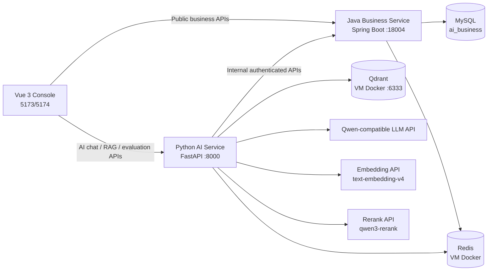

# 智能客服与工单系统：Vibe Coding 交接文档

最后更新：2026-08-05

这是一份交给新的 AI 编程助手的项目交接文档。目标是让新的助手在不丢失现有成果、不泄露密钥、不破坏多服务边界的前提下，继续补充、优化和开发项目。

## 1. 项目基础信息与协作约束

### 工作区与项目位置

```text
D:\wendang\java+python+ai\
├── projects\
│   ├── java-business-service\       Java 业务服务，真实业务主服务
│   ├── ai-service\                  Python AI 服务，真实 AI 主服务
│   ├── customer-service-console\    Vue 3 前端
│   ├── java-mock-service\           早期学习和模拟服务，不是当前主链路
│   └── python-basics\               Python 基础学习项目，不是当前产品代码
└── docs\                            架构、契约、运行与学习资料
```

当前真实项目由前三个服务组成。不要把 `java-mock-service` 当作当前业务服务，也不要为了“统一风格”删除学习项目。

### 当前 Git 状态

截至 2026-08-05，前两轮开发（MCP 接入产品主链路、多 Agent 协作升级）已全部**本地提交**（共 40 个 commit，`git log --oneline` 可见），工作区干净；仅 `.reasonix/` 与 `docs/superpowers/`（设计规格与实现计划）未跟踪。

新助手开始工作时必须先执行：

```powershell
git status --short
git log -10 --oneline
```

规则：

- 未跟踪的 `docs/superpowers/` 是本项目的设计规格与实现计划（`specs/`、`plans/`），保留参考；`.reasonix/` 是 Reasonix 工具目录，不要动。
- 不要执行 `git reset --hard`、`git checkout --` 或大范围删除。
- 只有用户明确说“上传 GitHub / 提交 / 推送”才执行 `git push`；本地 `git commit` 在本项目协作中已被用户批准（但提交信息不含密钥）。
- 只有准备上传 GitHub 时才做敏感信息扫描；平时不需要扫描。

### 用户协作偏好

- 当前优先级是：项目代码完整性、可运行性、真实前后端联调、高质量设计。
- 这个阶段不要求每个小功能都写长篇学习笔记、README 或手动任务文档；只有接口契约、数据库变更、运行部署、安全边界等重要内容才补简短文档。
- 用户已要求助手负责运行测试，不再把测试默认交给用户。
- 用户允许助手启动、停止和重启 Java 服务；Python 服务也可以为联调正常重启。
- 不要自动推送 GitHub。
- PowerShell 输出中的中文乱码，先怀疑终端输出编码，不要据此大范围修改 UTF-8 源文件。

## 2. 项目目标与当前定位

项目是一个本地可联调、可持久化的 AI 客服与智能工单系统。它不是单纯的 LLM Demo。

核心业务目标：

1. 客户登录后可通过 AI 对话咨询政策、查询订单、提交工单需求。
2. AI 根据意图进入 RAG、受控工具调用、工单草稿与人工确认等不同路径。
3. Java 服务拥有订单、工单、用户、权限、反馈等业务事实与写操作权。
4. Python 服务拥有 Agent、RAG、模型调用、流式输出、评测与 Bad Case 能力。
5. 主管能从线上负反馈审核并形成可执行回归案例。

当前是“本地真实项目形态”，不是已完成公网生产部署。MySQL、Redis、Qdrant 和模型 API 可以使用真实服务；CI/CD、云部署、HTTPS、统一监控平台、Kubernetes 尚未接入。

## 3. 总体架构



关键边界：

- 浏览器不直接访问 MySQL、Redis、Qdrant、模型 API，也不持有内部调用 token。
- Python AI 服务不能绕过 Java 直接写订单或工单数据库。
- Python 调用 Java 内部 API 时，必须携带内部调用认证、trace_id、用户和租户上下文。
- 涉及工单创建等写操作必须先进入确认流程，并使用幂等键保护。
- 前端传来的用户、租户、角色、答案上下文都不能直接被信任；后端必须自行验证。

## 4. 三个服务的职责与重要目录

### 4.1 Java 业务服务

位置：`projects/java-business-service`

技术：Java 17、Spring Boot 3.3、Spring MVC、Validation、MyBatis XML、MySQL、Redis、JUnit/Spring Test。

重要目录：

```text
src/main/java/com/panpan/aibusinessservice/
├── controller/       对外 REST API 与 internal API
├── service/          业务接口
├── service/impl/     业务实现
├── mapper/           MyBatis Mapper 接口
├── entity/           数据库实体
├── dto/              请求与响应 DTO
├── common/           认证、trace、缓存、限流、Redis、统一响应
├── exception/        错误码、业务异常、全局异常处理
└── config/           MyBatis、Redis、CORS、反馈表迁移等配置

src/main/resources/
├── application.yml
├── schema.sql
└── mapper/*.xml
```

已实现的核心能力：

- 登录、当前用户获取、角色与租户边界。
- 订单查询、订单归属校验。
- 工单创建、查询、分配、状态流转、消息、解决、重新打开。
- MySQL 持久化与 MyBatis XML 映射。
- Redis 订单缓存、幂等控制、限流等能力。
- 面向 AI 服务的 `/internal/...` 接口：订单查询、工单创建、AI 反馈读取和状态更新。
- AI 回答反馈表、主管可查看的反馈概览、反馈审核状态、Bad Case 回写状态。
- `trace_id` 日志和 CORS。

注意：内部 API 和公开 API 是不同信任边界。新增 AI 能力时，优先扩展 Java 的 internal API，而不是让 AI 服务访问数据库。

### 4.2 Python AI 服务

位置：`projects/ai-service`

技术：Python 3.12、uv、FastAPI、Pydantic、HTTPX、OpenAI-compatible SDK、LangGraph、Redis Checkpoint、Qdrant、pytest。

重要目录：

```text
app/
├── routers/          chat、rag、knowledge_base、evaluation、tickets、tools
├── agents/           LangGraph 工单 Agent、评测、观测与韧性策略
├── rag/              文档处理、embedding、检索、重排、生成、Qdrant 访问
├── services/         Java 客户端、LLM 客户端、会话、Agent 门面
├── tools/            工具注册、参数校验、确认、幂等控制
├── schemas/          Pydantic 请求/响应/业务模型
├── evaluation/       Bad Case 注册、正式回归执行与历史
├── core/             配置、异常、trace、安全边界、业务上下文
├── middleware/       限流和追踪
└── mcp_servers/      MCP server：minimal（学习型）+ product（已接入客服主链路，streamable HTTP :9100）

data/
├── knowledge_base/   知识库原始资料
├── agent_eval/       确定性 Agent 评测样例
├── rag_eval/         RAG 评测样例
└── evaluation/       数据集注册、正式 Bad Case、回归运行历史
```

已实现的核心能力：

- FastAPI 路由、统一异常、CORS、trace、限流和环境配置。
- OpenAI 兼容模型调用、超时、重试、fallback、多模型路由、成本预算保护。
- Pydantic 校验的结构化模型输出。
- LangGraph 工单 Agent：意图识别、政策检索、订单工具调用、工单字段提取、确认中断和恢复。
- SSE 流式 AI 对话与会话过程状态。
- Redis 保存 Agent Checkpoint 和前端会话上下文。
- RAG：真实 Embedding、Qdrant 检索、Rerank、带引用回答、无上下文拒答/转人工逻辑。
- 通过 Java 内部 API 获取订单、创建工单和记录 AI 反馈。
- 评测数据集、评测看板、负反馈到 Bad Case、正式 Bad Case 回归评测。

### 4.3 Vue 前端

位置：`projects/customer-service-console`

技术：Vue 3、TypeScript、Vite、Element Plus、Pinia、Vue Router、Axios。

重要目录：

```text
src/
├── views/            登录、AI 对话、工单、工单工作台、知识库、评测等页面
├── services/         javaApi、aiApi 与领域 API 封装
├── stores/           登录会话和用户状态
├── router/           路由与权限页面
├── layouts/           主布局
└── components/        通用 UI 组件
```

前端有两个 Axios 客户端：

- `javaApi`：访问 Java 服务，默认 `http://127.0.0.1:18004`。
- `aiApi`：访问 Python 服务，默认 `http://127.0.0.1:8000`。

认证 token、trace_id 必须同时同步给两个客户端。若 Vite 使用了新端口，例如 5174，Java 和 Python 的 CORS 仍需允许该来源；项目已配置 localhost/127.0.0.1 的本地端口正则规则。

## 5. 已完成的关键用户流程

### 登录与权限

1. 前端登录 Java 服务。
2. 前端保存 token 和当前用户信息。
3. 调用 AI 服务时，Python 通过 Java `/api/auth/me` 验证 token，不信任浏览器声称的身份和角色。
4. 主管或管理员才可处理 AI 评测和线上负反馈。

### AI 客服、RAG、工具与工单

1. 用户在 `AiChatView.vue` 发起或继续会话。
2. Python AI 服务解析意图并执行 LangGraph 工作流。
3. 政策问题走 Qdrant 检索、Rerank、回答生成和引用返回。
4. 订单查询通过受控 `query_order` 工具调用 Java internal API；Java 校验用户、租户、订单归属。
5. 工单请求由 Agent 提取字段，缺字段则追问，完整后展示确认；只有确认后才创建工单。
6. 前端展示最终回答、引用、工单确认状态和流式进度。

### 线上反馈与 AI 质量闭环

1. 用户可对一次 AI 最终回答提交 helpful/unhelpful 反馈。
2. Python 只能从 Redis 会话中找到该用户拥有的真实回答，抽取安全的提问、回答、引用摘要后提交给 Java。
3. Java 在 MySQL 持久化反馈，并在主管页提供负反馈候选。
4. 主管可审核、暂存或关闭候选。
5. 主管登记正式 Bad Case 时，要补充失败层级、严重度、预期行为、建议动作和一个可执行断言。
6. 主管可以运行正式 Bad Case 回归评测，结果按 `passed`、`failed`、`not_ready`、`error` 保存和展示。

当前支持的自动断言是：

- `intent`：当前 Agent 意图必须等于主管指定意图。
- `citation_present`：当前 Agent 必须输出至少一条 RAG 引用。
- `ticket_confirmation_required`：当前 Agent 必须进入工单确认。

自然语言期望不能被可靠自动判断时，不能伪造“通过”。这类历史 Bad Case 应显示 `not_ready`，由主管补充可执行断言或人工复核。

## 6. 真实运行依赖与本地启动

### 外部依赖

```text
Windows 本机
├── MySQL: 127.0.0.1:3306，数据库名 ai_business
├── Java 服务: 18004
├── Python 服务: 8000
└── Vue 开发服务器: 常见为 5173 或 5174

VMware Ubuntu
├── Redis Docker: 192.168.88.10:6379
└── Qdrant Docker: 192.168.88.10:6333
```

`192.168.88.10` 是当前 VMware NAT 网络中的地址，若虚拟机网络变化，应在 Ubuntu 中运行 `hostname -I` 后更新本机 `.env`。开始涉及 Redis 或 Qdrant 的联调前，应提醒用户打开 VMware Ubuntu 并启动相应容器。

### 启动顺序

先确认 MySQL、Redis、Qdrant 可用；再分别启动三个项目：

```powershell
# 终端 1：Java
Set-Location D:\wendang\java+python+ai\projects\java-business-service
mvn spring-boot:run

# 终端 2：Python
Set-Location D:\wendang\java+python+ai\projects\ai-service
uv run uvicorn app.main:app --host 127.0.0.1 --port 8000

# 终端 3：Vue
Set-Location D:\wendang\java+python+ai\projects\customer-service-console
npm run dev
```

健康检查：

```powershell
curl.exe http://127.0.0.1:18004/health
curl.exe http://127.0.0.1:8000/health
```

Windows PowerShell 中 `curl` 是 `Invoke-WebRequest` 的别名。需要原生 curl 行为时使用 `curl.exe`；复杂 JSON 请求建议优先使用 `Invoke-RestMethod` 或先用 `ConvertTo-Json` 构造请求体，避免转义错误。

### 配置与密钥

- Python 实际配置：`projects/ai-service/.env`，该文件已被 Git 忽略。
- 模板：`projects/ai-service/.env.example`，只能包含占位符，不能填真实 API Key。
- Java 使用环境变量和 `application.yml` 的默认本地开发配置。
- 不要在源码、测试、日志、README、提交信息或交接文档中写入 API Key、Bearer token、数据库密码或内部 token。

真实模型相关环境变量包括但不限于：

```text
LLM_MODEL / LLM_BASE_URL / LLM_API_KEY
EMBEDDING_MODEL / EMBEDDING_BASE_URL / EMBEDDING_API_KEY / EMBEDDING_DIMENSION
RERANK_MODEL / RERANK_BASE_URL / RERANK_API_KEY
QDRANT_BASE_URL / QDRANT_COLLECTION_NAME / QDRANT_VECTOR_SIZE
```

向量维度必须一致：Embedding 输出维度、Qdrant collection 的 vector size、`QDRANT_VECTOR_SIZE` 必须匹配。当前真实 RAG 主库使用 Qdrant，不使用 Milvus。

## 7. 测试与验证规则

当前已验证的基线：

```text
Java: mvn test -q
Python: 1288 passed
Frontend: npm run build
```

新功能的最低要求：

1. 为核心正常路径和关键失败边界补少量自动测试。
2. 自动测试中不能真实调用付费模型、真实 Embedding/Rerank API 或写入真实业务数据。
3. 跨服务功能要进行必要的真实联调；涉及真实模型、Docker、数据库时先明确依赖是否已启动和可能产生费用。
4. 涉及前端改动，至少运行 `npm run build`；涉及 Java/Python 业务核心，运行对应项目的测试。
5. 修改共享边界、数据库、认证、RAG、工具调用或评测时，执行对应服务全量测试。

常用命令：

```powershell
# Java
Set-Location D:\wendang\java+python+ai\projects\java-business-service
mvn test -q

# Python
Set-Location D:\wendang\java+python+ai\projects\ai-service
uv run pytest -q

# Frontend
Set-Location D:\wendang\java+python+ai\projects\customer-service-console
npm run build
```

## 8. 数据与安全边界

### 数据职责

- MySQL：用户、订单、工单、工单消息、AI 回答反馈等业务事实。
- Redis：Java 缓存、限流、幂等；Python Agent checkpoint 和会话上下文。
- Qdrant：知识库向量和检索数据。
- `data/evaluation/bad_cases.json`：正式 Bad Case 注册表。
- `data/evaluation/production_regression_runs.json`：正式回归运行历史，首次运行后才生成。

### 必须坚持的安全规则

- 任何工具名、工具参数、模型建议都必须在后端白名单和 Pydantic/DTO 校验后才可执行。
- 订单、工单等业务操作必须带用户和租户上下文；不能因为模型或前端说“允许”就绕过鉴权。
- 模型输出不可信。即使模型输出合法 JSON，也必须做字段、权限、状态和业务规则校验。
- 工单等写操作要走确认、幂等和状态机约束。
- RAG 引用应来自实际检索结果，不能由模型随意编造来源。
- 线上反馈上下文必须从服务端可信会话中取，不接收浏览器直接提交的“原回答内容”。

## 9. 已学但未进入当前主链路的技术

以下内容存在学习代码、适配器或本地环境，但不能宣称是当前系统的主运行链路：

| 技术/模块 | 当前状态 |
| --- | --- |
| Milvus | 已安装、已学习、代码有适配配置；当前真实 RAG 使用 Qdrant。 |
| `java-mock-service` | 早期工具调用和接口联调模拟服务；当前真实业务使用 Java business service。 |
| MCP | 学习型 minimal server 保留；产品主链路新增 product MCP server（streamable HTTP :9100）+ product MCP client，Agent 的 query_order/create_ticket 经 MCP 调用，确认凭证经共享存储校验（默认关闭，需设 `AGENT_MCP_TOOLS_ENABLED=true` 启用）。 |
| LangSmith / OpenTelemetry | 已接入真实 OpenTelemetry（本机 OTLP Collector :4317，`app/core/telemetry.py` + `app/agents/tracing_spans.py`）；LangSmith 条件启用（`LANGSMITH_TRACING=true` 且 `LANGSMITH_API_KEY` 非空才上报）。启动：`docker compose -f docker-compose.otel.yml up -d`。span 树随部署形态而异：MCP 模式（`AGENT_MCP_TOOLS_ENABLED=true`，当前 `.env` 形态）本进程为 `http.request → agent.invoke → llm.call → tool.call`，Java 调用在独立 MCP server 进程（其 `java.call` 不在此进程内）；非 MCP 模式为 `http.request → agent.invoke → llm.call → java.call`（无 `tool.call`）。 |
| Docker Compose 整体部署 | Redis/Qdrant/Milvus 使用 Docker；前后端项目尚未统一 Compose 化。 |
| CI/CD、云部署、HTTPS、Kubernetes | 尚未实现。 |
| 多 Agent 协作 | 已升级为监督-工作（supervisor-worker）多 Agent：顶层监督 Agent（LLM/rule 可切换路由）+ 3 个工作子 Agent（知识库问答、订单查询、工单创建）。默认关闭，需设 `AGENT_MULTI_AGENT_ENABLED=true` 启用；`SUPERVISOR_ROUTER_MODE=rule|llm` 切换监督路由方式。 |

## 10. Java API 与内部接口清单

Java 服务端口为 `18004`。统一响应采用 `success`、`code`、`message`、`data`、`trace_id` 结构，并将 Java 字段序列化为 snake_case。

### 对浏览器开放的主要接口

| 模块 | 接口前缀 | 说明 |
| --- | --- | --- |
| 认证 | `/api/auth/login`、`/api/auth/me` | 登录与当前用户身份解析。 |
| 订单 | `/api/orders` | 当前用户可见订单列表。 |
| 工单 | `/api/tickets` | 列表、详情、状态修改、认领/分配、消息、解决、重新打开。 |
| 知识库元数据 | `/api/knowledge-documents` | Java 侧知识库文档业务元数据。 |
| 员工目录 | `/api/users/staff` | 可分配的客服/主管人员。 |
| AI 反馈概览 | `/api/ai-response-feedback/overview` | 主管查看本租户 AI 反馈统计与负反馈候选。 |
| 健康检查 | `/health`、`/ready` | 服务进程和就绪状态。 |

工单详情和列表均由 Java 按当前用户、租户和角色过滤。浏览器不应使用 internal API。

### 仅供 Python AI 服务调用的接口

| 接口 | 用途 | 必要上下文 |
| --- | --- | --- |
| `GET /internal/orders/{orderId}` | 查询订单和物流状态 | internal token、caller、trace_id、user_id、tenant_id。 |
| `POST /internal/tickets` | 从已确认 Agent 流程创建工单 | 同上，另有 `Idempotency-Key`。 |
| `POST /internal/ai-response-feedback` | 写入或更新某条 AI 回答反馈 | 同上。 |
| `GET /internal/ai-response-feedback/{id}` | 读取反馈的可信审核上下文 | 同上。 |
| `POST /internal/ai-response-feedback/{id}/review` | 更新为 `triaged` 或 `closed` | 同上。 |
| `POST /internal/ai-response-feedback/{id}/promote` | 回写正式 Bad Case ID 与 `regression_added` 状态 | 同上。 |

internal API 的调用方标识当前是 `ai-service`。内部 token 通过环境变量管理，不能放进前端或提交到 Git。

## 11. Python API 与前端路由清单

Python 服务端口为 `8000`。产品主入口位于 `projects/ai-service/app/routers/`。

### Python 产品接口

| 模块 | 入口或前缀 | 说明 |
| --- | --- | --- |
| AI 对话 | `/api/ai/chat` | 简化 AI 对话入口。 |
| Agent 会话 | `/api/ai/agent/conversations`、`/stream` | 多轮 Agent 对话和 SSE 流。 |
| Agent 会话管理 | `chat.py` 内 conversation 子路由 | 会话列表、会话详情、工单确认、修改、人工转接、回答反馈。 |
| RAG | `rag.py` 的 `/ask` | 检索、重排、带引用回答。 |
| 知识库 | `knowledge_base.py` 的 `/status`、`/ingest` | 知识库状态和文档入库。 |
| 评测 | `/api/ai/evaluation/overview` | 本地评测概览、Bad Case 汇总、最近正式回归运行。 |
| 反馈审核 | `/api/ai/evaluation/feedback-candidates/{id}` | 主管读取可信上下文、审核和正式登记。 |
| 正式回归 | `/api/ai/evaluation/runs/production-regression` | 运行并持久化正式 Bad Case 回归。 |
| 工具 | `tools.py` | 订单查询、工具确认、LangChain 学习型工具接口。 |
| 健康检查 | `/health`、`/ready` | 服务存活与依赖就绪状态。 |

`chat.py` 还保留了 `/chat`、`/stream-chat`、`/tool-chat`、`/extract-ticket` 等阶段学习接口。它们可用于学习和调试，但前端产品主链路优先使用 `/api/ai/agent/conversations`。

### Vue 路由与角色

| 页面 | 路径 | 可访问角色 |
| --- | --- | --- |
| 登录 | `/login` | 未登录用户。 |
| AI 客服 | `/ai-chat` | customer、agent、supervisor、admin。 |
| 订单 | `/orders` | customer、agent、supervisor、admin。 |
| 工单 | `/tickets` | customer、agent、supervisor、admin。 |
| 工单工作台 | `/workbench` | agent、supervisor、admin。 |
| 知识库 | `/knowledge` | supervisor、admin。 |
| AI 评测 | `/evaluation` | supervisor、admin。 |
| 设置 | `/settings` | admin。 |

路由守卫只负责前端体验，不能替代 Java/Python 服务端鉴权。

## 12. MySQL 表、业务状态与迁移

### 主要表

| 表 | 所属事实 | 关键约束/用途 |
| --- | --- | --- |
| `app_users`、`app_roles`、`app_user_roles` | 用户、角色、租户 | 用户名和 user_id 均按租户唯一。 |
| `orders` | 订单事实 | `(tenant_id, order_id)` 唯一，订单归属 user_id。 |
| `tickets` | 工单主记录 | 租户+幂等键唯一，保存确认 ID、请求指纹和创建 trace。 |
| `ticket_events` | 工单事件审计 | 每条事件具备 event_id、操作人和 trace。 |
| `ticket_assignments` | 当前工单负责人 | 租户+工单唯一。 |
| `ticket_messages` | 工单消息 | 有 public/internal 可见性。 |
| `knowledge_documents` | Java 侧知识库文档元数据 | 不存向量，只存业务元信息。 |
| `ai_conversations`、`ai_messages` | AI 会话元数据与消息 | 与 Redis Checkpoint 不同，前者属于业务记录。 |
| `ai_response_feedback` | AI 回答反馈和审核状态 | 同一租户、用户、会话、trace 只能有一条反馈。 |

### 工单状态机

```text
created -> in_progress -> waiting_user -> in_progress -> resolved -> closed
created -> waiting_user
in_progress -> resolved
waiting_user -> resolved
resolved -> in_progress       通过 reopen
```

`closed` 不允许再直接流转；重新打开仅允许从 `resolved` 执行。客户公开回复只允许在 `created`、`in_progress`、`waiting_user` 状态下进行；客户回复 `waiting_user` 工单会将其恢复为 `in_progress`。

### AI 反馈状态

```text
candidate -> triaged
candidate -> closed
candidate/triaged -> regression_added
```

`ai_response_feedback` 中保存的 `user_message_excerpt`、`assistant_answer_excerpt`、`citation_summary_json` 是审核时使用的服务端可信快照。`bad_case_id` 只在正式登记后写入。

### 反馈表迁移说明

`AiFeedbackSchemaMigration` 会在 Java 服务启动时检查 `ai_response_feedback` 是否缺少审核字段，然后使用标准 `ALTER TABLE ADD COLUMN` 补齐。原因是本地 MySQL 不支持之前使用的 `ADD COLUMN IF NOT EXISTS` 方言写法。新数据库由 `schema.sql` 一次性创建完整列；已有数据库由该迁移兼容。

## 13. Agent、结构化输出、工具与写操作边界

### Agent 图

核心实现位于 `projects/ai-service/app/agents/`。默认是单 Agent（`ticket_agent.py`，`AGENT_MULTI_AGENT_ENABLED=false`）；开启后为监督-工作多 Agent（`supervisor/supervisor_graph.py` + `workers/` 三个子图）。

主要节点和分支：

```text
normalize_user_input
  -> classify_intent
     -> retrieve_policy -> decide_ticket_need -> ticket field / confirmation
     -> query_order -> final answer
     -> build_direct_answer
     -> build_unsupported_answer
     -> ask_clarifying_question
```

支持的意图：`policy_question`、`order_query`、`ticket_request`、`smalltalk`、`unsupported`、`unclear`。

### 模型运行模式

`TICKET_AGENT_MODEL_MODE` 决定 Agent 的结构化输出方式：

| 模式 | 行为 | 是否产生模型费用 |
| --- | --- | --- |
| `rule_based` | 本地规则，适合稳定调试和测试。 | 否。 |
| `fake_llm` | 模拟 LLM JSON，再经过同一 Pydantic 校验链路。 | 否。 |
| `real_llm` | 调用配置的 OpenAI 兼容模型。 | 是。 |

真实模式下，意图分类和工单字段提取都要求结构化 JSON，并经 Pydantic/业务字段校验后再进入后续节点。模型返回合法 JSON 不代表允许执行业务操作。

### 受控工具

当前业务主工具包括：

| 工具 | 读写属性 | 最终执行者 |
| --- | --- | --- |
| `query_order` | 只读 | Python 校验参数和权限后调用 Java internal order API。 |
| 创建工单 | 写 | Agent 只生成草稿；用户确认后 Python 调用 Java internal ticket API。 |

工具名、参数、订单归属、用户/租户、状态、确认和幂等均由后端校验。模型只负责提出结构化建议，不能直接访问数据库或决定授权。

## 14. RAG、知识库和向量数据细节

### 资料来源与处理

知识库原始文件在：

```text
projects/ai-service/data/knowledge_base/
├── account-security-faq.md
├── logistics-tracking-faq.txt
├── order-shipping-policy.md
└── refund-return-policy.md
```

入库和检索实现位于 `app/rag/`。链路为：文档读取 -> 切块 -> 元数据提取 -> Embedding -> Qdrant upsert -> 向量检索 -> Rerank -> 回答生成 -> 引用返回。

Qdrant payload 中的常用字段包含文档名、标题、业务域、权限组、chunk_id、chunk_index、section、content。权限过滤和引用来源不能依赖模型自己判断。

### 当前真实配置关系

```text
Embedding model output dimension
       == EMBEDDING_DIMENSION
       == QDRANT_VECTOR_SIZE
       == Qdrant collection vector size
```

当前真实 RAG collection 按 1024 维向量配置，适配 `text-embedding-v4`。若切换 embedding 模型或维度，必须新建/重建对应 collection，不能把不同维度写进原 collection。

Rerank 负责对向量检索候选重新排序；它不是向量库替代品，也不能弥补没有检索到的文档。无上下文时系统应拒绝编造，并根据业务流程进入追问、工单或人工处理路径。

### 与 Milvus 的关系

Milvus 容器、脚本和 `pymilvus` 依赖仍保留用于学习和对比；当前产品 RAG 运行路径不读取 Milvus。任何将 Milvus 接入主链路的改动都需要同时处理 collection schema、迁移、检索适配和回滚方案。

## 15. 评测、Bad Case 与运行历史的数据格式

### 固定评测数据

```text
data/agent_eval/agent_cases.json
data/rag_eval/retrieval_cases.json
data/rag_eval/rag_cases.json
data/evaluation/datasets.json
```

这些是确定性学习/回归样例，覆盖意图、字段、路由、RAG 回答、引用、无上下文、权限与工具行为。评测实现分别位于 `app/agents/*_evaluation.py` 与 `app/agents/eval_suite.py`。

### 正式 Bad Case

文件：`data/evaluation/bad_cases.json`

记录的核心字段：

```text
id, source, task_type, severity, status,
failure_layer, failure_category,
expected_behavior, actual_behavior,
recommended_action, regression_action,
evidence_summary, tags,
production_regression
```

`source=production` 且 `status=regression_added` 的记录才会被正式回归运行选中。`production_regression` 是主管定义的可执行规格，包含：

```text
message
assertion: intent | citation_present | ticket_confirmation_required
expected_intent: 仅 assertion=intent 时存在
```

当前正式 Bad Case 文件在提交时为空；它不应预置测试用线上反馈。第一次真实登记后才会写入记录。

### 正式回归历史

文件：`data/evaluation/production_regression_runs.json`，首次运行才生成。

每次运行保存 run_id、开始/结束时间、总数、通过/失败/待补充/异常计数和逐条结果。最多保留最近 30 次。写入使用临时文件替换，避免中断时留下半截 JSON。

结果含义：

| outcome | 含义 |
| --- | --- |
| `passed` | 当前 Agent 结果满足主管配置的断言。 |
| `failed` | Agent 正常运行但不满足断言。 |
| `not_ready` | 正式 Bad Case 没有可自动执行的规格。 |
| `error` | 运行该案例时 Agent 或依赖发生异常。 |

如果结果为 `not_ready` 或 `error`，整体运行不会标记为通过。

## 16. 运行时配置、服务状态与已知现象

### 关键配置文件

| 位置 | 内容 |
| --- | --- |
| `projects/ai-service/.env` | 本机真实模型、Qdrant、Redis、Java 地址与密钥；Git 忽略。 |
| `projects/ai-service/.env.example` | 无密钥配置模板。 |
| `projects/java-business-service/src/main/resources/application.yml` | Java 端口、MySQL、Redis、内部调用、MyBatis。 |
| `projects/customer-service-console/.env*` | 若存在，覆盖前端 Java/AI API 地址。 |

### 服务与容器

Java 依赖 Windows MySQL；Redis 和 Qdrant 当前位于 VMware Ubuntu 的 Docker 中。虚拟机关闭时，涉及会话、限流、RAG 和部分健康检查的功能会失败或降级。

Qdrant 容器不会因 Windows 启动自动出现，取决于 Ubuntu、Docker 和该容器的重启策略。Redis、Qdrant、Milvus 的容器状态应在 Ubuntu 中使用 `docker ps -a` 查看。

### 已知运行问题与定位方式

| 现象 | 已知原因或检查点 |
| --- | --- |
| Java 启动提示 `Port 18004 was already in use` | 上一次 Java 进程仍在监听端口。使用 `Get-NetTCPConnection -LocalPort 18004 -State Listen` 找到 PID 后停止。 |
| Vue 从 5174/5175 调用接口出现 CORS 403 | 确认运行的是最新 Java/Python 服务；Java `WebCorsConfig` 和 Python CORS 正则已允许 localhost/127.0.0.1 本地端口。 |
| Python 脚本报 `ModuleNotFoundError: app` | 在 `projects/ai-service` 根目录运行，优先使用 `uv run python -m ...` 或模块方式运行。 |
| PowerShell `curl` JSON 转义失败 | 使用 `curl.exe` 或 `Invoke-RestMethod`；不要把 Bash 单引号 JSON 直接照搬到 PowerShell。 |
| Qdrant 中中文显示异常 | 先按 PowerShell UTF-8 显示问题排查，不要先修改原始文档编码。 |
| Java 启动时反馈表字段缺失 | 检查 `AiFeedbackSchemaMigration` 日志和 MySQL 表权限；它负责已有表的审核字段迁移。 |
| MCP 联调时 Agent 报 `MCP_SERVER_UNREACHABLE` | 未启动 product MCP server：先运行 `cd projects/ai-service && uv run python -m app.mcp_servers.product_server`（监听 9100）；或检查 `MCP_PRODUCT_AUTH_TOKEN` 是否与 server 启动环境一致；或确认 `.env` 已设 `AGENT_MCP_TOOLS_ENABLED=true`。`MCP_PRODUCT_AUTH_TOKEN` 必须设置：未设置时 product MCP server 启动直接退出（fail-fast），且 client 端会返回 `MCP_AUTH_FAILED` 而非无限重试。 |
| 多 Agent 模式 Agent 报错或路由异常 | 确认 `.env` 已设 `AGENT_MULTI_AGENT_ENABLED=true`；LLM 路由模式（`SUPERVISOR_ROUTER_MODE=llm`）下确认 `LLM_API_KEY` 已配置（失败会自动回退 rule）。 |
| OTEL span 未出现在 Collector | 确认已启动 Collector（`docker compose -f docker-compose.otel.yml up -d`）且 `.env` 设了 `OTEL_EXPORTER_OTLP_ENDPOINT=http://localhost:4317`；Collector 不可达时服务静默降级（启动期日志 `otel_setup_failed`，运行期批量导出失败不阻断业务），不影响业务。 |
| SSE 流式对话路径的 span 链存在已知限制 | `stream_reply` 生成器跨线程 yield 导致流式下 `agent.invoke` 与子 span 的 parent 关系不完整；非流式 reply 路径 span 链完整。如需完整 span 树，验收时用非流式路径（普通 HTTP 请求）。 |

## 17. 已实现但未接入产品主流程的模块

| 模块 | 代码/环境位置 | 当前实际状态 |
| --- | --- | --- |
| `java-mock-service` | `projects/java-mock-service` | 早期学习与模拟；当前不承载真实业务。 |
| Milvus | VMware Ubuntu、`app/rag` 的 Milvus 脚本 | 已安装和学习；当前 RAG 主链路为 Qdrant。 |
| MCP | `app/mcp_servers`（minimal + product）、`app/mcp_clients`（minimal + product） | 学习型 minimal server 保留；产品级 product server（独立进程，streamable HTTP :9100，Bearer token 认证，`MCP_PRODUCT_AUTH_TOKEN` 必须设置、未设置启动即退出）与 product client 已接入客服 Agent 主链路（需在 `.env` 设 `AGENT_MCP_TOOLS_ENABLED=true` 并启动 product server 才生效；确认凭证跨进程校验要求 `TOOL_CONFIRMATION_BACKEND=redis`，否则 AI 服务与 server 进程各自持有独立确认存储，工单确认会失败）。启动：`cd projects/ai-service && uv run python -m app.mcp_servers.product_server`。配置：`MCP_PRODUCT_BASE_URL` / `MCP_PRODUCT_AUTH_TOKEN` / `TOOL_CONFIRMATION_BACKEND` / `AGENT_MCP_TOOLS_ENABLED`。工具调用会透传已认证用户的 `X-User-Id`/`X-Tenant-Id` 到 Java 业务服务（经 MCP 工具参数注入业务上下文），订单/工单归属按真实调用者校验。 |
| LangSmith/OTEL | `app/core/telemetry.py`、`app/agents/tracing_spans.py`（真实接入）；`app/agents/langsmith_tracing.py`、`otel_tracing.py`（plan 数据类，学习/测试保留） | 真实 OTEL 已接入（本机 Collector :4317；span 树随部署形态不同，见下方说明）；LangSmith 条件启用（配 key 即上报）。 |
| span 树形态 | 部署形态差异 | **MCP 模式**（当前 `.env` 形态：`AGENT_MCP_TOOLS_ENABLED=true`）：本进程 span 树为 `http.request → agent.invoke → llm.call → tool.call`，Java 调用发生在**独立 MCP server 进程**，其 `java.call` 不出现在本进程 span 树中（MCP server 若也接入 OTEL，会形成跨进程的独立 span）。**非 MCP 模式**（`AGENT_MCP_TOOLS_ENABLED=false`，工具直接调用 Java 内部 API）：span 树为 `http.request → agent.invoke → llm.call → java.call`（无 `tool.call`）。`llm.call` 覆盖意图分类、工单字段提取与 RAG 回答等模型调用点。 |
| LangChain 学习接口 | `langchain_chat` 等服务和路由 | 仍可学习/验证；产品主 Agent 使用 LangGraph 和直接 OpenAI-compatible 调用。 |
| Docker Compose 整体部署 | 无项目级 Compose 文件 | 各依赖容器已使用 Docker；三服务仍分别本地启动。 |
| CI/CD、云部署、HTTPS、Kubernetes | 无 | 尚未进入当前项目运行形态。 |
| 多 Agent 协作 | `app/agents/supervisor/`（监督图+路由）、`app/agents/workers/`（3 个工作子图） | 监督-工作多 Agent 已实现：监督 Agent 嵌套 3 个子图（知识库问答、订单查询、工单创建），LLM/rule 可切换路由（`SUPERVISOR_ROUTER_MODE`）；`AGENT_MULTI_AGENT_ENABLED=true` 开启后生效，与 MCP 工具链路（`AGENT_MCP_TOOLS_ENABLED`）正交可叠加；单 Agent 图（`ticket_agent.py`）保留，默认关闭。 |

## 18. 当前进度与下一步方向

### 已完成里程碑（截至 2026-08-05）

| 阶段 | 内容 | 状态 |
| --- | --- | --- |
| Stage 1-11 | Python 基础 → FastAPI → LLM → RAG → LangGraph → 真实 Java 后端 → 前端联调 → 反馈/评测闭环 | 已完成 |
| MCP 接入产品主链路 | product MCP server（streamable HTTP :9100）+ product MCP client，Agent 工具调用经 MCP 执行，确认凭证 Redis 共享校验 | 已完成（HEAD 92c4649） |
| 多 Agent 协作升级 | 监督-工作多 Agent：顶层监督 Agent（LLM/rule 路由）+ 3 工作子图（知识库/订单/工单），跨 Agent 转单 | 已完成 |

**当前 HEAD**：`92c4649`（`git log --oneline` 可见全部 40 个 commit）。

**当前基线测试**：Python `uv run pytest -q` = 1395 passed；Java `mvn test -q` = 49 passed；前端 `npm run build` 通过。

### 候选下一步方向（按优先级）

| 候选方向 | 内容 | 优先级理由 |
| --- | --- | --- |
| **生产化部署** | Docker Compose 三服务一键编排（Java 18004 / Python 8000 / MCP 9100 + 依赖容器）+ CI/CD | 交接文档第 9 节明确列为未实现；最接近真实交付形态，作品展示价值高 |
| **可观测性真实接入** | OTEL 本机 Collector 已接入（`docker-compose.otel.yml` + `app/core/telemetry.py`，span 树 http→agent→llm→tool→java 实时可见）；剩余 LangSmith 真实上报（配 `LANGSMITH_TRACING=true` 与 `LANGSMITH_API_KEY` 即上报）与远端/云平台对接 | 本地联调排障已提效；补齐 LangSmith/远端平台后跨端排障更高效 |
| **业务功能扩展** | 退款工具解禁（`refund_order` 当前 enabled=False）、新增业务工具/页面 | 有 MCP + 多 Agent 基础，扩展成本低，丰富作品展示面 |
| **评测体系深化** | Bad Case 扩展、断言类型增强、回归覆盖加深 | 已有闭环（Stage 11），可进一步提升 Agent 行为质量证明 |

### 新对话开始前置动作

1. `git status --short` + `git log -10 --oneline` 确认状态。
2. 读 `docs/superpowers/specs/` 与 `docs/superpowers/plans/`（如有对应阶段的设计与实现计划）。
3. 涉及真实运行前跑 `cd projects/ai-service && uv run pytest -q` 确认基线（1395 passed）。
4. 联调启动顺序：依赖容器（MySQL/Redis/Qdrant）→ Java（18004）→ MCP server（9100，如启用）→ Python（8000）→ Vue（5173）。
