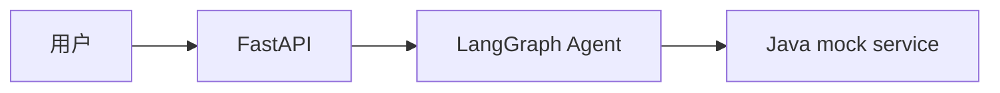

# M6 第 3 节：架构图和核心流程图

## 本节定位

这一节是 M6 快速作品化阶段的第三节。

前两节已经完成：

```text
M6 第 1 节：项目定位和作品化目标
M6 第 2 节：整理 GitHub 首页 README
```

现在 README 已经能用文字说明：

```text
这个项目是什么。
它展示哪些技术能力。
它不是完整生产系统。
它后续要补什么。
```

但一个作品项目不能只靠文字。

别人理解一个系统时，经常需要先看图。

这一节要做的是：

```text
把当前 AI 客服工单系统的整体架构、RAG 流程、Agent 流程和工具调用安全边界画出来。
```

图的目标不是炫技。

图的目标是：

```text
让第一次打开仓库的人，用更短时间看懂项目。
```

---

## 一、本节学习目标

学完本节，你要能讲清楚：

1. 架构图是什么。
2. 流程图是什么。
3. 架构图和流程图有什么区别。
4. 为什么作品项目需要图。
5. 为什么图不能把所有代码细节都画进去。
6. 当前项目为什么需要整体架构图。
7. RAG 问答流程应该怎么画。
8. 智能工单 Agent 流程应该怎么画。
9. 工具调用安全流程应该怎么画。
10. 图里的箭头代表什么。
11. 图里的模块边界代表什么。
12. Mermaid 是什么，为什么用它写图。
13. README 里应该怎么放图文档入口。
14. 面试时怎么根据图讲项目。

---

## 二、本节先不做什么

这一节不做这些事：

1. 不重构业务代码。
2. 不新增 API。
3. 不启动 Docker。
4. 不真实调用大模型。
5. 不做截图。
6. 不写完整运行说明。
7. 不写最终简历描述。

原因是：

```text
M6 第 3 节只解决“图怎么表达项目”。
```

完整运行说明和演示脚本放到 M6 第 4 节。

简历描述和面试问答放到 M6 第 5 节。

---

## 三、基础知识铺垫

### 1. 什么是架构图

架构图用来回答：

```text
系统由哪些重要部分组成？
这些部分之间怎么连接？
谁调用谁？
数据大概流向哪里？
外部依赖在哪里？
边界在哪里？
```

比如当前项目的整体架构图要说明：

```text
用户从哪里进来。
Python FastAPI AI 服务负责什么。
RAG 模块负责什么。
LangGraph Agent 负责什么。
Java mock service 负责什么。
Qdrant 和 Milvus 在哪里。
评测、CI、日志和稳定性策略属于什么层。
```

架构图看的是“系统结构”。

它不追求画出每一行代码。

它追求让人建立整体认知。

### 2. 什么是流程图

流程图用来回答：

```text
一件事情按什么步骤发生？
第一步是什么？
第二步是什么？
中间有哪些分支？
什么时候结束？
失败或拒绝时怎么处理？
```

比如 RAG 问答流程图要说明：

```text
文档如何进入知识库。
用户问题如何进入检索。
检索结果如何交给模型。
模型回答如何带引用来源。
没有上下文时如何拒答。
```

Agent 工单流程图要说明：

```text
用户输入后先识别意图。
不同意图走不同分支。
创建工单时先提取字段。
字段缺失时追问。
写操作前必须确认。
确认后才调用 Java 服务。
```

流程图看的是“事情怎么发生”。

### 3. 架构图和流程图的区别

可以这样区分：

| 类型 | 关注点 | 适合回答 |
| --- | --- | --- |
| 架构图 | 系统由哪些模块组成，模块之间怎么连接 | 这个系统整体长什么样 |
| 流程图 | 一次业务请求按什么步骤流转 | 用户请求进来以后发生了什么 |

如果别人问：

```text
你的项目有哪些组成部分？
```

用架构图回答。

如果别人问：

```text
用户创建工单时系统怎么走？
```

用流程图回答。

### 4. 为什么作品项目需要图

没有图时，读者只能靠文字和目录想象系统。

目录通常是这样的：

```text
app/agents
app/rag
app/tools
app/services
app/routers
```

目录只能说明文件在哪里。

它不能直接说明：

```text
这些模块怎么协作？
RAG 和 Agent 什么关系？
Python 和 Java 什么关系？
Qdrant 和 Milvus 在链路里的位置是什么？
工具调用为什么要安全校验？
```

图可以把这些关系一次性展示出来。

这对作品项目很重要。

### 5. 为什么图不能画太细

初学者画图容易犯一个错误：

```text
把所有类、函数、文件、字段都画进去。
```

结果图会变成一团。

好的图不是越细越好。

好的图要服务一个明确问题。

比如：

```text
整体架构图：只画主要系统和模块。
RAG 流程图：只画入库和问答关键步骤。
Agent 流程图：只画主要节点和分支。
工具安全图：只画执行工具前后的安全边界。
```

每张图只解决一个问题。

这比一张超级复杂大图更容易理解。

### 6. 什么是边界

边界就是系统中职责发生变化的地方。

当前项目里有几个重要边界：

```text
用户和 FastAPI 的边界。
FastAPI 和 Agent 的边界。
Agent 和 RAG 的边界。
Agent 和工具系统的边界。
Python AI 服务和 Java mock service 的边界。
Python AI 服务和向量数据库的边界。
模型输出和业务状态之间的边界。
读操作和写操作之间的边界。
```

架构图和流程图都要体现边界。

特别是工具调用安全流程图。

因为 AI 系统最重要的原则之一是：

```text
模型可以提出意图，但不能直接执行危险动作。
```

### 7. 什么是数据流

数据流表示数据从哪里来，到哪里去。

比如 RAG 里有两条数据流：

```text
文档入库流：
文档 -> 清洗 -> chunk -> embedding -> 向量库

问答检索流：
用户问题 -> query embedding -> 向量库检索 -> context -> 模型回答
```

如果图里不区分这两条流，读者容易混淆。

### 8. 什么是控制流

控制流表示系统按什么逻辑分支。

Agent 里最重要的是控制流。

比如：

```text
用户输入 -> 意图识别
    -> RAG 回答
    -> 查订单
    -> 创建工单
    -> 闲聊或拒绝
```

创建工单内部又有：

```text
字段提取
缺字段追问
用户确认
创建工单
```

这就是控制流。

### 9. Mermaid 是什么

Mermaid 是一种用文本写图的格式。

比如：

```text
用户 -> FastAPI -> Agent -> Java 服务
```

可以写成 Mermaid：



很多 Markdown 渲染器和 GitHub 都支持 Mermaid。

用 Mermaid 的好处是：

```text
图可以和文档一起放进 Git。
修改方便。
可以看 diff。
不依赖手动画图工具。
```

### 10. 为什么本节用 Mermaid

当前项目是学习仓库。

图要能长期维护。

如果用图片，后面每次改图都要重新导出。

如果用 Mermaid，后面改一行文本就能更新图。

这适合当前阶段。

后续如果要做更正式的展示材料，可以再把 Mermaid 图导出成图片或放进 PPT。

---

## 四、本节主题系统讲解

### 1. 本节新增的图文档

本节新增：

```text
docs/project-diagrams.md
```

它是当前项目的图文档入口。

里面包含 4 张核心图：

```text
整体架构图
RAG 问答流程图
智能工单 Agent 流程图
工具调用安全流程图
```

为什么先做这 4 张？

因为它们对应当前项目最重要的 4 个理解问题：

```text
这个系统整体长什么样？
知识库问答怎么跑？
智能工单怎么流转？
AI 调工具为什么安全？
```

### 2. 整体架构图应该怎么看

整体架构图从左到右看。

左边是：

```text
用户 / 调用方
```

中间是：

```text
Python FastAPI AI 服务
```

AI 服务内部有：

```text
routers
services
rag
agents
tools
core/middleware
```

右边是外部依赖：

```text
Java mock service
Qdrant
Milvus
LLM API
```

底部是工程保障：

```text
pytest
eval
logging
trace
metrics
Docker Compose
CI
```

这张图的重点是：

```text
Python AI 服务不是孤立脚本。
它连接模型、知识库、业务服务和工程保障。
```

### 3. RAG 流程图应该怎么看

RAG 图分成两部分：

```text
入库链路
问答链路
```

入库链路是离线或管理动作：

```text
Markdown/txt 文档
-> 加载
-> 清洗
-> chunk
-> metadata
-> embedding
-> 写入 Qdrant/Milvus
```

问答链路是用户请求时发生：

```text
用户问题
-> 生成 query embedding
-> 向量检索
-> filter / threshold / rerank
-> 构造上下文
-> 模型回答
-> 返回引用来源
```

这张图的重点是：

```text
RAG 不是模型直接回答。
RAG 是先检索，再把检索结果交给模型回答。
```

### 4. Agent 流程图应该怎么看

Agent 图从用户输入开始。

第一步是：

```text
意图识别
```

然后根据意图分支：

```text
知识库问题 -> RAG 回答
订单问题 -> query_order
创建工单 -> 工单流程
闲聊/无法处理 -> 安全文案
```

创建工单流程内部要注意：

```text
字段提取
缺字段追问
用户确认
创建工单
```

这张图的重点是：

```text
Agent 不是一次模型回答。
Agent 是多步骤、有状态、有分支、有安全边界的业务流程。
```

### 5. 工具调用安全流程图应该怎么看

工具调用安全图最重要。

因为它说明：

```text
AI 为什么不能直接操作业务系统。
```

流程是：

```text
模型或规则提出工具意图
-> 后端检查工具是否注册
-> 后端校验参数 schema
-> 判断读操作还是写操作
-> 写操作必须用户确认
-> 生成或检查幂等键
-> 执行 Java API
-> 校验结果
-> 写回 Agent 状态
-> 记录日志和 trace
```

这张图要传达的核心原则：

```text
模型负责建议。
后端负责执行。
```

如果面试官问：

```text
怎么避免模型乱调工具？
```

你就可以用这张图回答。

### 6. 图和 README 的关系

README 不适合放太多大图。

README 应该放入口：

```text
项目架构图和流程图：docs/project-diagrams.md
```

这样 README 保持清晰。

想看图的人可以点进去。

想看完整学习索引的人继续往下看。

### 7. 图和面试表达的关系

面试讲项目时，可以先用整体架构图。

顺序可以是：

```text
先讲整体架构。
再讲 RAG。
再讲 Agent。
最后讲工具安全边界。
```

如果时间短，只讲整体架构图。

如果面试官问细节，再展开其他图。

### 8. 本节对项目的实际改变

本节新增：

```text
notes/m6-03-architecture-and-core-flow-diagrams.md
docs/project-diagrams.md
```

本节修改：

```text
README.md
docs/learning-progress.md
```

本节没有修改业务代码。

原因是：

```text
本节是作品化图文整理，不是功能开发。
```

---

## 五、本节练习

### 练习 1：架构图和流程图有什么区别？

参考答案：

```text
架构图关注系统由哪些模块组成、模块之间如何连接；流程图关注一件事情按什么步骤发生、有哪些分支、什么时候结束。架构图回答“系统长什么样”，流程图回答“请求怎么流转”。
```

### 练习 2：为什么当前项目需要整体架构图？

参考答案：

```text
因为当前项目包含 Python AI 服务、Java mock service、RAG、LangGraph Agent、Qdrant、Milvus、LLM API、评测和 CI 等多个部分。没有整体架构图，读者很难快速理解这些模块之间的关系。
```

### 练习 3：RAG 流程为什么要分成入库链路和问答链路？

参考答案：

```text
因为入库链路处理文档，把文档变成向量库里的数据；问答链路处理用户问题，从向量库检索上下文再交给模型回答。这两条链路发生时间不同，职责也不同，分开画更清楚。
```

### 练习 4：Agent 流程图最应该突出什么？

参考答案：

```text
最应该突出意图识别后的分支，以及创建工单流程里的字段提取、缺字段追问、用户确认和创建工单。这样才能说明 Agent 是多步骤、有状态、有安全边界的业务流程。
```

### 练习 5：工具调用安全流程图的核心原则是什么？

参考答案：

```text
核心原则是模型可以提出工具意图，但真正执行工具必须由后端完成工具名校验、参数校验、权限判断、用户确认、幂等控制、结果校验和日志追踪。
```

---

## 六、自测问题

### 自测 1：如果别人问“这个系统整体怎么组成”，你应该看哪张图？

答案：

```text
看整体架构图。它展示用户、Python FastAPI AI 服务、RAG、LangGraph Agent、Java mock service、向量数据库、LLM API 和工程保障之间的关系。
```

### 自测 2：如果别人问“RAG 是怎么回答问题的”，你应该看哪张图？

答案：

```text
看 RAG 问答流程图。它展示文档入库链路和用户问答链路，包括加载、清洗、chunk、embedding、向量检索、上下文构造、模型回答和引用来源。
```

### 自测 3：如果别人问“创建工单为什么不会直接执行”，你应该看哪张图？

答案：

```text
看工具调用安全流程图，也可以配合 Agent 流程图说明。写操作必须经过字段提取、用户确认、权限判断和幂等控制，模型不能直接执行 Java API。
```

### 自测 4：为什么本节使用 Mermaid，而不是直接放图片？

答案：

```text
因为 Mermaid 可以用文本维护，适合放进 Git，修改方便，也能看 diff。当前阶段是学习仓库和作品原型，用 Mermaid 更容易长期维护。
```

### 自测 5：图应该越详细越好吗？

答案：

```text
不是。图应该服务明确问题。整体架构图画主要模块，RAG 图画核心链路，Agent 图画主要分支，工具安全图画安全边界。把所有函数和字段都画进去会让图难以阅读。
```

---

## 七、本节总结

这一节完成了 M6 第 3 节：

```text
架构图和核心流程图
```

新增的图文档是：

```text
docs/project-diagrams.md
```

它包含：

```text
整体架构图
RAG 问答流程图
智能工单 Agent 流程图
工具调用安全流程图
```

你要记住：

```text
图不是为了好看。
图是为了降低理解成本。
```

下一节进入：

```text
M6 第 4 节：本地运行说明和演示脚本
```

那一节会把项目如何启动、如何演示、如何跑回归整理成清楚步骤。
