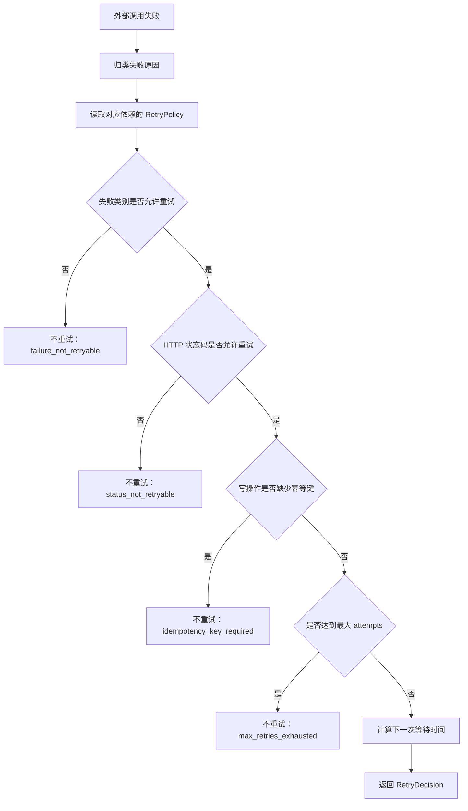

# 阶段 6 第 32 节：retry 重试策略

本节主题：

retry 重试策略。

上一节我们学了 timeout。

timeout 解决的是：

一个请求最多等多久。

这一节学习 retry。

retry 解决的是：

一次请求失败以后，要不要再试一次。

这两个知识点经常一起出现，但它们不是一回事。

timeout 管的是“单次等待边界”。

retry 管的是“失败后的再次尝试策略”。

如果 timeout 设置得不好，系统会无限等待。

如果 retry 设置得不好，系统会把小故障放大成大故障。

所以真实工程里，retry 不是“失败就再来一次”这么简单。

retry 必须回答几个问题：

1. 什么失败能重试？
2. 什么失败不能重试？
3. 最多重试几次？
4. 重试前等多久？
5. 写操作重试会不会造成重复创建？
6. LLM 调用重试会不会导致成本变高？
7. 多个用户同时重试会不会压垮外部服务？
8. 重试失败以后，是继续等、报错，还是走兜底？

本节就是围绕这些问题展开。

---

## 一、本节学习目标

学完本节，你要能真正讲明白：

1. retry 是什么。
2. retry 和 timeout、fallback、circuit breaker 的区别。
3. 什么是 attempt，什么是 retry。
4. `max_retries=2` 到底表示请求几次。
5. 哪些错误一般适合重试。
6. 哪些错误一般不适合重试。
7. 为什么 400、401、403、404 通常不能靠重试解决。
8. 为什么 408、429、5xx 更常见于 retry 策略。
9. 什么是固定间隔重试。
10. 什么是指数退避。
11. 什么是 jitter。
12. 为什么没有 jitter 的 retry 容易造成请求峰值。
13. 什么是 Retry-After。
14. 为什么写操作重试必须考虑幂等性。
15. 为什么 LLM 调用虽然可以重试，但要考虑成本和非确定性。
16. 为什么向量库检索失败可以短暂重试，但不应该无限重试。
17. 如何把 retry 决策变成清晰的策略对象。
18. 如何把 retry 结果写入日志和指标。
19. 为什么本节只实现“策略层”，不直接把所有网络调用包一层 retry loop。

---

## 二、官方资料

本节参考以下官方或主文档资料：

1. OpenAI Python SDK：
   https://github.com/openai/openai-python

   重点参考：

   OpenAI Python SDK 默认会对部分临时错误自动重试，包括连接错误、408、409、429、5xx 等，也可以通过 `max_retries` 配置。

2. HTTPX Transports：
   https://www.python-httpx.org/advanced/transports/

   重点参考：

   HTTPX 的 transport 层可以配置连接级重试，但它主要覆盖连接错误和连接超时。更复杂的 retry，比如处理 503，需要额外策略。

3. Tenacity API：
   https://tenacity.readthedocs.io/en/latest/api.html

   重点参考：

   Tenacity 提供 `stop_after_attempt`、`wait_exponential`、`wait_exponential_jitter` 等重试停止条件和等待策略。

4. urllib3 Retry：
   https://urllib3.readthedocs.io/en/stable/reference/urllib3.util.html

   重点参考：

   urllib3 的 Retry 会区分 `allowed_methods`、`status_forcelist`、`backoff_factor`、`respect_retry_after_header` 等配置。

---

## 三、承接上一节：timeout 和 retry 的关系

上一节我们做了 `timeout_strategy.py`。

它的重点是：

1. 给不同外部依赖设置 timeout budget。
2. 区分 connect、read、write、pool、total、operation timeout。
3. 把 timeout 失败映射成业务可理解的错误。
4. 判断 timeout 后是否允许 retry。
5. 判断 timeout 后是否允许 fallback。
6. 写操作 timeout 时必须考虑幂等键。

这一节不是推翻上一节。

这一节是在上一节基础上继续往前走。

上一节的核心问题：

这次调用等太久了怎么办？

这一节的核心问题：

这次调用失败了，下一次还要不要试？

一个真实调用链可能是这样：

```text
用户请求
-> Python AI Service
-> LLM
-> Java 工具服务
-> Qdrant/Milvus
-> 返回结果
```

这条链路里任何一个地方都可能失败。

比如：

LLM 调用超时。

Java 工具连接失败。

Qdrant 偶发 503。

Milvus 短暂不可用。

外部模型 API 返回 429。

这些失败不一定代表系统真的坏了。

有些只是临时抖动。

临时抖动就适合短暂重试。

但有些失败代表请求本身错了。

比如：

API Key 错了。

参数格式错了。

用户没有权限。

订单号不存在。

这些通常不适合重试。

因为你再试 100 次，结果也大概率一样。

---

## 四、基础知识铺垫

这一部分非常重要。

不要先急着看代码。

先把 retry 的思想学清楚。

### 4.1 retry 是什么

retry 的中文一般叫“重试”。

它指的是：

某一次操作失败后，系统按照一定规则再次执行同一个操作。

比如：

第一次调用模型接口失败。

等 0.25 秒。

再调用一次。

如果还失败。

等 0.5 秒。

再调用一次。

超过最大次数以后停止。

这就是 retry。

retry 不是简单的 while 循环。

错误的 retry 写法可能是：

```python
while True:
    call_external_service()
```

这种代码非常危险。

因为它没有最大次数。

没有 timeout。

没有等待。

没有错误分类。

没有幂等保护。

没有日志。

没有指标。

真实工程中的 retry 一定要有边界。

### 4.2 attempt 和 retry 的区别

这个概念一定要弄清楚。

`attempt` 表示尝试次数。

`retry` 表示失败后的再次尝试。

第一次请求叫第 1 次 attempt。

第一次请求失败后，再试一次叫第 1 次 retry，也就是第 2 次 attempt。

所以：

```text
max_retries = 0
总 attempt = 1
```

意思是：

只请求一次，失败就失败，不再重试。

```text
max_retries = 1
总 attempt = 2
```

意思是：

第一次请求失败后，最多再试一次。

```text
max_retries = 2
总 attempt = 3
```

意思是：

第一次请求失败后，最多再试两次。

这也是本节代码里为什么有：

```python
max_attempts = max_retries + 1
```

因为初始请求本身不叫 retry。

它叫第 1 次 attempt。

### 4.3 retry 不是越多越好

很多初学者会觉得：

失败了就多试几次，总会成功。

这在真实系统里是危险想法。

retry 的坏处包括：

1. 增加延迟。
2. 增加外部服务压力。
3. 增加 LLM token 成本。
4. 增加重复写入风险。
5. 让故障传播得更慢、更隐蔽。
6. 让排查问题更复杂。

举个例子：

如果一个接口原本每秒 100 个请求。

每个请求失败后都重试 3 次。

外部服务故障时，瞬间可能变成每秒 400 次请求。

外部服务本来只是慢。

结果被 retry 打得更慢。

更慢又导致更多 timeout。

更多 timeout 又触发更多 retry。

这就是 retry storm。

也叫重试风暴。

retry storm 是生产系统里非常典型的故障放大器。

所以 retry 的第一原则不是“多试几次”。

retry 的第一原则是：

只对有希望恢复的临时失败做有限重试。

### 4.4 临时失败和永久失败

判断能不能 retry，关键是区分：

临时失败。

永久失败。

临时失败是指：

现在失败，不代表下一次一定失败。

比如：

网络短暂抖动。

连接池暂时耗尽。

对方服务临时过载。

请求超时。

限流。

服务器 503。

永久失败是指：

请求本身不对，再试也大概率不行。

比如：

参数错误。

认证失败。

权限不足。

资源不存在。

业务规则不允许。

API Key 缺失。

模型名写错。

两类失败的处理思路完全不同。

临时失败：

可以短暂 retry。

永久失败：

应该尽快返回明确错误。

不要浪费时间和资源。

### 4.5 哪些 HTTP 状态码通常适合 retry

常见适合 retry 的 HTTP 状态码有：

```text
408 Request Timeout
429 Too Many Requests
500 Internal Server Error
502 Bad Gateway
503 Service Unavailable
504 Gateway Timeout
```

还有一些 SDK 或服务会把 `409 Conflict` 也纳入重试范围。

OpenAI Python SDK 文档里就提到，默认重试连接错误、408、409、429、5xx 等临时错误。

但你不能机械地认为所有项目都应该照搬。

要结合业务场景。

比如：

查询型操作遇到 409，可能可以重试。

创建工单遇到 409，可能意味着重复请求或业务冲突。

这种时候就要谨慎。

### 4.6 哪些 HTTP 状态码通常不适合 retry

常见不适合 retry 的 HTTP 状态码有：

```text
400 Bad Request
401 Unauthorized
403 Forbidden
404 Not Found
422 Unprocessable Entity
```

原因很简单：

400 多半是请求格式、参数、字段不对。

401 多半是身份认证失败。

403 多半是权限不足。

404 多半是资源不存在。

422 多半是业务或校验不通过。

这些失败不是“等一等就好”的问题。

如果参数错了，不修改参数就不会成功。

如果 API Key 错了，不换 Key 就不会成功。

如果权限不足，不改变权限就不会成功。

所以不应该自动重试。

### 4.7 response error 和 exception error

外部调用失败可能有两种表现。

第一种：

服务返回了 HTTP 响应。

比如状态码是 429 或 503。

这叫 response error。

第二种：

请求过程中直接抛异常。

比如连接失败、DNS 失败、超时。

这叫 exception error。

两者处理方式不同。

response error 可以看状态码。

exception error 要看异常类型。

所以本节代码里有三类分类函数：

```python
classify_http_status_for_retry()
classify_error_code_for_retry()
classify_exception_for_retry()
```

它们解决的是同一个问题：

把不同来源的失败，统一归类成业务能理解的 failure category。

### 4.8 failure category 是什么

failure category 是失败分类。

它不是原始错误。

它是我们为了做策略判断而抽象出来的类别。

比如：

```text
504
httpx.ReadTimeout
LLM_TIMEOUT
APITimeoutError
```

这些原始错误来源不同。

但它们都可以归类成：

```text
timeout
```

再比如：

```text
429
RateLimitError
LLM_RATE_LIMIT
```

都可以归类成：

```text
rate_limited
```

这样做的好处是：

策略不用关心每一个 SDK 的具体异常名字。

策略只关心：

这是不是 timeout。

这是不是 rate limit。

这是不是 server error。

这是不是 validation error。

抽象之后，代码会更稳定。

### 4.9 固定间隔重试

固定间隔重试是最简单的策略。

比如：

```text
失败
等 1 秒
再试
失败
等 1 秒
再试
```

优点：

简单。

容易理解。

缺点：

不够灵活。

如果对方服务正在恢复，固定间隔可能太激进。

如果大量客户端同时失败，又同时每 1 秒重试，就容易形成固定节奏的压力峰值。

### 4.10 指数退避

指数退避英文是 exponential backoff。

它的思想是：

失败次数越多，等待越久。

比如：

```text
第 1 次 retry 前等 0.25 秒
第 2 次 retry 前等 0.5 秒
第 3 次 retry 前等 1 秒
第 4 次 retry 前等 2 秒
```

等待时间大致按倍数增长。

常见公式是：

```text
delay = initial_delay * multiplier ** (retry_number - 1)
```

如果：

```text
initial_delay = 0.25
multiplier = 2
```

那么：

```text
retry 1: 0.25
retry 2: 0.5
retry 3: 1.0
retry 4: 2.0
```

指数退避的意义是：

失败越多，越说明对方可能还没恢复。

不要一直高频打过去。

### 4.11 最大等待上限

指数退避不能无限增长。

否则等待时间可能变得非常长。

所以会设置 max delay。

比如：

```text
initial = 0.25
multiplier = 2
max_delay = 2
```

那么等待时间最多到 2 秒。

不会变成 4、8、16 秒。

这叫 capped exponential backoff。

中文可以理解为：

带上限的指数退避。

### 4.12 jitter 是什么

jitter 是随机抖动。

它的作用是：

让多个客户端不要在完全同一时间重试。

假设 1000 个请求同时失败。

如果大家都等 1 秒再重试。

那么 1 秒后会同时打过来 1000 个请求。

这会形成新的峰值。

如果加一点随机抖动：

```text
有的等 1.02 秒
有的等 1.07 秒
有的等 1.15 秒
有的等 1.18 秒
```

请求会被打散。

系统压力更平滑。

Tenacity 和 urllib3 的文档都提到了带 jitter 的等待策略。

本节代码为了方便测试，没有直接调用随机数。

而是把 `jitter_ratio` 作为参数传入。

这样自动化测试可以稳定断言。

真实运行时，可以由调用层传入随机值。

### 4.13 Retry-After 是什么

Retry-After 是一个 HTTP 响应头。

它表示：

服务端告诉客户端，多久以后再来。

最常见场景是 429。

也就是限流。

比如服务端说：

```text
Retry-After: 30
```

意思是：

30 秒后再试。

如果客户端完全不理这个头，可能会继续被限流。

所以 retry 策略一般要考虑 Retry-After。

但业务系统也不能无条件等很久。

比如客服系统里，用户正在等答案。

如果服务端让你 120 秒后再试，用户体验可能不可接受。

所以本节代码做了一个保守策略：

如果是 rate limit 并且有 Retry-After，就尊重它。

但等待时间会被当前策略的 `max_delay_seconds` 限制。

这不是唯一方案。

真实生产系统里还可以结合总请求预算、用户等待体验、任务是否可异步处理来决定。

### 4.14 幂等性是什么

幂等性英文是 idempotency。

它表示：

同一个操作执行一次和执行多次，最终状态一样。

比如查询订单：

```text
GET /orders/ORD-001
```

执行一次是查订单。

执行两次还是查订单。

不会多创建一条订单。

这类操作通常比较适合 retry。

再比如创建工单：

```text
POST /tickets
```

如果第一次请求已经到达 Java 服务，但 Python 没等到响应就 timeout。

Python 以为失败了。

然后自动 retry。

可能会创建第二张工单。

这就是重复写入风险。

### 4.15 写操作为什么危险

写操作会改变系统状态。

比如：

创建工单。

退款。

扣库存。

发送短信。

发优惠券。

改订单状态。

这些操作如果自动重试，可能造成严重问题。

例如：

用户只想创建一张售后工单。

第一次请求到了 Java 服务，Java 已经创建成功。

但网络断了，Python 没拿到响应。

Python 认为失败，又重试一次。

Java 又创建一张工单。

这就重复了。

所以写操作 retry 一般需要幂等键。

幂等键可以理解为：

给这次写操作一个唯一业务标识。

如果服务端发现同一个幂等键已经处理过，就返回之前的结果，而不是再创建一次。

### 4.16 幂等键不是 trace_id

注意：

幂等键不是 trace_id。

trace_id 用来追踪请求链路。

idempotency_key 用来防止重复写入。

它们解决的问题不同。

trace_id 的问题是：

这次请求经过了哪些服务？

idempotency_key 的问题是：

这次写操作是不是已经执行过？

不要把它们混用。

### 4.17 retry 和 fallback 的区别

retry 是再试一次。

fallback 是走兜底方案。

比如：

RAG 检索 Qdrant 超时。

retry：

再查一次 Qdrant。

fallback：

使用缓存结果，或者返回“暂时无法查询知识库”的安全回答。

retry 发生在失败之后、最终失败之前。

fallback 发生在不能继续正常完成之后。

两者通常配合使用。

比如：

```text
第一次调用失败
-> retry 一次
-> 仍失败
-> fallback
```

### 4.18 retry 和 circuit breaker 的区别

circuit breaker 是熔断器。

它解决的是：

当外部服务持续失败时，不要每个请求都继续打过去。

retry 是请求级策略。

circuit breaker 是系统级保护策略。

如果外部服务只是偶发失败：

retry 可以提高成功率。

如果外部服务已经持续故障：

retry 会放大故障。

这时候应该由 circuit breaker 限制继续调用。

所以顺序通常是：

```text
正常调用
-> 临时失败可以 retry
-> 连续失败达到阈值
-> circuit breaker 打开
-> 后续请求直接降级
```

下一节会继续讲 rate limit、circuit breaker 和降级。

### 4.19 LLM 调用 retry 的特殊性

LLM 调用和普通 HTTP 查询不完全一样。

它有几个特殊点：

1. 成本敏感。
2. 输出不一定完全确定。
3. 可能消耗大量 token。
4. 可能受到模型服务限流。
5. SDK 自己可能已经带 retry。

比如 OpenAI Python SDK 默认会重试部分临时错误。

我们项目里的 `llm_client.py` 已经把：

```python
max_retries=settings.llm_max_retries
```

传给了 OpenAI 兼容客户端。

这意味着：

模型 SDK 层已经可能在重试。

如果我们再在外面包一层 retry，就可能出现双重 retry。

双重 retry 可能导致：

一次用户请求触发太多模型调用。

延迟变长。

成本变高。

问题更难排查。

所以本节只做策略层。

先把“应该怎么判断”学清楚。

后续如果要真正接入执行层，要明确：

到底让 SDK 重试。

还是让我们自己的业务层重试。

不要两边都无脑重试。

### 4.20 RAG 检索 retry 的特殊性

RAG 检索依赖向量库。

比如 Qdrant。

比如 Milvus。

向量库检索通常是读操作。

读操作一般比写操作更适合重试。

但也不能无限重试。

因为客服场景里，用户在等回答。

如果向量库暂时慢，可以短暂 retry 一次。

如果还失败，就应该：

使用缓存。

返回无上下文兜底。

或者诚实告诉用户知识库暂时不可用。

不要为了等检索结果让整个接口卡很久。

### 4.21 Java 工具 retry 的特殊性

我们项目里有 Java mock 服务。

它目前有两类工具：

查询订单。

创建工单。

查询订单是读操作。

它通常可以 retry。

创建工单是写操作。

它必须考虑幂等。

所以本节策略里：

```text
java.query_order
允许短暂 retry
```

```text
java.create_ticket
只有有 idempotency_key 才允许 retry
```

这个区别非常关键。

如果你以后面试或给别人讲 Agent 工具调用，能讲清楚这一点，就说明你不是只会调接口。

你理解了工程风险。

### 4.22 retry 的日志和指标

retry 一定要能观察。

否则线上出现问题，你会不知道：

到底有没有重试。

重试了几次。

为什么重试。

因为什么失败。

下一次等待多久。

是否因为幂等键缺失被拦截。

是否最后走了 fallback。

本节 `RetryDecision` 提供了：

```python
log_fields()
metric_attributes()
```

日志字段用于排查单次问题。

指标字段用于观察整体趋势。

但注意：

指标字段不能放高基数字段。

不能放：

trace_id。

span_id。

thread_id。

request_id。

idempotency_key。

用户原文。

完整 prompt。

完整 tool_args。

这些字段会导致指标爆炸，或者泄漏敏感信息。

所以本节也做了：

```python
sanitize_retry_metric_attributes()
```

---

## 五、本节主题系统讲解

这一节的核心不是“写一个 for 循环 retry”。

这一节的核心是：

把 retry 变成可解释、可测试、可观察、可扩展的策略。

### 5.1 本节实现边界

本节做：

1. 定义 retry 失败分类。
2. 定义 retry backoff。
3. 定义每个依赖的 retry policy。
4. 定义 retry decision。
5. 判断某次失败要不要 retry。
6. 输出日志字段和指标字段。
7. 写单元测试验证边界。
8. 写学习笔记和索引。

本节不做：

1. 不把所有 HTTP 调用真正包上 retry loop。
2. 不引入 Tenacity 依赖。
3. 不修改 Java mock 服务。
4. 不真实调用 LLM。
5. 不真实调用 Qdrant/Milvus。
6. 不提前讲 circuit breaker。
7. 不提前讲 rate limit 全套治理。

为什么先不写真正的 retry loop？

因为 retry loop 一旦接到真实调用链，就会影响运行行为。

尤其我们已有 OpenAI SDK 的 `max_retries`。

如果不先设计清楚，很容易出现重复重试。

所以本节先做策略层。

策略层的价值是：

它能清楚说明“该不该重试”。

以后执行层可以复用这些判断。

### 5.2 本节新增文件

新增代码：

```text
projects/ai-service/app/agents/retry_strategy.py
```

新增测试：

```text
projects/ai-service/tests/test_ticket_agent_retry_strategy.py
```

新增笔记：

```text
notes/stage6-32-retry-strategy.md
```

更新索引：

```text
README.md
docs/learning-progress.md
```

### 5.3 retry 策略的完整流程

本节设计的 retry 判断流程如下：



注意：

这里返回的是 RetryDecision。

它不是直接 sleep。

它不是直接发请求。

它只是告诉调用层：

应该重试吗？

为什么？

下一次等多久？

下一次是第几次 attempt？

是否允许 fallback？

是否涉及成本敏感？

### 5.4 本节定义的 failure category

本节定义了这些失败分类：

```text
connection_error
timeout
rate_limited
server_error
conflict
client_error
validation_error
auth_error
permission_error
not_found
business_rule
unknown
```

可以简单分成两类。

第一类，通常可能 retry：

```text
connection_error
timeout
rate_limited
server_error
conflict
```

第二类，通常不应该 retry：

```text
client_error
validation_error
auth_error
permission_error
not_found
business_rule
unknown
```

但这不是绝对规则。

最终要看具体 policy。

比如：

LLM 可以把 conflict 纳入重试。

Java 创建工单不一定应该把 conflict 当成普通可重试错误。

策略必须结合业务含义。

### 5.5 本节定义的 dependency kind

本节沿用当前 Agent 工程里的外部依赖分类：

```text
llm
embedding
java_read_tool
java_write_tool
vector_store
milvus
rag_generation
```

这些分类是低基数字段。

适合进日志和指标。

为什么不用具体 URL？

因为 URL 可能太细。

也可能包含动态路径。

指标里需要的是可聚合维度。

比如你想看：

LLM 重试多不多。

Java 工具重试多不多。

Qdrant 重试多不多。

Milvus 重试多不多。

这就需要 dependency kind。

### 5.6 本项目的 retry policy 表

本节在 `build_ticket_agent_retry_policies()` 里定义了这些策略：

| policy key | 依赖 | 操作 | max_retries | 是否 fallback | 是否要求幂等键 | 成本敏感 |
| --- | --- | --- | --- | --- | --- | --- |
| `llm.intent_classification` | LLM | 意图识别 | 来自 `settings.llm_max_retries` | 是 | 否 | 是 |
| `llm.field_extraction` | LLM | 字段提取 | 来自 `settings.llm_max_retries` | 是 | 否 | 是 |
| `embedding.create` | Embedding | 向量生成 | 1 | 否 | 否 | 是 |
| `java.query_order` | Java 读工具 | 查询订单 | 1 | 是 | 否 | 否 |
| `java.create_ticket` | Java 写工具 | 创建工单 | 1 | 否 | 是 | 否 |
| `qdrant.vector_search` | Qdrant | 向量检索 | 1 | 是 | 否 | 否 |
| `milvus.vector_search` | Milvus | 向量检索 | 1 | 是 | 否 | 否 |
| `rag.generate_answer` | RAG 生成 | 生成回答 | 1 | 是 | 否 | 是 |

这个表很重要。

它说明 retry 不是全局一个开关。

不同依赖要有不同策略。

### 5.7 为什么 LLM 是 cost_sensitive

LLM 调用会花钱。

也会消耗 token。

所以本节把 LLM 和 RAG 生成标记成：

```python
cost_sensitive=True
```

这不是说不能 retry。

而是提醒日志、指标、排查时要关注：

一次用户请求实际触发了几次模型调用。

是否因为重试导致成本上涨。

是否应该减少重试次数。

是否应该走 fallback。

### 5.8 为什么写操作需要 idempotency_key

本节把：

```text
java.create_ticket
```

设置为：

```python
requires_idempotency_key=True
```

这表示：

如果没有幂等键，即使错误本身是 timeout，也不允许自动 retry。

原因不是技术上不能再发请求。

而是业务上风险太大。

创建工单可能已经成功，只是响应丢了。

如果自动再发一次，可能重复创建。

所以策略层必须拦住。

### 5.9 为什么查询订单不需要幂等键

查询订单是读操作。

读操作一般不改变业务状态。

所以：

```text
java.query_order
```

不要求 idempotency_key。

它可以在临时失败时短暂 retry 一次。

这正是读操作和写操作的核心区别。

### 5.10 为什么只有短暂 retry

本节大多数依赖只设置：

```text
max_retries = 1
```

意思是：

第一次失败后最多再试一次。

原因是：

当前 Agent 接口是在线请求。

用户正在等待响应。

我们更关注：

延迟可控。

错误边界清楚。

避免 retry storm。

如果将来是后台异步任务，可以设计更长 retry。

比如：

工单同步任务。

知识库离线入库任务。

报表生成任务。

这些任务不要求用户立刻等待，可以有更多 retry。

但在线接口要保守。

### 5.11 retry policy 和 timeout policy 怎么配合

上一节 timeout policy 告诉我们：

某个依赖最多等多久。

本节 retry policy 告诉我们：

失败后最多再试几次。

两者要一起算总延迟。

比如：

```text
单次 timeout = 5 秒
max_retries = 1
```

最坏情况可能是：

第一次等 5 秒失败。

再等 0.25 秒 backoff。

第二次再等 5 秒失败。

总共超过 10 秒。

所以 retry 不是免费的。

它会放大 timeout。

设计 retry 时不能只看 max_retries。

还要看每次 timeout 多久。

### 5.12 本节为什么没有直接用 Tenacity

Tenacity 是成熟的 Python retry 库。

它能做：

停止条件。

等待策略。

异常筛选。

结果筛选。

异步重试。

回调。

但本节没有直接引入它。

原因有三个。

第一：

我们现在是学习阶段。

先把 retry 的底层概念学清楚，比直接套库更重要。

第二：

我们项目目前需要的是策略对象。

不是马上给所有真实调用加执行层 retry。

第三：

LLM SDK 已经有自己的 retry。

如果直接 Tenacity 套 OpenAI SDK，容易双重 retry。

后续如果真的要把执行层抽出来，可以再用 Tenacity。

但那时你已经知道要配置什么。

不会只是照抄装饰器。

### 5.13 本节为什么不用 HTTPX transport retries 解决全部问题

HTTPX 的 transport retries 更偏底层连接问题。

官方文档说明，它适合处理连接错误和连接超时。

但我们的业务需要处理更多情况：

429。

503。

LLM SDK 异常。

本地 error_code。

写操作幂等键。

fallback。

成本敏感。

日志和指标字段。

这些不是 transport 层能完整表达的。

所以本节做业务层 retry policy。

### 5.14 retry decision 的意义

`RetryDecision` 是本节最核心的结果对象。

它告诉系统：

```text
should_retry: 是否重试
reason: 为什么这么决定
next_delay_seconds: 下次等多久
next_attempt_number: 下次是第几次尝试
fallback_allowed: 是否允许兜底
blocked_by_idempotency: 是否被幂等规则拦住
cost_sensitive: 是否成本敏感
```

为什么不只返回 True 或 False？

因为 True 或 False 不够排查问题。

线上排查时，你需要知道：

为什么没有 retry。

是次数用完了？

是错误不可重试？

是状态码不允许？

还是缺少幂等键？

这就是 `reason` 的价值。

### 5.15 本节的 retry reason

本节定义了这些 reason：

```text
retry_allowed
retry_after_allowed
retry_disabled
max_retries_exhausted
failure_not_retryable
status_not_retryable
idempotency_key_required
```

这些 reason 都是低基数。

适合写入指标。

你可以统计：

哪个原因导致不重试最多。

哪个依赖经常 max_retries_exhausted。

哪个写操作经常因为缺少幂等键被拦住。

这就是生产可观测性的价值。

---

## 六、本节代码讲解

本节新增代码：

```text
projects/ai-service/app/agents/retry_strategy.py
```

下面只讲和学习 retry 有关的关键代码。

### 6.1 RetryDependencyKind

```python
RetryDependencyKind = Literal[
    "llm",
    "embedding",
    "java_read_tool",
    "java_write_tool",
    "vector_store",
    "milvus",
    "rag_generation",
]
```

这是依赖类型。

它的作用是给 retry 策略一个稳定分类。

不要把它理解成具体类名。

它是观察和策略维度。

例如：

LLM 失败和 Java 工具失败，retry 边界不一样。

Qdrant 和 Milvus 都是向量检索，但我们仍然能分开观察。

Java 读工具和 Java 写工具必须分开。

因为读和写的幂等风险不同。

### 6.2 RetryFailureCategory

```python
RetryFailureCategory = Literal[
    "connection_error",
    "timeout",
    "rate_limited",
    "server_error",
    "conflict",
    "client_error",
    "validation_error",
    "auth_error",
    "permission_error",
    "not_found",
    "business_rule",
    "unknown",
]
```

这是失败分类。

它把不同来源的错误统一成几个类别。

例如：

`httpx.ConnectTimeout` 可以归类为 `timeout`。

`429` 可以归类为 `rate_limited`。

`LLM_API_KEY_MISSING` 可以归类为 `auth_error`。

这样 retry policy 不需要理解所有底层错误类型。

### 6.3 RetryBackoff

```python
@dataclass(frozen=True)
class RetryBackoff:
    initial_delay_seconds: float = 0.25
    multiplier: float = 2.0
    max_delay_seconds: float = 2.0
    jitter_seconds: float = 0.1
```

它描述重试前等多久。

字段含义：

`initial_delay_seconds`：

第一次 retry 前的基础等待时间。

`multiplier`：

每次 retry 后等待时间放大的倍数。

`max_delay_seconds`：

最大等待上限。

`jitter_seconds`：

最多增加多少随机抖动。

本节默认：

```text
0.25 -> 0.5 -> 1.0 -> 2.0
```

最多等 2 秒。

这是在线接口的保守策略。

### 6.4 delay_for_retry()

```python
def delay_for_retry(self, retry_number: int, *, jitter_ratio: float | None = None) -> float:
```

这个函数计算某次 retry 前应该等多久。

`retry_number=1` 表示第一次 retry。

也就是第 1 次 attempt 失败后，准备发第 2 次 attempt。

如果 `jitter_ratio=None`，返回固定指数退避结果。

如果传入 `jitter_ratio`，会加上可控 jitter。

为什么不直接在函数里 random？

因为测试需要稳定。

随机数会让测试不稳定。

所以策略层允许调用者传入 jitter ratio。

### 6.5 TicketAgentRetryPolicy

```python
@dataclass(frozen=True)
class TicketAgentRetryPolicy:
    dependency_kind: RetryDependencyKind
    operation: str
    max_retries: int
    backoff: RetryBackoff
    retryable_categories: frozenset[RetryFailureCategory]
    retryable_status_codes: frozenset[int]
    fallback_allowed: bool
    user_message: str
    requires_idempotency_key: bool = False
    retry_all_server_errors: bool = True
    respect_retry_after_header: bool = True
    cost_sensitive: bool = False
```

这是本节最重要的策略对象。

它不是一次失败。

它是一类依赖的 retry 规则。

例如：

`java.query_order` 的规则和 `java.create_ticket` 的规则不同。

`llm.intent_classification` 的规则和 `qdrant.vector_search` 的规则也不同。

它包含：

能重试几次。

什么失败类别能重试。

什么状态码能重试。

是否允许 fallback。

是否需要幂等键。

是否尊重 Retry-After。

是否成本敏感。

### 6.6 max_attempts

```python
@property
def max_attempts(self) -> int:
    return self.max_retries + 1
```

这个属性用来避免概念混乱。

如果 `max_retries=2`：

最多不是请求 2 次。

而是最多请求 3 次。

第 1 次是原始 attempt。

后 2 次才是 retry。

### 6.7 RetryDecision

```python
@dataclass(frozen=True)
class RetryDecision:
    should_retry: bool
    reason: RetryDecisionReason
    next_delay_seconds: float | None = None
    next_attempt_number: int | None = None
```

`RetryDecision` 是某一次失败后的判断结果。

如果 `should_retry=True`：

说明可以重试。

并且会给出下一次等待时间。

如果 `should_retry=False`：

说明不能重试。

并且会给出原因。

比如：

`max_retries_exhausted`。

`failure_not_retryable`。

`idempotency_key_required`。

### 6.8 classify_http_status_for_retry()

```python
def classify_http_status_for_retry(status_code: int) -> RetryFailureCategory:
```

这个函数把 HTTP 状态码变成失败分类。

规则包括：

408 -> timeout。

409 -> conflict。

429 -> rate_limited。

5xx -> server_error。

400/422 -> validation_error。

401 -> auth_error。

403 -> permission_error。

404 -> not_found。

这比到处写 if 更清晰。

### 6.9 classify_error_code_for_retry()

```python
def classify_error_code_for_retry(error_code: str) -> RetryFailureCategory:
```

这个函数处理我们项目自己的 error_code。

比如：

`LLM_TIMEOUT` -> timeout。

`LLM_RATE_LIMIT` -> rate_limited。

`NETWORK_ERROR` -> connection_error。

`LLM_API_KEY_MISSING` -> auth_error。

这能把本地异常和 HTTP 状态码放到同一个策略体系里。

### 6.10 classify_exception_for_retry()

```python
def classify_exception_for_retry(exc: BaseException) -> RetryFailureCategory:
```

这个函数处理异常对象。

它会识别：

HTTPX timeout。

HTTPX connection error。

Python TimeoutError。

OpenAI 风格异常名。

为什么用类名匹配 OpenAI 风格异常？

因为我们不希望策略层强依赖 OpenAI 具体异常类。

当前项目支持 OpenAI compatible provider。

不同兼容平台的异常包装可能不完全一样。

策略层保持轻量更合适。

### 6.11 classify_retry_failure()

```python
def classify_retry_failure(
    *,
    exc: BaseException | None = None,
    status_code: int | None = None,
    error_code: str | None = None,
) -> RetryFailureCategory:
```

这是统一入口。

优先级是：

1. status_code。
2. error_code。
3. exception。
4. unknown。

为什么 status_code 优先？

因为如果已经有明确 HTTP 响应，状态码通常比异常包装名字更直接。

比如调用方同时传入：

```text
status_code=400
error_code=LLM_TIMEOUT
```

策略会按 400 判断为 validation_error。

因为响应已经明确告诉你请求有问题。

### 6.12 decide_retry()

```python
def decide_retry(
    policy: TicketAgentRetryPolicy,
    *,
    attempt_number: int,
    failure_category: RetryFailureCategory,
    status_code: int | None = None,
    idempotency_key_present: bool = False,
    retry_after_seconds: float | None = None,
    jitter_ratio: float | None = None,
) -> RetryDecision:
```

这是本节最核心的函数。

它按顺序做判断：

第一步：

如果 `max_retries=0`，不重试。

第二步：

如果失败分类不在 policy 允许列表里，不重试。

第三步：

如果 HTTP 状态码不允许重试，不重试。

第四步：

如果写操作需要幂等键但没有幂等键，不重试。

第五步：

如果已经达到最大 attempts，不重试。

第六步：

计算下一次等待时间。

第七步：

返回 RetryDecision。

这个判断顺序是有意设计的。

越基础、越确定的拦截越靠前。

这样 reason 更清楚。

### 6.13 status_not_retryable 的意义

有时候 failure category 看起来能 retry。

但具体状态码不应该 retry。

例如：

调用者传入：

```text
failure_category = server_error
status_code = 418
```

这个组合本身就很怪。

策略会通过状态码再挡一次。

这就是 defensive programming。

不要完全相信上游传来的分类。

### 6.14 sanitize_retry_metric_attributes()

```python
def sanitize_retry_metric_attributes(attributes: dict[str, object]) -> dict[str, str | int | float | bool]:
```

这个函数过滤不适合进入指标的字段。

会过滤：

trace_id。

span_id。

thread_id。

session_id。

actor_id。

user_id。

conversation_id。

request_id。

idempotency_key。

用户原文。

完整 prompt。

tool_args。

为什么 `idempotency_key` 也不进指标？

因为它通常是高基数。

每次写操作都可能不同。

放进指标会造成维度爆炸。

---

## 七、本节测试讲解

本节测试文件：

```text
projects/ai-service/tests/test_ticket_agent_retry_strategy.py
```

测试不需要真实调用模型。

也不需要启动 Qdrant 或 Milvus。

因为我们测的是策略逻辑。

### 7.1 backoff 测试

测试：

```text
test_retry_backoff_builds_exponential_schedule_with_optional_jitter
```

它验证：

0.5、1.0、2.0、2.0 这样的指数退避和最大上限。

也验证 jitter 不会超过上限。

### 7.2 policy 测试

测试：

```text
test_build_ticket_agent_retry_policies_use_existing_settings
```

它验证：

LLM 的 `max_retries` 来自 settings。

Java 写工具要求幂等键。

Qdrant 和 Milvus 被分成不同 dependency kind。

### 7.3 失败分类测试

测试：

```text
test_classify_http_status_for_retry_separates_retryable_and_non_retryable
test_classify_error_code_for_retry_maps_local_error_codes
test_classify_exception_for_retry_handles_httpx_and_openai_like_names
```

它们验证：

不同来源的错误都能被归类成统一的 failure category。

### 7.4 retry decision 测试

测试：

```text
test_decide_retry_allows_retryable_llm_failure_before_attempts_exhausted
test_decide_retry_uses_retry_after_for_rate_limit_with_cap
test_decide_retry_blocks_when_max_attempts_are_exhausted
test_decide_retry_blocks_non_retryable_failure_category
test_decide_retry_blocks_retryable_category_with_non_retryable_status
test_write_tool_retry_requires_idempotency_key
```

这些是本节最关键的测试。

它们验证：

不是所有失败都会 retry。

次数耗尽不会 retry。

写操作缺幂等键不会 retry。

429 可以使用 Retry-After。

不可信状态码会被再次拦截。

### 7.5 指标字段测试

测试：

```text
test_retry_decision_metric_attributes_are_low_cardinality
test_sanitize_retry_metric_attributes_excludes_payload_and_request_ids
```

它们验证：

指标字段只保留低基数字段。

不会把用户原文、请求 ID、幂等键、工具参数放进指标。

---

## 八、把本节知识讲给别人时可以这样说

如果别人问：

什么是 retry？

你可以回答：

retry 是一次操作失败后，系统按照策略再次尝试。它必须有最大次数、错误分类、等待策略和幂等边界，不能简单失败就无限循环。

如果别人问：

retry 和 timeout 是什么关系？

你可以回答：

timeout 限制单次请求最多等多久，retry 决定失败后是否再试。两者会叠加影响总延迟，所以设计 retry 时必须同时考虑单次 timeout。

如果别人问：

什么错误适合 retry？

你可以回答：

一般是临时错误，比如连接失败、timeout、429、5xx。参数错误、认证失败、权限不足、资源不存在、业务规则失败通常不适合 retry。

如果别人问：

为什么写操作 retry 危险？

你可以回答：

写操作会改变业务状态。第一次请求可能已经执行成功，只是响应丢失。如果自动重试，可能重复创建或重复扣款。所以写操作通常需要幂等键。

如果别人问：

什么是指数退避和 jitter？

你可以回答：

指数退避是失败越多，等待越久。jitter 是在等待时间上加入随机抖动，让大量客户端不要同时重试，避免形成新的请求峰值。

如果别人问：

为什么 LLM retry 要谨慎？

你可以回答：

LLM 调用会消耗 token 和费用，输出也可能不是完全确定的。而且 SDK 自己可能已经内置 retry。如果业务层再无脑 retry，可能造成双重重试、成本上涨和延迟增加。

---

## 九、本节练习

### 练习 1

解释 `max_retries=2` 表示最多请求几次。

参考答案：

最多请求 3 次。

第 1 次是原始 attempt。

失败后最多再 retry 2 次。

所以总 attempts 是 `2 + 1 = 3`。

### 练习 2

下面哪些错误通常适合 retry？

```text
400
401
408
429
500
503
```

参考答案：

通常适合 retry：

```text
408
429
500
503
```

通常不适合 retry：

```text
400
401
```

400 多半是请求参数错。

401 多半是认证失败。

它们不是等一等就能解决的问题。

### 练习 3

为什么创建工单这种写操作不能无脑 retry？

参考答案：

因为第一次请求可能已经到达服务端并创建成功，只是调用方没有收到响应。

如果调用方自动再发一次，可能创建第二张工单。

所以写操作 retry 必须考虑幂等键。

### 练习 4

解释指数退避的作用。

参考答案：

指数退避让重试等待时间随着失败次数增加而增加。

它可以减少对故障服务的压力。

也能避免失败时立刻高频打爆外部依赖。

### 练习 5

解释 jitter 的作用。

参考答案：

jitter 是随机抖动。

它让多个客户端不要在同一时间点同时重试。

这样可以打散请求峰值，降低 retry storm 的风险。

### 练习 6

为什么本节没有直接引入 Tenacity？

参考答案：

因为本节目标是先学习 retry 的核心策略。

当前项目已有 OpenAI SDK 自带 retry，如果直接再套 Tenacity，可能造成双重 retry。

所以本节先做策略层，让我们清楚知道什么失败能重试、等多久、为什么。

### 练习 7

为什么 retry decision 不只返回 True 或 False？

参考答案：

因为线上排查需要知道决策原因。

例如：

是次数耗尽。

是错误不可重试。

是状态码不可重试。

还是缺少幂等键。

所以需要 `reason`、`next_delay_seconds`、`fallback_allowed` 等信息。

### 练习 8

为什么 `idempotency_key` 不适合进入 metrics attributes？

参考答案：

因为幂等键通常每次请求都不同，是高基数字段。

放进指标会造成维度爆炸。

它也可能包含业务含义，不应该作为指标维度传播。

---

## 十、自测题

### 自测 1

retry 和 timeout 是同一个东西吗？

答案：

不是。

timeout 限制单次请求等待时间。

retry 决定失败后是否再次尝试。

### 自测 2

`max_retries=0` 是不是表示不请求？

答案：

不是。

它表示会请求 1 次，但失败后不再重试。

### 自测 3

429 为什么通常可以 retry？

答案：

429 表示请求过多或被限流。

这类失败可能是临时的。

如果服务端给了 Retry-After，客户端可以等待一段时间后再试。

### 自测 4

401 为什么通常不 retry？

答案：

401 表示认证失败。

如果 API Key 或身份信息不变，再试也大概率失败。

应该修复认证配置，而不是自动重试。

### 自测 5

为什么 LLM retry 是成本敏感的？

答案：

因为每次 LLM 调用都可能消耗 token 和费用。

retry 次数越多，成本越高。

同时输出可能不完全一致，排查也更复杂。

### 自测 6

查询订单和创建工单的 retry 边界一样吗？

答案：

不一样。

查询订单是读操作，通常可以短暂 retry。

创建工单是写操作，可能造成重复创建，必须考虑幂等键。

### 自测 7

jitter 是为了让单个请求更快吗？

答案：

不是。

jitter 主要是为了把大量客户端的重试时间打散，避免大家同时重试形成峰值。

### 自测 8

为什么 retry 可能导致系统更慢？

答案：

retry 会增加额外请求和等待时间。

外部服务故障时，大量 retry 还可能增加外部服务压力，使故障更严重。

### 自测 9

Retry-After 一定要无条件照做吗？

答案：

不一定。

应该尊重服务端建议，但还要结合用户等待体验、总超时预算和业务场景。

在线接口通常不能无限等待。

### 自测 10

本节的 `retry_strategy.py` 是否已经真正执行网络重试？

答案：

没有。

它是策略层。

它负责判断是否应该 retry、为什么 retry、下次等多久。

真正执行请求的 retry loop 后续可以基于它实现。

---

## 十一、本节小结

本节我们学习了 retry 重试策略。

重点不是“失败就再试”。

重点是：

失败要分类。

次数要限制。

等待要退避。

峰值要打散。

写操作要幂等。

LLM 调用要考虑成本。

指标字段要低基数。

日志要能解释决策。

本节新增的 `retry_strategy.py` 是策略层。

它让系统可以清楚回答：

这次失败是否应该重试？

如果不重试，为什么？

如果重试，下一次等多久？

是否因为幂等键缺失被拦住？

是否成本敏感？

这就是从“会调接口”走向“会设计生产系统”的重要一步。

---

## 十二、下一节学什么

下一节进入阶段 6 第 33 节：

```text
rate limit、circuit breaker 和降级
```

它会继续接在 timeout 和 retry 后面。

第 31 节讲：

一次请求最多等多久。

第 32 节讲：

失败后要不要再试。

第 33 节会讲：

当外部依赖持续失败或请求过多时，系统如何保护自己。

下一节会重点学习：

1. rate limit 是什么。
2. circuit breaker 是什么。
3. 降级是什么。
4. retry storm 和熔断的关系。
5. 为什么失败率高时不能继续无限调用外部依赖。
6. 如何为 Agent 工具链路设计保护边界。

下一节不需要提前开 VMware。

如果需要 Qdrant 或 Milvus，我会明确告诉你。
