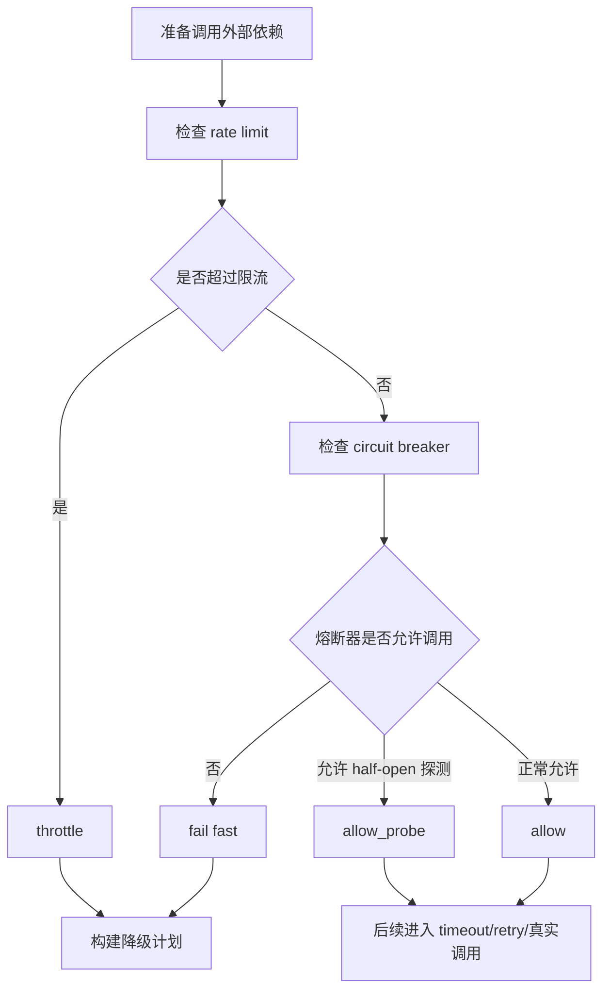

# 阶段 6 第 33 节：rate limit、circuit breaker 和降级

本节主题：

rate limit、circuit breaker 和降级。

上一节我们学了 retry。

retry 解决的是：

一次调用失败后，要不要再试。

再上一节我们学了 timeout。

timeout 解决的是：

一次调用最多等多久。

这一节继续往生产稳定性方向走。

本节解决的是：

当外部依赖持续失败、请求过多、模型限流、向量库变慢时，系统怎么保护自己。

这节的三个关键词是：

```text
rate limit
circuit breaker
degradation
```

中文可以理解为：

```text
限流
熔断
降级
```

这三者经常一起出现，但它们不是一回事。

限流控制“别进来太多”。

熔断控制“坏了就先别打过去”。

降级控制“不能正常完成时，给一个安全替代结果”。

它们和 timeout、retry 的关系是：

timeout：

单次调用最多等多久。

retry：

失败后要不要再试。

rate limit：

单位时间内最多允许多少调用。

circuit breaker：

外部依赖持续失败时，暂时停止调用。

degradation：

外部依赖不可用时，系统怎么安全兜底。

---

## 一、本节学习目标

学完本节，你要能真正讲明白：

1. rate limit 是什么。
2. throttling 和 rate limit 有什么关系。
3. 为什么限流不是只为了防攻击。
4. 为什么 LLM 应用尤其需要限流。
5. 什么是 circuit breaker。
6. circuit breaker 为什么不是 retry。
7. closed、open、half-open 三种熔断状态分别是什么意思。
8. 什么情况下应该打开熔断器。
9. 为什么 open 状态要 fail fast。
10. 为什么 half-open 只能放少量探测请求。
11. 什么是降级。
12. 降级和报错有什么区别。
13. 降级和 retry、fallback、cache 的关系。
14. 为什么写操作不能随便降级。
15. 为什么向量检索可以降级为缓存或无上下文回答。
16. 为什么 LLM 失败可以降级为规则兜底，但不能编造答案。
17. 为什么 retry storm 会把小故障放大成大故障。
18. 如何为 LLM、Embedding、Java 工具、Qdrant、Milvus 分别设计保护策略。
19. 如何把限流、熔断、降级决策写进日志和指标。
20. 为什么本节继续先做策略层，不直接改真实请求链路。

---

## 二、官方资料

本节参考以下官方资料：

1. Microsoft Azure Architecture Center：Circuit Breaker Pattern
   https://learn.microsoft.com/en-us/azure/architecture/patterns/circuit-breaker

   重点参考：

   circuit breaker 的目标是：在失败达到阈值后暂时阻止访问远程服务，而不是反复执行可能失败的操作；它和 retry 目的不同，可以组合使用。

2. Microsoft Azure Architecture Center：Rate Limiting Pattern
   https://learn.microsoft.com/en-us/azure/architecture/patterns/rate-limiting-pattern

   重点参考：

   rate limiting 要管理多个工作流共享同一个被限流服务时的容量，相关请求应经过统一的限流机制。

3. Microsoft Azure Architecture Center：Throttling Pattern
   https://learn.microsoft.com/en-us/azure/architecture/patterns/throttling

   重点参考：

   throttling 应该尽早作为系统架构决策处理；它用于在应用内部按自定义限制计量合法流量。

4. OpenAI Cookbook：How to handle rate limits
   https://developers.openai.com/cookbook/examples/how_to_handle_rate_limits

   重点参考：

   OpenAI API rate limits 的存在是为了防滥用、保证公平访问、管理整体负载；遇到 429 或 RateLimitError 时要合理处理。

5. AWS Well-Architected Reliability Pillar：Control and limit retry calls
   https://docs.aws.amazon.com/wellarchitected/latest/reliability-pillar/rel_mitigate_interaction_failure_limit_retries.html

   重点参考：

   retry 必须有限制、使用 backoff 和 jitter，并避免在多层系统里重复 retry；非幂等调用重试可能造成重复副作用。

---

## 三、承接前两节

前两节你已经学了：

第 31 节：

```text
timeout 超时策略
```

第 32 节：

```text
retry 重试策略
```

现在我们把它们串起来。

假设用户问：

```text
帮我查一下订单 ORD-001 的售后状态
```

系统可能会经历：

```text
FastAPI 接收请求
-> Agent 判断意图
-> LLM 做字段提取
-> Java 工具查询订单
-> RAG 检索政策
-> 模型总结回答
```

这条链路里每一步都可能失败。

timeout 让每一步别无限等。

retry 让临时失败有一次恢复机会。

但如果外部依赖真的出问题了呢？

比如：

LLM 服务限流。

Qdrant 响应持续超时。

Milvus 刚重启，短时间不可用。

Java mock 服务变慢。

用户请求突然变多。

这时只靠 timeout 和 retry 不够。

如果每个请求都 timeout。

每个 timeout 又 retry。

每个 retry 又继续打向外部依赖。

外部依赖会承受更大压力。

系统也会积压更多线程、连接、内存和等待中的请求。

所以本节加入三层保护：

```text
rate limit
circuit breaker
degradation
```

它们让系统从“失败了再处理”变成：

```text
提前限制
持续失败时快速拒绝
无法正常完成时安全兜底
```

---

## 四、基础知识铺垫

这一部分是本节最重要的基础。

不要先急着看代码。

先把限流、熔断、降级的思想学明白。

### 4.1 什么是 rate limit

rate limit 是限流。

它的意思是：

在一段时间内，限制某类请求最多能执行多少次。

比如：

```text
每分钟最多调用 LLM 60 次
每分钟最多生成 embedding 30 次
每分钟最多查询 Qdrant 120 次
每分钟最多创建工单 30 次
```

限流的核心不是“出错后怎么办”。

限流的核心是：

在请求真正打到依赖之前，先控制流量。

你可以把它理解成系统门口的闸门。

没超过额度：

放行。

快到额度：

记录 near limit。

超过额度：

拒绝、排队、降级、或者提示稍后再试。

### 4.2 限流不是只为了防攻击

很多初学者会以为限流只是为了防恶意攻击。

这不完整。

限流还用于正常用户流量保护。

比如：

一个用户连续点很多次“提交”。

一个前端 bug 导致重复发请求。

一个后台任务突然批量入库。

多个业务流同时调用同一个 LLM API。

这些不一定是攻击。

但它们都可能压垮下游依赖。

所以限流保护的是系统容量。

不是只保护安全边界。

### 4.3 throttling 和 rate limit 的关系

rate limit 通常描述规则：

```text
每分钟最多 60 次
每秒最多 10 次
每个用户每天最多 1000 次
```

throttling 通常描述行为：

```text
超过限制后减速、拒绝、排队或返回 429
```

在很多语境里，两者会混用。

简单理解：

rate limit 是限制规则。

throttling 是执行限制的动作。

例如：

```text
规则：每分钟最多 60 次
动作：超过后返回 429 Too Many Requests
```

### 4.4 为什么 LLM 应用特别需要限流

LLM 应用和普通接口不一样。

它有几个特点：

1. 调用成本高。
2. 响应时间不稳定。
3. API 有请求数和 token 数限制。
4. 用户输入可能很长。
5. retry 会增加额外 token 消耗。
6. 多个 Agent 节点可能在一次请求中调用多次模型。

比如一次用户请求可能调用：

```text
意图识别 LLM
字段提取 LLM
RAG 回答生成 LLM
```

如果每个节点都 retry。

一次用户请求可能变成多次模型调用。

如果并发用户又多。

很容易碰到模型 API 的 rate limit。

所以 LLM 应用限流不是可选项。

它是生产化必备能力。

### 4.5 限流的常见维度

限流可以按不同维度做。

常见维度有：

```text
global
per_user
per_tenant
per_dependency
per_operation
```

`global`：

整个系统共享一个总额度。

`per_user`：

每个用户单独限制。

`per_tenant`：

每个租户或客户单独限制。

`per_dependency`：

每个外部依赖单独限制。

`per_operation`：

每种操作单独限制。

例如：

查询订单可以高一点。

创建工单要低一点。

模型生成要更谨慎。

本节策略里主要用：

```text
per_dependency
```

因为我们当前学习的是 Agent 外部依赖保护。

### 4.6 固定窗口限流

固定窗口是最容易理解的限流方式。

比如：

```text
每 60 秒最多 100 次
```

当前窗口里已经用了 100 次。

第 101 次就被限制。

优点：

简单。

容易测试。

容易讲清楚。

缺点：

窗口边界可能不平滑。

比如：

第 59 秒来了 100 次。

第 60 秒窗口刷新又来 100 次。

两秒内实际来了 200 次。

生产系统里还会用滑动窗口、令牌桶、漏桶等算法。

但本节先学策略思想。

### 4.7 什么是 near limit

near limit 表示接近限流阈值。

比如每分钟最多 100 次。

当已经用到 80 次时，就可以标记：

```text
near_limit = true
```

near limit 不一定要拒绝请求。

它的价值是提前预警。

你可以在日志和指标里看到：

```text
LLM 快到限制了
Qdrant 快到限制了
Java 写工具快到限制了
```

如果 near limit 经常出现，说明容量或策略需要调整。

### 4.8 什么是 429

HTTP 429 表示：

```text
Too Many Requests
```

也就是请求太多。

当 API 返回 429，通常说明触发了限流。

OpenAI Cookbook 也明确说明，调用 API 过于频繁时可能遇到 429 或 RateLimitError。

但注意：

429 不一定只有一种原因。

它可能是：

请求次数超限。

token 速率超限。

并发超限。

额度或计费限制。

模型级限制。

所以看到 429 不能只说“重试一下”。

要先看是哪种限制。

### 4.9 什么是 circuit breaker

circuit breaker 是熔断器。

它的意思是：

如果某个依赖连续失败，系统暂时停止调用它。

不要每次请求都继续打过去等待失败。

它解决的问题是：

外部依赖已经明显不健康。

继续调用只会浪费资源。

甚至让对方更难恢复。

熔断器会在失败达到阈值后打开。

打开后，请求会快速失败或走降级。

过一段时间后，允许少量探测请求试探依赖是否恢复。

如果探测成功，再恢复正常调用。

### 4.10 circuit breaker 和 retry 的区别

retry 的假设是：

这个失败可能是临时的，再试一次可能成功。

circuit breaker 的假设是：

这个依赖已经持续失败，继续调用大概率没意义。

所以：

retry 是“再试一次”。

circuit breaker 是“先别试了”。

Microsoft 的 circuit breaker 文档也强调：

retry 和 circuit breaker 目的不同，可以组合使用。

组合方式通常是：

```text
通过 circuit breaker 调用外部依赖
如果 circuit breaker 允许调用，再执行 timeout/retry 策略
如果 circuit breaker 已打开，直接 fail fast 或降级
```

### 4.11 熔断器的 closed 状态

closed 是正常状态。

意思是：

电路闭合，请求可以通过。

在 closed 状态下：

请求正常打到外部依赖。

系统记录成功次数和失败次数。

如果失败达到阈值，就切到 open。

你可以理解成：

系统暂时相信这个依赖是健康的。

但它一直在观察。

### 4.12 熔断器的 open 状态

open 是熔断状态。

意思是：

电路断开，请求不能通过。

在 open 状态下：

系统不再调用外部依赖。

请求会快速失败。

或者直接走降级。

这叫 fail fast。

fail fast 的价值是：

别让请求一直卡在注定失败的外部依赖上。

释放系统资源。

给外部依赖恢复时间。

保护用户体验。

### 4.13 熔断器的 half-open 状态

half-open 是半开状态。

意思是：

熔断器不再完全拒绝，但也不完全放开。

它只允许少量探测请求通过。

如果探测请求成功：

说明依赖可能恢复了。

连续成功达到阈值后，切回 closed。

如果探测请求失败：

说明依赖还没恢复。

重新切回 open。

为什么不能直接从 open 回到 closed？

因为恢复中的服务可能很脆弱。

如果刚恢复就被大量请求打过去，可能再次崩溃。

half-open 就是为了慢慢探测。

### 4.14 熔断打开的条件

熔断不能一失败就打开。

否则偶发失败会导致系统频繁熔断。

常见条件包括：

```text
最小请求数
失败次数阈值
失败率阈值
统计窗口
```

比如：

```text
最近 60 秒至少有 5 次请求
失败次数至少 5 次
失败率达到 50%
```

这时才打开熔断。

为什么要有最小请求数？

因为如果只有 1 次请求，失败率就是 100%。

但这不足以说明依赖已经持续故障。

### 4.15 什么是 fail fast

fail fast 是快速失败。

它不是不负责任。

它是生产系统里的重要保护策略。

如果依赖已熔断：

继续调用只会浪费时间。

所以系统直接返回降级结果。

或者告诉用户稍后再试。

fail fast 的好处：

1. 节省线程和连接。
2. 避免请求堆积。
3. 降低下游压力。
4. 保持接口响应时间可控。
5. 给故障依赖恢复时间。

### 4.16 什么是降级

降级是 degradation。

它表示：

系统不能按完整功能返回结果时，返回一个安全、可解释、受控的替代结果。

比如：

RAG 检索不可用。

可以使用缓存。

没有缓存。

可以返回：

```text
当前知识库检索服务暂时不可用，无法根据知识库上下文回答。
```

而不是让接口卡死。

也不是让模型编造答案。

### 4.17 降级不是随便糊弄用户

降级必须安全。

错误的降级是：

知识库不可用，但模型假装查到了。

订单查询失败，但系统编一个订单状态。

创建工单失败，但告诉用户已经创建成功。

这些都不允许。

正确的降级是：

明确告诉用户当前能力受限。

能用缓存就说明使用缓存。

不能查知识库就不声称查了知识库。

不能创建工单就不说创建成功。

### 4.18 降级和 fallback 的关系

fallback 是兜底。

degradation 是更广义的降级策略。

可以理解为：

fallback 是降级的一种具体方式。

例如：

```text
return_safe_fallback
use_cache_or_return_no_context
retry_later
require_manual_review
```

这些都是降级模式。

### 4.19 降级和缓存的关系

缓存是常见降级手段。

比如 Qdrant 暂时不可用。

如果之前同一个问题检索过，并且缓存还没过期。

可以使用缓存检索结果。

然后告诉系统：

```text
should_use_cache = true
should_call_model = true
```

意思是：

不再调用向量库。

但可以用缓存上下文让模型生成回答。

如果没有缓存：

就不要让模型假装有上下文。

应该返回无上下文兜底。

### 4.20 写操作为什么不能随便降级

写操作不能像读操作那样降级。

比如：

创建工单失败。

不能降级成：

```text
我假装创建成功
```

也不能自动重复创建。

正确做法是：

要求人工确认。

提示稍后查看是否已创建。

使用幂等键重试。

或者进入人工审核流程。

所以本节中：

```text
java.create_ticket
```

降级模式是：

```text
require_manual_review
```

这体现了真实工程里的业务安全意识。

### 4.21 Agent 链路里的保护顺序

一个比较合理的保护顺序是：

```text
rate limit
-> circuit breaker
-> timeout
-> retry
-> degradation
```

解释一下：

先限流。

如果超过额度，就不要继续往下走。

再看熔断。

如果依赖已经处于 open 状态，就 fail fast。

如果允许调用，再执行 timeout。

调用失败后，按照 retry 策略判断能否重试。

重试仍失败，或者不能重试，就进入降级。

本节实现的是前两步和降级策略：

```text
rate limit
circuit breaker
degradation
```

timeout 和 retry 已经在第 31、32 节学过。

### 4.22 retry storm 为什么危险

retry storm 是重试风暴。

假设：

每秒有 100 个用户请求。

每个请求失败后 retry 2 次。

如果外部依赖故障，原本 100 次调用可能变成 300 次。

如果系统有多层 retry：

前端 retry。

Python retry。

SDK retry。

Java retry。

那调用量可能指数级放大。

AWS Well-Architected 文档也提醒：

多层 retry 会进一步消耗资源，造成 retry storm。

所以：

retry 要有限制。

限流要提前挡。

熔断要快速拒绝。

降级要兜住用户体验。

### 4.23 可观测性为什么重要

限流、熔断、降级不能偷偷发生。

否则线上出问题你不知道：

到底是模型慢。

还是限流了。

还是熔断了。

还是走了缓存。

还是返回了无上下文兜底。

所以这些策略必须输出：

```text
dependency_kind
operation
protection_action
protection_reason
rate_limit_reason
circuit_state
degradation_mode
```

这些字段应该是低基数。

不要把用户原文、trace_id、request_id、idempotency_key、完整 prompt 放进指标。

---

## 五、本节主题系统讲解

这一节不是单独讲某一个模式。

它讲的是：

如何把限流、熔断、降级组合成一个 Agent 外部依赖保护策略。

### 5.1 本节实现边界

本节做：

1. 新增 `resilience_strategy.py`。
2. 定义限流策略 `RateLimitPolicy`。
3. 定义限流使用快照 `RateLimitUsage`。
4. 定义限流决策 `RateLimitDecision`。
5. 定义熔断策略 `CircuitBreakerPolicy`。
6. 定义熔断状态快照 `CircuitBreakerSnapshot`。
7. 定义熔断决策 `CircuitBreakerDecision`。
8. 定义熔断结果记录 `CircuitBreakerResult`。
9. 定义降级计划 `DegradationPlan`。
10. 定义总保护策略 `TicketAgentResiliencePolicy`。
11. 定义组合保护决策 `DependencyProtectionDecision`。
12. 为当前 Agent 依赖生成默认保护策略。
13. 写 22 条测试。
14. 写高质量笔记和索引。

本节不做：

1. 不接入真实中间件限流。
2. 不引入 Redis。
3. 不实现分布式 token bucket。
4. 不修改真实 FastAPI 中间件。
5. 不改 Java mock 服务。
6. 不真实调用 Qdrant/Milvus。
7. 不真实调用 LLM。
8. 不提前讲 Docker Compose 编排。

为什么仍然先做策略层？

因为生产保护策略一旦接入真实请求路径，就会改变用户可见行为。

学习阶段先把规则讲清楚、测试写扎实，再接执行层更稳。

### 5.2 本节新增文件

新增代码：

```text
projects/ai-service/app/agents/resilience_strategy.py
```

新增测试：

```text
projects/ai-service/tests/test_ticket_agent_resilience_strategy.py
```

新增笔记：

```text
notes/stage6-33-rate-limit-circuit-breaker-degradation.md
```

更新索引：

```text
README.md
docs/learning-progress.md
```

### 5.3 本节的组合保护流程

本节的组合保护流程是：



注意：

本节没有真正发请求。

它只回答：

```text
这次调用是否允许继续？
如果不允许，应该走什么降级？
如果允许，是正常调用还是 half-open 探测？
```

### 5.4 为什么先检查 rate limit

限流是入口保护。

如果已经超过额度，就不要继续检查下游熔断。

因为这个请求本来就不应该再消耗下游容量。

所以本节 `evaluate_dependency_protection()` 先执行：

```python
rate_limit_decision = decide_rate_limit(...)
```

如果限流不允许：

直接返回 throttle。

并构建降级计划。

### 5.5 为什么再检查 circuit breaker

通过限流以后，还要检查依赖健康状态。

如果熔断器 open：

说明依赖最近持续失败。

这时不应该继续调用。

应该 fail fast。

如果 open 时间已经结束：

可以允许 half-open probe。

也就是少量探测请求。

如果 closed：

正常允许。

### 5.6 本项目默认保护策略表

本节 `build_ticket_agent_resilience_policies()` 生成默认策略。

| policy key | 依赖 | 操作 | 每分钟示例限制 | 降级模式 | 是否成本敏感 |
| --- | --- | --- | --- | --- | --- |
| `llm.intent_classification` | LLM | 意图识别 | 60 | `return_safe_fallback` | 是 |
| `llm.field_extraction` | LLM | 字段提取 | 60 | `return_safe_fallback` | 是 |
| `embedding.create` | Embedding | 向量生成 | 30 | `retry_later` | 是 |
| `java.query_order` | Java 读工具 | 查询订单 | 120 | `retry_later` | 否 |
| `java.create_ticket` | Java 写工具 | 创建工单 | 30 | `require_manual_review` | 否 |
| `qdrant.vector_search` | Qdrant | 向量检索 | 120 | `use_cache_or_return_no_context` | 否 |
| `milvus.vector_search` | Milvus | 向量检索 | 120 | `use_cache_or_return_no_context` | 否 |
| `rag.generate_answer` | RAG 生成 | 生成回答 | 60 | `return_safe_fallback` | 是 |

这些数值是学习项目里的策略默认值。

不是生产系统唯一答案。

真实生产要根据：

模型供应商限制。

用户并发。

预算。

业务优先级。

机器资源。

错误率。

历史延迟。

来调整。

### 5.7 LLM 为什么降级为安全兜底

LLM 节点失败时，不能让系统胡乱编造。

意图识别失败：

可以降级为规则兜底或让用户补充信息。

字段提取失败：

可以返回缺少字段，让用户补充。

RAG 生成失败：

可以基于已有安全信息返回有限回答。

所以 LLM 类策略使用：

```text
return_safe_fallback
```

### 5.8 Embedding 为什么降级为 retry_later

embedding 负责把文本变向量。

如果 embedding 创建失败，通常没有安全替代结果。

不能随便生成一个假向量。

也不能让检索继续假装正常。

所以本节设置：

```text
embedding.create -> retry_later
```

意思是：

先别继续。

稍后再试。

### 5.9 Java 读工具和写工具为什么不同

`java.query_order` 是读操作。

失败后可以提示稍后重试。

必要时可以走查询失败兜底。

`java.create_ticket` 是写操作。

失败时不能假装创建成功。

也不能无脑重复创建。

所以它的降级是：

```text
require_manual_review
```

意思是：

让用户或系统确认当前写操作是否已经成功。

### 5.10 向量库为什么可以用缓存或无上下文兜底

Qdrant 和 Milvus 都是检索依赖。

如果它们不可用：

有缓存时：

可以用缓存检索结果。

没有缓存时：

返回无上下文兜底。

不能让模型假装查到了知识库。

所以本节设置：

```text
use_cache_or_return_no_context
```

这是 RAG 生产化里非常重要的安全边界。

### 5.11 本节为什么记录 cost_sensitive

LLM 和 embedding 是成本敏感。

RAG generation 也成本敏感。

当这些依赖触发限流、熔断、降级时，应该特别关注：

是否请求过多。

是否重试太多。

是否 token 消耗异常。

是否需要降低并发。

是否需要切换更便宜模型。

所以本节在保护策略里保留：

```text
cost_sensitive
```

### 5.12 日志字段和指标字段怎么设计

本节设计了：

```python
log_fields()
metric_attributes()
```

日志字段可以更细。

用于排查单次请求。

指标字段要更克制。

用于聚合趋势。

指标里保留：

```text
dependency_kind
operation
protection_action
protection_reason
degradation_mode
circuit_state
rate_limit_reason
```

指标里不放：

```text
trace_id
span_id
thread_id
request_id
idempotency_key
user_message
prompt
messages
tool_args
raw_response
```

这些要么高基数，要么敏感。

---

## 六、本节代码讲解

本节代码文件：

```text
projects/ai-service/app/agents/resilience_strategy.py
```

下面讲核心代码。

### 6.1 ProtectedDependencyKind

```python
ProtectedDependencyKind = Literal[
    "llm",
    "embedding",
    "java_read_tool",
    "java_write_tool",
    "vector_store",
    "milvus",
    "rag_generation",
]
```

这是受保护依赖类型。

它延续了 timeout 和 retry 两节的依赖分类。

这样你能把三个阶段串起来：

同一个 `llm`，可以有 timeout 策略、retry 策略、resilience 策略。

同一个 `vector_store`，也可以有 timeout、retry、降级策略。

### 6.2 RateLimitPolicy

```python
@dataclass(frozen=True)
class RateLimitPolicy:
    dependency_kind: ProtectedDependencyKind
    operation: str
    max_requests: int
    window_seconds: float = 60.0
    scope: RateLimitScope = "per_dependency"
    near_limit_ratio: float = 0.8
```

它表示限流规则。

比如：

```text
某个依赖某个操作，每 60 秒最多 60 次
```

字段含义：

`dependency_kind`：

保护哪类依赖。

`operation`：

保护哪个操作。

`max_requests`：

窗口内最多请求数。

`window_seconds`：

窗口长度。

`scope`：

限流维度。

`near_limit_ratio`：

达到多少比例算接近上限。

### 6.3 RateLimitUsage

```python
@dataclass(frozen=True)
class RateLimitUsage:
    requests_in_window: int
    window_seconds_remaining: float
```

它表示当前限流窗口的使用情况。

比如：

```text
当前窗口已经用了 47 次
距离窗口结束还有 20 秒
```

本节没有实现真正的计数器。

原因是：

计数器可能在 Redis、本地内存、数据库或网关里。

我们先把“拿到用量后怎么决策”做清楚。

### 6.4 decide_rate_limit()

```python
def decide_rate_limit(policy: RateLimitPolicy, usage: RateLimitUsage) -> RateLimitDecision:
```

这个函数判断是否超过限流。

如果：

```text
requests_in_window >= max_requests
```

返回：

```text
allowed = false
reason = limit_exceeded
retry_after_seconds = 剩余窗口时间
```

如果没超过，但接近阈值：

返回：

```text
allowed = true
reason = near_limit
near_limit = true
```

否则：

返回：

```text
allowed = true
reason = within_limit
```

### 6.5 CircuitBreakerPolicy

```python
@dataclass(frozen=True)
class CircuitBreakerPolicy:
    failure_count_threshold: int = 5
    failure_rate_threshold: float = 0.5
    minimum_request_count: int = 5
    rolling_window_seconds: float = 60.0
    open_seconds: float = 30.0
    half_open_max_probes: int = 1
    half_open_success_threshold: int = 2
```

这是熔断规则。

关键字段：

`failure_count_threshold`：

失败次数达到多少。

`failure_rate_threshold`：

失败率达到多少。

`minimum_request_count`：

至少有多少请求后才判断。

`open_seconds`：

熔断打开多久。

`half_open_max_probes`：

半开状态最多允许多少探测请求。

`half_open_success_threshold`：

连续成功多少次后恢复 closed。

### 6.6 CircuitBreakerSnapshot

```python
@dataclass(frozen=True)
class CircuitBreakerSnapshot:
    state: CircuitBreakerState
    request_count: int = 0
    failure_count: int = 0
    consecutive_success_count: int = 0
    open_elapsed_seconds: float = 0.0
    half_open_in_flight_probes: int = 0
```

这是某一刻熔断器的状态快照。

它不是持久化存储。

它是策略判断需要的输入。

真实生产里，这些数据可能来自：

内存。

Redis。

服务网格。

网关。

监控系统。

本节只关心：

拿到这些状态后，策略应该怎么判断。

### 6.7 decide_circuit_breaker()

```python
def decide_circuit_breaker(
    policy: CircuitBreakerPolicy,
    snapshot: CircuitBreakerSnapshot,
) -> CircuitBreakerDecision:
```

这个函数按状态判断。

如果是 closed：

检查失败阈值。

没达到阈值，允许调用。

达到阈值，切到 open。

如果是 open：

检查打开时间是否结束。

没结束，fail fast。

结束了，允许 half-open probe。

如果是 half-open：

检查当前探测请求数。

超过限制，拒绝。

没超过，允许探测。

### 6.8 record_circuit_breaker_result()

```python
def record_circuit_breaker_result(
    policy: CircuitBreakerPolicy,
    snapshot: CircuitBreakerSnapshot,
    *,
    call_succeeded: bool,
) -> CircuitBreakerResult:
```

这个函数记录一次调用结果。

如果 closed 状态下失败达到阈值：

切到 open。

如果 half-open 探测成功次数达到阈值：

切回 closed。

如果 half-open 探测失败：

切回 open。

这就是熔断器状态机的核心。

### 6.9 DegradationPlan

```python
@dataclass(frozen=True)
class DegradationPlan:
    trigger: DegradationTrigger
    mode: DegradationMode
    should_call_dependency: bool
    should_retry: bool
    should_use_cache: bool
    should_call_model: bool
```

这是降级计划。

它告诉系统：

是否继续调用依赖。

是否重试。

是否用缓存。

是否调用模型。

返回什么用户提示。

状态码是什么。

为什么不用一个字符串表示？

因为降级不只是“返回一句话”。

它会影响后续链路。

比如向量检索降级为缓存时：

```text
should_call_dependency = false
should_use_cache = true
should_call_model = true
```

意思是：

不查向量库。

使用缓存。

仍然可以基于缓存上下文调用模型。

### 6.10 build_degradation_plan()

```python
def build_degradation_plan(
    policy: TicketAgentResiliencePolicy,
    *,
    trigger: DegradationTrigger,
    has_cached_result: bool = False,
    has_safe_context: bool = False,
) -> DegradationPlan:
```

这个函数根据触发原因和策略生成降级计划。

比如：

Qdrant 熔断，有缓存：

使用缓存。

Qdrant 熔断，无缓存：

返回无上下文兜底。

Java 写工具熔断：

需要人工确认。

LLM 限流：

返回安全兜底。

### 6.11 TicketAgentResiliencePolicy

```python
@dataclass(frozen=True)
class TicketAgentResiliencePolicy:
    dependency_kind: ProtectedDependencyKind
    operation: str
    rate_limit: RateLimitPolicy
    circuit_breaker: CircuitBreakerPolicy
    degradation_mode: DegradationMode
    fallback_allowed: bool
    cost_sensitive: bool = False
```

这是一个完整依赖的保护策略。

它把三件事绑在一起：

限流。

熔断。

降级。

这样调用层只需要拿到一个 policy，就能做完整保护判断。

### 6.12 evaluate_dependency_protection()

```python
def evaluate_dependency_protection(
    policy: TicketAgentResiliencePolicy,
    *,
    rate_limit_usage: RateLimitUsage,
    circuit_breaker_snapshot: CircuitBreakerSnapshot,
    has_cached_result: bool = False,
    has_safe_context: bool = False,
) -> DependencyProtectionDecision:
```

这是本节最核心函数。

它的顺序是：

第一步：

检查 rate limit。

超过限流，返回 throttle 和降级计划。

第二步：

检查 circuit breaker。

熔断打开，返回 fail_fast 和降级计划。

第三步：

如果 half-open 允许探测，返回 allow_probe。

第四步：

正常允许调用。

这就是本节保护链路的策略核心。

### 6.13 sanitize_resilience_metric_attributes()

```python
def sanitize_resilience_metric_attributes(attributes: dict[str, object]) -> dict[str, str | int | float | bool]:
```

这个函数过滤不适合进入指标的字段。

会过滤：

trace_id。

span_id。

thread_id。

request_id。

idempotency_key。

用户原文。

完整 prompt。

完整 tool_args。

这样做是为了避免：

指标维度爆炸。

敏感信息泄漏。

---

## 七、本节测试讲解

本节测试文件：

```text
projects/ai-service/tests/test_ticket_agent_resilience_strategy.py
```

本节共有 22 条测试。

### 7.1 限流测试

包括：

```text
test_rate_limit_allows_request_when_window_has_capacity
test_rate_limit_marks_near_limit_before_capacity_is_exhausted
test_rate_limit_blocks_request_after_capacity_is_exhausted
test_rate_limit_policy_rejects_invalid_values
```

它们验证：

没超过限流时允许。

接近限流时标记 near_limit。

超过限流时返回 429 和 retry_after。

非法配置会报错。

### 7.2 熔断决策测试

包括：

```text
test_circuit_breaker_closed_state_allows_call_before_threshold
test_circuit_breaker_closed_state_opens_after_failure_threshold
test_circuit_breaker_open_state_fails_fast_before_cooldown_expires
test_circuit_breaker_open_state_allows_half_open_probe_after_cooldown
test_circuit_breaker_half_open_limits_concurrent_probe_count
```

它们验证：

closed 正常放行。

达到失败阈值会打开。

open 时快速失败。

冷却结束允许 half-open 探测。

half-open 不允许无限探测。

### 7.3 熔断结果记录测试

包括：

```text
test_record_circuit_breaker_result_opens_after_closed_failures
test_record_circuit_breaker_result_closes_after_half_open_successes
test_record_circuit_breaker_result_reopens_after_half_open_failure
```

它们验证：

失败过多会打开熔断。

半开探测成功足够多会关闭。

半开探测失败会重新打开。

### 7.4 降级计划测试

包括：

```text
test_degradation_plan_uses_cache_for_vector_store_when_available
test_degradation_plan_returns_no_context_without_vector_cache
test_degradation_plan_requires_manual_review_for_write_tool
```

它们验证：

向量库有缓存时使用缓存。

向量库无缓存时返回无上下文兜底。

写操作失败时要求人工确认。

### 7.5 组合保护测试

包括：

```text
test_evaluate_dependency_protection_blocks_by_rate_limit_before_circuit
test_evaluate_dependency_protection_fails_fast_when_circuit_is_open
test_evaluate_dependency_protection_allows_half_open_probe
test_evaluate_dependency_protection_allows_normal_call_and_marks_near_limit
```

它们验证：

组合保护先限流。

再熔断。

熔断 open 时 fail fast。

half-open 可以放探测请求。

正常状态允许调用。

### 7.6 安全字段测试

测试：

```text
test_sanitize_resilience_metric_attributes_filters_sensitive_high_cardinality
```

它验证：

指标字段不会带上用户原文、prompt、request_id、idempotency_key、tool_args 等高基数或敏感字段。

---

## 八、把本节知识讲给别人时可以这样说

如果别人问：

什么是限流？

你可以回答：

限流是在请求进入外部依赖前控制调用速率，比如每分钟最多调用模型 60 次。它不是只防攻击，也用于保护成本、容量和下游稳定性。

如果别人问：

什么是熔断？

你可以回答：

熔断是在某个依赖持续失败时暂时停止调用它。closed 状态正常放行，open 状态快速失败，half-open 状态只允许少量探测请求验证恢复。

如果别人问：

熔断和 retry 有什么区别？

你可以回答：

retry 是认为失败可能短暂，再试一次可能成功；熔断是认为依赖已经持续失败，继续调用大概率浪费资源，所以暂时停止调用。

如果别人问：

什么是降级？

你可以回答：

降级是在完整功能不可用时返回安全替代结果，例如使用缓存、返回无上下文兜底、提示稍后重试、要求人工确认。降级不能编造结果。

如果别人问：

为什么写操作不能随便降级？

你可以回答：

写操作会改变业务状态，失败时不能假装成功，也不能无脑重复执行。创建工单这类操作应该依赖幂等键、人工确认或明确提示用户稍后查看。

如果别人问：

为什么向量库可以降级为缓存？

你可以回答：

向量检索是读操作。如果 Qdrant 或 Milvus 不可用，有可靠缓存时可以使用缓存上下文继续生成回答；没有缓存时应返回无上下文兜底，不应该让模型假装查到了知识库。

---

## 九、本节练习

### 练习 1

解释 rate limit 和 retry 的区别。

参考答案：

rate limit 是在请求进入依赖前控制调用速率。

retry 是调用失败后决定是否再次尝试。

rate limit 是入口保护。

retry 是失败恢复策略。

### 练习 2

为什么 LLM 应用需要限流？

参考答案：

因为 LLM 调用成本高、延迟不稳定，并且通常有请求数和 token 数限制。

如果多个 Agent 节点和 retry 同时触发，调用量会迅速放大。

限流可以保护成本、容量和模型服务稳定性。

### 练习 3

解释 circuit breaker 的 closed、open、half-open。

参考答案：

closed：

正常放行请求，同时记录成功和失败。

open：

熔断打开，请求快速失败或降级，不再调用依赖。

half-open：

冷却时间结束后，只允许少量探测请求判断依赖是否恢复。

### 练习 4

为什么 half-open 不能一下子放开所有请求？

参考答案：

因为依赖刚恢复时可能仍然脆弱。

如果一下子放开所有请求，可能再次把服务打挂。

half-open 只放少量探测请求，可以更稳地确认恢复情况。

### 练习 5

什么是降级？举一个 RAG 场景例子。

参考答案：

降级是在完整能力不可用时返回安全替代结果。

RAG 场景里，如果 Qdrant 不可用但有缓存，可以使用缓存检索结果；如果没有缓存，就返回无上下文兜底，不能让模型假装查到了知识库。

### 练习 6

为什么创建工单失败不能降级成“创建成功”？

参考答案：

因为创建工单是写操作。

失败时可能是服务端已经创建成功但响应丢失，也可能是完全没创建。

系统不能假装成功，否则会误导用户。

正确做法是幂等重试、人工确认或提示用户稍后查看。

### 练习 7

为什么保护策略里要记录 `protection_reason`？

参考答案：

因为线上排查需要知道为什么被保护策略拦截。

比如是限流超过、熔断打开、半开探测受限，还是正常放行但接近限流。

只记录 true/false 不够排查问题。

### 练习 8

为什么 `idempotency_key` 不适合进入 metrics attributes？

参考答案：

因为 idempotency_key 通常每次写操作都不同，是高基数字段。

放进指标会造成维度爆炸。

它也可能带有业务含义，不适合作为聚合指标字段。

---

## 十、自测题

### 自测 1

rate limit 是在失败后才发生的吗？

答案：

不是。

rate limit 通常在请求真正调用外部依赖前发生，用来控制入口流量。

### 自测 2

429 一般表示什么？

答案：

429 表示 Too Many Requests，也就是请求过多，通常和限流有关。

### 自测 3

熔断器 open 状态下应该继续调用外部依赖吗？

答案：

不应该。

open 状态下应该 fail fast 或走降级，让外部依赖有恢复时间。

### 自测 4

half-open 状态的目的是什么？

答案：

half-open 用来少量探测依赖是否恢复。

如果探测成功足够多，可以回到 closed。

如果探测失败，重新 open。

### 自测 5

降级是不是可以随便返回一个看起来正常的答案？

答案：

不可以。

降级必须安全、诚实、可解释。

不能编造订单状态，不能假装工单创建成功，也不能假装查到了知识库。

### 自测 6

为什么限流、熔断、降级要输出日志和指标？

答案：

因为线上需要知道保护策略是否触发、为什么触发、影响了哪个依赖、是否使用缓存或兜底。

没有日志和指标，就无法定位问题。

### 自测 7

retry storm 是什么？

答案：

retry storm 是大量请求在失败后同时重试，导致调用量进一步放大，外部依赖更难恢复的故障放大现象。

### 自测 8

Qdrant 熔断但有缓存时，合理降级是什么？

答案：

不再调用 Qdrant。

使用缓存检索结果。

可以基于缓存上下文继续调用模型生成回答。

### 自测 9

Embedding 创建失败能不能随便用假向量代替？

答案：

不能。

假向量会破坏检索结果。

更合理的是稍后重试或停止当前链路。

### 自测 10

本节代码是否已经真正拦截 FastAPI 请求？

答案：

没有。

本节实现的是策略层。

它负责判断是否允许调用、是否限流、是否熔断、如何降级。

真正接入请求链路是后续工程化内容。

---

## 十一、本节小结

本节学习了生产稳定性保护里的三个重要概念：

```text
rate limit
circuit breaker
degradation
```

你现在应该能把它们和前两节串起来：

timeout 控制单次等待。

retry 控制失败后是否再试。

rate limit 控制入口流量。

circuit breaker 控制持续失败时是否继续调用。

degradation 控制不能正常完成时如何安全兜底。

本节新增的 `resilience_strategy.py` 没有直接改变真实请求行为。

它先把策略做成可解释、可测试的对象。

这样你以后接入真实执行层时，不是凭感觉写 if。

你知道每个判断背后的工程原因。

---

## 十二、下一节学什么

下一节进入阶段 6 第 34 节：

```text
Docker Compose 本地编排
```

这一节会从策略层转向本地生产化运行环境。

它会学习：

1. Docker Compose 是什么。
2. 为什么多服务项目需要 compose。
3. Python AI Service、Java mock service、Qdrant、Milvus 这类服务如何编排。
4. `.env`、端口、网络、volume 怎么配合。
5. 本地开发和生产部署有什么区别。

下一节很可能会涉及 Docker。

如果需要打开 VMware Ubuntu 或启动 Docker，我会在开始前明确告诉你。
