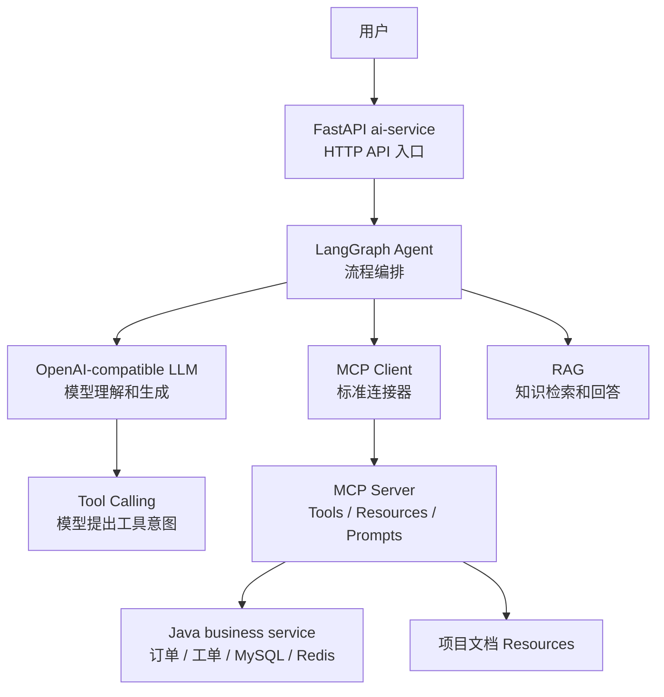

# 阶段 8 第 18 节：MCP 和现有 Agent 的关系

## 本节定位

前面几节我们已经把 MCP 的几个核心能力接到了项目里：

```text
第 15 节：query_order MCP Tool。
第 16 节：create_ticket MCP Tool。
第 17 节：项目文档 MCP Resources。
```

现在问题变成：

```text
MCP 和我们之前做过的 Tool Calling、LangGraph Agent、RAG、Java business service 到底是什么关系？
```

如果这个关系不清楚，后面很容易混乱。

常见混乱包括：

```text
以为 MCP 替代 Tool Calling。
以为 MCP 替代 LangGraph。
以为 MCP 替代 RAG。
以为 MCP Server 就是 Java business service。
以为只要用了 MCP，就不用做权限、确认、幂等、trace_id。
```

这些都不准确。

一句话总结本节：

```text
MCP 不是替代现有 Agent、RAG、Tool Calling 或 Java 后端；MCP 是一层标准连接协议，用来把 Tools、Resources、Prompts 等上下文和能力，以统一方式提供给 AI 应用。
```

## 本节学习目标

学完本节后，你应该能讲清楚：

```text
MCP 在当前项目里放在哪里。
MCP Host、Client、Server 在项目里分别可以对应什么。
MCP 和 Tool Calling 是什么关系。
MCP 和 LangGraph 是什么关系。
MCP 和 RAG 是什么关系。
MCP 和 Java business service 是什么关系。
MCP Server 是业务系统吗。
MCP Tool adapter 和已有 Python tool adapter 有什么关系。
query_order / create_ticket 迁移到 MCP 后，原有链路有没有被替代。
什么时候 Agent 直接调用内部 Python tool。
什么时候 Agent 通过 MCP Client 调 MCP Server。
MCP Server 放在 ai-service 内部和拆成独立服务有什么区别。
当前阶段的合理架构是什么。
后续工程化改造应该怎么走。
```

本节新增或修改：

```text
notes/stage8-18-mcp-and-existing-agent-relationship.md
README.md
docs/learning-progress.md
```

## 本节不做什么

省 token 模式下，本节是架构理解课，不新增业务代码。

本节不做：

```text
不启动 VMware。
不启动 Docker。
不启动 Java 服务。
不连接 MySQL / Redis。
不连接 Qdrant / Milvus。
不调用真实大模型。
不改 LangGraph Agent 主链路。
不把现有工具全部迁移到 MCP。
不做独立 MCP 服务拆分。
不做手动验证文档。
```

本节只做：

```text
架构关系讲解。
项目映射。
迁移路线。
边界对比。
练习题和自测题。
```

## 官方资料依据

本节参考 MCP 官方资料：

```text
MCP Architecture overview:
https://modelcontextprotocol.io/docs/2026-07-28/learn/architecture

MCP Architecture specification:
https://modelcontextprotocol.io/specification/2026-07-28/architecture

MCP Tools specification:
https://modelcontextprotocol.io/specification/2026-07-28/server/tools

MCP Prompts specification:
https://modelcontextprotocol.io/specification/2026-07-28/server/prompts

MCP Base Protocol:
https://modelcontextprotocol.io/specification/2026-07-28/basic
```

官方资料里和本节最相关的是：

```text
MCP 是 Host-Client-Server 架构。
Host 是 AI 应用，负责协调多个 Client。
Client 连接一个 MCP Server。
Server 提供上下文和能力。
Tools 是模型可调用的外部动作接口。
Prompts 偏用户选择的模板。
Resources 是只读上下文。
当前 MCP 规范强调请求应携带所需元信息，不能把连接本身当作会话状态。
```

## 基础知识铺垫

### 1. 先把几个名字放到一张图里

当前项目已经有很多概念：

```text
FastAPI
OpenAI-compatible API
Tool Calling
LangGraph
RAG
Java business service
MCP
```

这些不是同一层东西。

可以先粗略分层：

```text
用户入口层：FastAPI / Web API
模型调用层：OpenAI-compatible LLM API
模型工具意图层：Tool Calling
流程编排层：LangGraph Agent
知识上下文层：RAG / MCP Resources
工具连接层：MCP Tools / Python tool adapters
业务系统层：Java business service / MySQL / Redis
工程保障层：测试、日志、trace_id、重试、限流、幂等、评测
```

如果层次不清，很容易把所有东西都叫“Agent”。

但真正工程项目里，每一层负责的问题不同。

### 2. MCP 的核心位置

MCP 位于：

```text
AI 应用和外部上下文/外部能力之间。
```

它不是模型。

它不是 Agent 编排框架。

它不是数据库。

它不是 Java 后端。

它是一套连接协议。

可以这样理解：

```text
没有 MCP 时：
ai-service 自己写代码连接各种工具、文档、业务服务。

有 MCP 后：
ai-service 可以通过 MCP Client，用统一协议连接 MCP Server 暴露的 Tools、Resources、Prompts。
```

MCP 的价值是：

```text
统一发现。
统一调用。
统一资源读取。
统一 prompt 暴露。
统一协议边界。
```

### 3. MCP Host、Client、Server 在项目里怎么对应

官方架构里：

```text
Host 创建并管理多个 Client。
每个 Client 连接一个 Server。
Server 暴露 Tools、Resources、Prompts。
```

映射到当前项目，可以这样理解：

| MCP 角色 | 当前项目可能对应 |
| --- | --- |
| Host | `ai-service` 里的 Agent 应用、FastAPI AI 服务、未来的桌面/IDE/聊天应用 |
| Client | `app/mcp_clients/minimal_client.py` 这种连接 MCP Server 的客户端组件 |
| Server | `app/mcp_servers/minimal_server.py` 这种暴露 tools/resources 的服务 |

现在我们的实现是学习版：

```text
Client(mcp)
```

它是 in-memory client。

也就是说：

```text
MCP Client 和 MCP Server 在同一个 Python 进程里测试。
```

未来更真实的形态可能是：

```text
ai-service 作为 MCP Host
-> 创建 MCP Client
-> 连接一个本地或远程 MCP Server
-> 读取 resources / 调用 tools
```

### 4. MCP 和 Tool Calling 的关系

Tool Calling 是模型 API 的能力。

它解决的问题是：

```text
模型怎么表达“我想调用某个工具”。
```

例如模型输出：

```json
{
  "name": "query_order",
  "arguments": {
    "order_id": "A1001"
  }
}
```

MCP 解决的问题是：

```text
AI 应用怎么标准化连接和发现工具。
```

也就是：

```text
工具来自哪里？
工具 schema 怎么获取？
工具怎么调用？
工具结果怎么返回？
除了工具，还有没有 resources 和 prompts？
```

所以：

```text
Tool Calling 是模型和应用之间的工具意图表达。
MCP 是应用和工具提供方之间的连接协议。
```

它们可以配合，不是互相替代。

### 5. Tool Calling + MCP 的典型流程

真实项目里可以出现这样的流程：

```text
用户：帮我查 A1001 的物流。
-> LangGraph Agent 调用 LLM。
-> LLM 通过 Tool Calling 决定要 query_order。
-> ai-service 收到模型 tool call。
-> ai-service 通过 MCP Client 调用 MCP Server 的 query_order。
-> MCP Server 复用 JavaOrderClient 查询 Java business service。
-> MCP Tool 返回结构化结果。
-> ai-service 把 tool result 再交给模型总结。
-> 用户看到最终回答。
```

这条链路里：

```text
模型 API Tool Calling 负责“模型提出调用意图”。
MCP 负责“应用调用标准工具服务”。
Java business service 负责“真实业务数据和规则”。
```

三者都在，但职责不同。

### 6. MCP 和 LangGraph 的关系

LangGraph 是 Agent 编排框架。

它解决的问题是：

```text
复杂任务流程怎么拆成节点。
节点之间怎么跳转。
状态怎么保存。
什么时候 human-in-the-loop。
什么时候恢复。
什么时候结束。
```

MCP 不解决这些问题。

MCP 不会替你设计：

```text
先做意图识别。
再做 RAG。
再判断是否建工单。
再抽取字段。
再等待用户确认。
再调用 Java。
```

这些仍然是 LangGraph 的职责。

MCP 可以被 LangGraph 节点使用。

例如：

```text
query_order_node
-> 通过 MCP Client 调 query_order tool。

retrieve_project_context_node
-> 通过 MCP Client read_resource。

create_ticket_node
-> 通过 MCP Client 调 create_ticket tool。
```

所以可以记：

```text
LangGraph 管流程。
MCP 管连接。
```

### 7. MCP 和 RAG 的关系

RAG 解决的问题是：

```text
从大量知识中检索相关片段，再让模型基于片段回答。
```

MCP Resource 解决的问题是：

```text
用统一协议读取某个上下文资源。
```

它们的关系可以有几种：

```text
1. 直接 read_resource，把某个明确文档交给模型。
2. MCP Resource 作为 RAG 文档来源，先被入库。
3. MCP Tool 暴露 search_knowledge_base，让 Agent 调用检索。
4. RAG 结果作为 Resource-like 上下文进入模型。
```

不要把 MCP Resource 等同于 RAG。

Resource 更偏：

```text
标准读取入口。
```

RAG 更偏：

```text
检索、排序、截断、引用、拒答。
```

### 8. MCP 和 Java business service 的关系

Java business service 是真实业务系统。

它负责：

```text
订单数据。
工单数据。
MySQL 持久化。
Redis 缓存、幂等、限流。
内部鉴权。
业务错误码。
事务。
MyBatis。
```

MCP Server 不是 Java business service。

MCP Server 只是给 AI 应用暴露工具入口。

例如：

```text
MCP query_order
-> Python order_tool.query_order_for_mcp()
-> fake_order_tool.query_order()
-> JavaOrderClient
-> Java business service
```

MCP Server 不应该绕过 Java 的业务规则。

它应该复用和尊重 Java 的：

```text
权限。
错误码。
字段契约。
幂等要求。
trace_id。
```

### 9. MCP 和 FastAPI ai-service 的关系

当前 `ai-service` 是 Python FastAPI AI 服务。

它已经承担：

```text
HTTP API。
模型调用。
RAG。
LangGraph Agent。
工具调用。
Java client。
测试和配置。
```

阶段 8 目前把 MCP server 放在：

```text
projects/ai-service/app/mcp_servers/
```

这是合理的学习选择。

因为 MCP 现在只是 ai-service 的一部分能力。

未来有两种路线：

```text
路线 A：MCP server 继续放在 ai-service 内部。
路线 B：MCP server 拆成独立 mcp-service。
```

什么时候保持内部？

```text
只有当前 AI 服务使用。
部署简单。
工具数量少。
学习阶段。
和 ai-service 共享配置、模型、client。
```

什么时候拆成独立服务？

```text
多个 AI 应用都要使用同一组 MCP 工具。
工具和资源生命周期独立。
需要独立权限、部署、监控。
MCP server 要服务 IDE、桌面应用、其他 Agent。
```

### 10. MCP 不会自动带来生产能力

用了 MCP，不代表自动拥有：

```text
权限。
确认。
幂等。
trace_id。
日志。
重试。
限流。
缓存。
评测。
审计。
```

这些仍然要自己做。

这也是为什么第 15、16 节没有简单写：

```python
@mcp.tool()
def create_ticket(...):
    return java_client.post(...)
```

而是做了：

```text
参数模型。
确认边界。
幂等键。
错误分类。
输出白名单。
fake 测试。
```

MCP 提供协议，不替代工程质量。

### 11. MCP stateless 对 Agent 的影响

当前 MCP 规范强调：

```text
请求应自包含。
不要把连接或进程当作会话状态。
跨请求状态要通过显式标识传递。
```

这对 Agent 很重要。

例如不能假设：

```text
刚才这个 MCP 连接里用户已经确认过 create_ticket，所以这次可以直接写。
```

正确做法是传明确标识：

```text
confirmation_id
thread_id
actor_id
tenant_id
trace_id
```

也就是说：

```text
Agent 状态可以由 LangGraph 管。
业务状态可以由数据库管。
MCP 请求里需要显式携带必要引用。
MCP Server 不应该靠连接记忆来判断上下文。
```

### 12. 为什么本节不急着改 LangGraph

现在我们已经有 MCP 版本的：

```text
query_order
create_ticket
project resources
```

但本节不急着把 LangGraph 节点改成 MCP 调用。

原因是：

```text
先讲清楚架构关系。
再做迁移。
```

如果直接改节点，你可能会只看到代码：

```text
client.call_tool(...)
```

但不一定理解：

```text
为什么要通过 MCP。
哪些工具值得迁移。
迁移后测试怎么变化。
MCP 和现有 Python adapter 怎么共存。
```

这节先把关系讲清楚，是为了后续迁移不乱。

## 本节主题系统讲解

### 1. 当前项目的真实关系图

下面是当前阶段最应该理解的一张图：



这张图要表达：

```text
LangGraph 不是被 MCP 替代。
Tool Calling 不是被 MCP 替代。
RAG 不是被 MCP 替代。
Java business service 不是被 MCP 替代。
MCP Server 是连接层，把工具和资源标准化暴露出来。
```

### 2. 当前 query_order 的两种调用方式

原有方式：

```text
LangGraph query_order_node
-> app.tools.fake_order_tool.query_order()
-> JavaOrderClient
-> Java business service
```

MCP 方式：

```text
LangGraph query_order_node
-> MCP Client call_tool("query_order")
-> MCP Server query_order
-> order_tool.query_order_for_mcp()
-> fake_order_tool.query_order()
-> JavaOrderClient
-> Java business service
```

对比可见：

```text
MCP 不是替换 JavaOrderClient。
MCP 是在外面包了一层标准工具服务。
```

如果只有一个 Python 服务内部使用，原有方式更简单。

如果多个 AI 应用都要调用订单查询，MCP 方式更通用。

### 3. 当前 create_ticket 的两种调用方式

原有方式：

```text
LangGraph create_ticket_node
-> 确认状态检查
-> CreateTicketArgs
-> TicketCreator / JavaTicketClient
-> Java business service
```

MCP 方式：

```text
LangGraph create_ticket_node
-> MCP Client call_tool("create_ticket")
-> MCP Server create_ticket
-> ticket_tool.create_ticket_for_mcp()
-> user_confirmed / confirmation_id
-> run_idempotent_tool()
-> TicketCreator / JavaTicketClient
-> Java business service
```

这里要特别注意：

```text
MCP create_ticket 仍然需要确认和幂等。
```

不能因为换成 MCP，就把原来 LangGraph 里的安全边界删掉。

更合理的是：

```text
LangGraph 负责什么时候进入确认。
MCP Tool adapter 负责执行前再次校验确认和幂等。
Java business service 负责最终业务写入。
```

### 4. 当前 project resources 的作用

第 17 节新增了：

```text
learning://project/readme
learning://project/progress
learning://project/java-ai-contract
learning://project/stage8-plan
learning://project/mcp-create-ticket-note
```

这些 Resource 在 Agent 里的作用是：

```text
给 Agent 提供项目上下文。
```

例如：

```text
用户问：这个项目现在做到哪了？
-> Agent 读取 learning://project/progress。
-> 模型基于进度文档回答。
```

这不是 RAG 的完整检索流程。

这是明确 Resource 读取。

如果未来文档很多，再把 Resource 内容进入 RAG 索引。

### 5. MCP Prompt 未来会放在哪里

我们前面学过 MCP Prompts 基础，但还没接项目。

未来 MCP Prompt 可以提供：

```text
客服回复模板。
工单总结模板。
项目学习总结模板。
代码 review 辅助模板。
```

它和 Tool、Resource 的关系是：

```text
Tool：执行动作。
Resource：读取资料。
Prompt：提供可复用任务模板。
```

例如：

```text
Prompt: customer_ticket_reply
Resource: refund_policy.md
Tool: query_order
```

Agent 可以组合它们：

```text
读政策 Resource。
调用订单 Tool。
套用回复 Prompt。
让模型生成最终答复。
```

### 6. 什么时候直接用内部 Python tool

下面这些情况，可以先直接用内部 Python tool：

```text
只有 ai-service 自己用。
工具和 Agent 强绑定。
代码还在快速学习迭代。
不需要给外部 AI 应用使用。
部署越简单越好。
测试想保持最短链路。
```

例如早期：

```text
LangGraph query_order_node 直接调用 fake_order_tool.query_order。
```

这没问题。

因为学习阶段先把业务链路跑通更重要。

### 7. 什么时候通过 MCP Client 调 MCP Server

下面这些情况更适合 MCP：

```text
多个 AI 应用要共享工具。
工具要被 IDE、桌面应用、其他 Agent 使用。
需要统一 list_tools / call_tool / read_resource。
需要把工具和资源从 ai-service 中解耦。
希望把 MCP Server 独立部署和治理。
希望标准化接入第三方工具生态。
```

例如未来：

```text
Chat 应用要用 query_order。
IDE 插件要读项目 Resource。
另一个 Agent 要调用 create_ticket。
```

这时 MCP 的价值就明显了。

### 8. 内部调用和 MCP 调用的取舍表

| 场景 | 内部 Python tool | MCP tool |
| --- | --- | --- |
| 单服务内部使用 | 更简单 | 稍重 |
| 多应用共享 | 不方便 | 更合适 |
| 标准工具发现 | 要自己做 | MCP 自带 |
| 额外协议开销 | 少 | 有 |
| 部署复杂度 | 低 | 可能更高 |
| 生态兼容 | 弱 | 强 |
| 测试难度 | 低 | 多一层协议测试 |

所以不要盲目说：

```text
以后都必须 MCP。
```

更准确的说法是：

```text
MCP 适合把可复用工具和上下文标准化暴露给 AI 应用；内部强耦合、单服务专用的能力，可以先保留内部调用。
```

### 9. 当前阶段推荐架构

当前阶段最合理的是：

```text
保留现有 LangGraph 主链路。
继续保留内部 Python tool adapter。
并行维护 MCP 学习版 server。
通过测试固定 MCP tools/resources 行为。
暂时不强行把全部 Agent 节点改成 MCP。
```

也就是说：

```text
MCP 先作为“标准暴露层”学习和验证。
不是立刻作为“唯一调用层”替换现有系统。
```

这样风险更小。

因为现有 Agent 主链路已经有大量测试。

直接全部迁移，容易引入不必要的不稳定。

### 10. 后续迁移路线

比较稳的路线是：

```text
第一步：MCP Server 中完成 query_order / create_ticket / resources。
第二步：补 MCP 测试和契约测试。
第三步：整理 MCP Server 工程结构。
第四步：补配置、trace_id、日志、耗时。
第五步：写一个可选的 MCP-backed Agent adapter。
第六步：让部分 LangGraph 节点可选择走 MCP 或内部 tool。
第七步：对比两条链路测试结果。
第八步：根据需要决定是否独立部署 MCP Server。
```

这比直接重构安全。

### 11. MCP-backed Agent adapter 是什么

可以想象未来有一个 adapter：

```text
McpOrderToolExecutor
```

它实现和原来内部 tool 一样的接口。

内部做：

```text
client.call_tool("query_order", {"order_id": order_id})
```

这样 LangGraph 节点不用关心底层是：

```text
内部 Python tool
```

还是：

```text
MCP tool
```

节点只关心：

```text
我需要一个订单查询 executor。
```

这就是适配器模式。

### 12. MCP 和权限边界

MCP 不应该成为权限漏洞。

权限边界应该至少有三层：

```text
Agent 层：判断是否该进入工具流程。
MCP Tool adapter 层：校验参数、确认、幂等、输出白名单。
Java business service 层：最终鉴权、租户、业务规则、数据库事务。
```

任何一层都不能完全依赖另一层。

例如：

```text
Agent 说用户确认了，不代表 MCP adapter 不需要检查 confirmation_id。
MCP adapter 说可以创建，不代表 Java 不需要校验权限。
Java 返回完整数据，不代表 MCP adapter 可以原样给模型。
```

这就是纵深防御。

### 13. MCP 和 trace_id

现有项目已经重视：

```text
trace_id
```

MCP 接入后，trace_id 也要继续贯通。

未来链路应该是：

```text
用户请求 trace_id
-> FastAPI middleware
-> LangGraph node
-> MCP Client request
-> MCP Server tool
-> JavaOrderClient / JavaTicketClient
-> Java business service
-> Java log MDC
```

这样排查时可以知道：

```text
用户请求在哪个 Agent 节点调用了哪个 MCP tool。
MCP tool 又调用了哪个 Java API。
Java API 返回了什么错误码。
```

本节不实现 trace_id，但要先把位置讲清楚。

### 14. MCP 和测试边界

MCP 加入后，测试应该分层：

```text
纯函数测试：参数校验、输出白名单、错误映射。
MCP in-memory client 测试：list_tools、call_tool、list_resources、read_resource。
Java client 测试：httpx.MockTransport。
Agent 节点测试：fake executor。
端到端 smoke：可选真实 Java 服务。
```

不要把所有测试都变成真实端到端。

真实端到端慢且不稳定。

本阶段坚持 fake/in-memory，是正确的。

## 当前项目中的关系总表

| 组件 | 它是什么 | 负责什么 | 不负责什么 |
| --- | --- | --- | --- |
| FastAPI ai-service | Python AI 服务入口 | HTTP API、配置、模型服务、Agent 调用 | 不直接存订单和工单业务数据 |
| OpenAI-compatible LLM | 模型 API | 理解、生成、工具意图 | 不负责后端权限 |
| Tool Calling | 模型 API 的工具意图机制 | 让模型表达想调用哪个工具 | 不负责工具托管和资源读取 |
| LangGraph | Agent 编排框架 | 状态、节点、条件边、恢复、人工确认流程 | 不负责标准化外部工具协议 |
| RAG | 检索增强生成 | 从知识库检索片段并生成引用回答 | 不负责业务写操作 |
| MCP Client | 标准连接器 | 连接 MCP Server、list/call/read | 不负责业务规则本身 |
| MCP Server | 上下文和能力提供方 | 暴露 Tools、Resources、Prompts | 不替代 Java 后端 |
| Java business service | 真实业务系统 | 订单、工单、MySQL、Redis、权限、事务 | 不负责模型推理 |

## 三种容易混淆的链路

### 链路 1：模型 Tool Calling

```text
LLM -> tool_call(name, arguments) -> ai-service 执行
```

重点：

```text
模型提出工具意图。
```

### 链路 2：MCP Tool 调用

```text
MCP Client -> MCP Server tools/call -> tool result
```

重点：

```text
应用通过标准协议调用工具提供方。
```

### 链路 3：Java API 调用

```text
Python JavaOrderClient / JavaTicketClient -> Java business service
```

重点：

```text
业务系统执行真实查询或写入。
```

这三条链路可以串起来：

```text
LLM Tool Calling
-> ai-service
-> MCP Client
-> MCP Server Tool
-> Java Client
-> Java business service
```

但它们不是同一个东西。

## 常见误区

### 误区 1：MCP 替代 Tool Calling

不对。

Tool Calling 是模型和应用之间的意图表达。

MCP 是应用和工具服务之间的连接协议。

它们可以组合。

### 误区 2：MCP 替代 LangGraph

不对。

LangGraph 管多步骤流程和状态。

MCP 管工具和资源的标准连接。

LangGraph 节点可以调用 MCP。

### 误区 3：MCP 替代 RAG

不对。

RAG 管检索、排序、引用和无资料拒答。

MCP Resource 可以作为上下文来源，也可以作为 RAG 数据来源。

### 误区 4：MCP Server 就是业务系统

不对。

业务系统仍然是 Java business service。

MCP Server 是 AI 应用侧的标准能力入口。

### 误区 5：用了 MCP 就不用做权限

不对。

MCP 工具仍然要：

```text
参数校验。
权限检查。
用户确认。
幂等。
输出白名单。
错误安全包装。
```

### 误区 6：所有内部工具都应该立即迁移到 MCP

不对。

如果工具只在当前服务内部使用，内部调用更简单。

MCP 更适合共享、标准化、跨应用连接。

### 误区 7：MCP Server 应该记住对话状态

不应该这样依赖。

MCP 请求应该携带必要显式标识。

对话状态应该由 Agent、数据库、checkpoint 或显式 handle 管理。

不要把连接本身当成会话。

## 本节真正学会了什么

本节真正学的是：

```text
把 MCP 放回真实 AI 应用架构里，而不是孤立理解成一个 demo server。
```

你现在应该能讲清楚：

```text
MCP 是连接层。
Tool Calling 是模型工具意图。
LangGraph 是流程编排。
RAG 是知识检索增强。
Java business service 是真实业务系统。
FastAPI ai-service 是当前 AI 应用入口。
```

也应该能讲清楚：

```text
MCP 可以让 query_order、create_ticket、项目文档 Resource 标准化暴露，但它不替代权限、幂等、确认、trace_id、错误映射和测试。
```

## 练习题

### 练习 1：MCP 和 Tool Calling 谁替代谁？

参考答案：

```text
谁也不替代谁。Tool Calling 是模型表达工具调用意图的机制，MCP 是 AI 应用连接工具和资源提供方的标准协议。它们可以组合：模型用 Tool Calling 提出 query_order，应用再通过 MCP Client 调 MCP Server 的 query_order。
```

### 练习 2：为什么 MCP 不替代 LangGraph？

参考答案：

```text
LangGraph 负责 Agent 流程编排，比如节点、状态、条件边、人工确认、checkpoint 恢复。MCP 负责标准化连接 Tools、Resources、Prompts。LangGraph 的某个节点可以调用 MCP，但 MCP 不负责设计整个 Agent 流程。
```

### 练习 3：MCP Server 和 Java business service 有什么区别？

参考答案：

```text
MCP Server 是 AI 应用侧的标准能力入口，暴露 tools/resources/prompts；Java business service 是真实业务系统，负责订单、工单、数据库、事务、Redis、权限和业务规则。MCP Tool 可以调用 Java service，但不能替代 Java service。
```

### 练习 4：什么时候适合直接用内部 Python tool？

参考答案：

```text
当工具只给当前 ai-service 内部使用、和 LangGraph 强绑定、学习阶段需要快速迭代、没有跨应用共享需求时，直接用内部 Python tool 更简单。
```

### 练习 5：什么时候适合通过 MCP 调用？

参考答案：

```text
当多个 AI 应用需要共享工具，或者需要标准化 list_tools/call_tool/read_resource，或者希望工具和资源从 ai-service 解耦并独立部署时，更适合通过 MCP Client 调 MCP Server。
```

## 自测题

### 自测 1：当前项目里 MCP Host 可以对应什么？

参考答案：

```text
可以对应 Python ai-service 里的 AI 应用或未来的聊天/IDE/桌面应用。Host 负责协调多个 MCP Client，并把 MCP Server 提供的上下文和能力交给模型或 Agent 使用。
```

### 自测 2：MCP Client 的职责是什么？

参考答案：

```text
MCP Client 是连接某个 MCP Server 的组件，负责发送 list_tools、call_tool、list_resources、read_resource 等协议请求，并把结果交给 Host 使用。
```

### 自测 3：MCP Server 暴露了 query_order 后，JavaOrderClient 还需要吗？

参考答案：

```text
需要。MCP query_order 只是标准工具入口，真正查询 Java 服务仍然复用 JavaOrderClient。MCP 不替代 Java HTTP adapter。
```

### 自测 4：为什么 MCP 请求里要显式传 confirmation_id？

参考答案：

```text
因为 MCP Server 不应该依赖连接记忆来判断用户是否确认过写操作。写操作必须通过显式 confirmation_id、user_confirmed 等字段表达确认和幂等边界。
```

### 自测 5：MCP Resource 和 RAG 怎么组合？

参考答案：

```text
Resource 可以作为标准文档读取入口，RAG 可以把 Resource 或文档集合入库后做检索。明确的少量资料可以直接 read_resource，大量分散资料更适合 RAG 检索后再交给模型。
```

## 面试表达

如果别人问：

```text
你项目里 MCP 和 Agent 是什么关系？
```

可以回答：

```text
在我的项目里，LangGraph 负责 Agent 流程编排，MCP 负责把外部工具和上下文标准化暴露给 AI 应用。比如 query_order 和 create_ticket 可以作为 MCP Tools 暴露，项目 README、学习进度、Java-AI 契约可以作为 MCP Resources 暴露。LangGraph 节点未来可以通过 MCP Client 调用这些能力，但 MCP 不替代 LangGraph 的状态、节点、条件跳转和人工确认流程。
```

如果别人问：

```text
MCP 和 Tool Calling 有什么区别？
```

可以回答：

```text
Tool Calling 是模型 API 的能力，解决模型如何表达“我要调用哪个工具和参数”。MCP 是应用和工具提供方之间的标准协议，解决工具、资源、prompt 如何被发现、读取和调用。真实链路里可以是模型先用 Tool Calling 提出 query_order，然后 ai-service 通过 MCP Client 调用 MCP Server 的 query_order。
```

如果别人问：

```text
用了 MCP 后 Java 后端还重要吗？
```

可以回答：

```text
重要。MCP Server 不是业务系统，它只是 AI 应用连接业务能力的标准入口。订单、工单、权限、事务、MySQL、Redis、幂等等核心业务仍然在 Java business service 里。MCP Tool adapter 需要尊重 Java 后端的契约和错误码，并做参数校验、输出白名单和安全错误包装。
```

## 本节小结

本节把 MCP 放回整个项目架构中：

```text
MCP：标准连接层。
Tool Calling：模型工具意图层。
LangGraph：Agent 流程编排层。
RAG：知识检索增强层。
Java business service：真实业务系统层。
FastAPI ai-service：当前 AI 应用入口。
```

下一节进入：

```text
阶段 8 第 19 节：MCP 测试和契约测试
```

下一节会把前面 query_order、create_ticket、resources 的测试体系系统整理清楚，重点学习 fake client、工具测试、错误映射测试和 MCP 契约测试该怎么分层。
