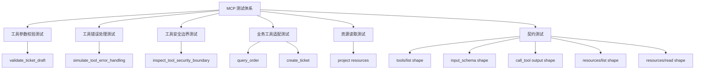

# 阶段 8 第 19 节：MCP 测试和契约测试

## 本节定位

前面几节我们已经把 MCP 的几类能力接进了项目：

```text
MCP Tools：
echo
add
validate_ticket_draft
simulate_tool_error_handling
inspect_tool_security_boundary
query_order
create_ticket

MCP Resources：
learning://project/readme
learning://project/progress
learning://project/java-ai-contract
learning://project/stage8-plan
learning://project/mcp-create-ticket-note
```

现在要学的问题是：

```text
这些 MCP 能力写出来以后，怎么保证它以后不会被自己改坏？
怎么保证外部 MCP Client 看到的工具名、参数 schema、资源 URI、返回结构是稳定的？
怎么保证 Agent 依赖这些工具时，不会因为一个字段名变化就整体坏掉？
```

这就是本节的主题：

```text
MCP 测试和契约测试。
```

本节不是单纯“多写几个 pytest”。

真正要学的是：

```text
AI 工具生态里，测试不能只测函数能不能跑。
还要测对外暴露的协议形状是否稳定。
```

如果你以后在工作里做 MCP Server，别人真正依赖的不是你内部函数名。

别人依赖的是：

```text
tools/list 里有没有某个工具。
工具 inputSchema 里有哪些字段。
哪些字段必填。
字段类型、枚举、默认值、长度、正则是什么。
tools/call 成功时 structured_content 长什么样。
业务失败时 structured_content.ok=false 还是 is_error=true。
系统失败时错误信息会不会泄露内部细节。
resources/list 里有哪些 URI。
resources/read 返回什么 mime_type 和内容形状。
```

这些就是 MCP 的对外契约。

## 本节学习目标

学完本节，你要能说清楚：

```text
1. 单元测试、集成测试、契约测试分别测什么。
2. MCP Tool 为什么必须测 tools/list 和 input_schema。
3. MCP Tool 为什么还要测 tools/call 的返回结构。
4. MCP Resource 为什么必须测 URI、title、mime_type 和 read 结果。
5. 业务错误和系统错误在测试里为什么要分开。
6. fake client、in-memory MCP client、真实远程 MCP client 的区别。
7. 为什么 MCP 契约测试不应该真实调用大模型。
8. 为什么契约测试不应该随便写得太宽松。
9. 本项目新增的 `test_mcp_contracts.py` 到底保护了什么。
10. 面试时怎么解释“我做过 MCP 契约测试”。
```

## 本节不做什么

本节保持省 token 模式，只做和学习目标直接相关的内容。

不做：

```text
不启动 Qdrant。
不启动 Milvus。
不启动 VMware Ubuntu。
不调用真实大模型。
不调用真实 embedding。
不调用真实 Java business service。
不修改 Java README。
不生成手动测试文档。
不做敏感信息扫描，除非之后你要求上传 GitHub。
```

原因很简单：

```text
本节是 MCP 测试体系。
核心验证对象是 MCP Server 暴露给 MCP Client 的协议契约。
这些内容可以用 Python in-memory Client 稳定验证，不需要真实外部服务。
```

## 官方资料依据

本节参考 MCP 官方规范中的几个关键点：

```text
1. MCP Tools 通过 tools/list 暴露工具元数据，通过 tools/call 执行工具。
2. Tool 有 name、description、inputSchema、outputSchema。
3. Tool 返回结果可以包含 structuredContent、content 和 isError。
4. 工具执行错误应该让模型能够看见并处理，协议级错误和工具执行错误要区分。
5. MCP Resources 通过 resources/list 和 resources/read 暴露上下文资源。
6. Resource 由 URI 标识，并带有 title、description、mimeType 等元数据。
```

这些点决定了 MCP 测试不能只测 Python 函数。

MCP 测试必须覆盖：

```text
工具发现。
工具参数契约。
工具调用结果契约。
资源发现。
资源读取结果契约。
错误边界。
安全边界。
```

## 基础知识铺垫

### 1. 什么是测试

测试不是为了证明“代码没有 bug”。

更准确地说：

```text
测试是把你认为必须成立的规则写成可重复执行的检查。
```

例如你认为：

```text
create_ticket 是写操作。
写操作必须有用户确认。
没有用户确认时不能创建真实工单。
没有用户确认时返回 TOOL_CONFIRMATION_REQUIRED。
```

那就应该把它写成测试。

这样以后你或者别人改代码时，如果不小心让没有确认的请求也能创建工单，测试会立刻失败。

这就是测试的价值：

```text
把经验变成机器能反复检查的规则。
```

### 2. 测试不只是“跑一下”

很多初学者容易把测试理解成：

```text
我手动点一下。
我 curl 一下。
我看它返回了。
```

这叫手动验证，不叫自动化测试。

手动验证有价值，尤其是验证本地环境、真实服务、网络连通性。

但手动验证有几个问题：

```text
容易忘。
容易漏。
每次都要人手动做。
返回内容稍微变化，人不一定注意到。
不适合 CI 自动执行。
```

自动化测试的目标是：

```text
让机器每次都按同样规则检查。
```

本节我们做的就是自动化 MCP 契约测试。

### 3. 什么是单元测试

单元测试关注一个很小的代码单元。

在本项目里，例如：

```text
query_order_for_mcp()
create_ticket_for_mcp()
read_project_resource()
validate_ticket_draft_arguments()
```

这些函数都可以单独测。

单元测试通常不需要真实网络。

例如测试 `query_order_for_mcp()` 时，我们用 fake client 代替真实 Java 服务：

```text
query_order_for_mcp()
-> FakeOrderLookupClient
-> 返回假订单结果
```

这样可以稳定测试：

```text
参数是否合法。
业务错误是否转换成 ok=false。
系统错误是否变成安全 ToolError。
敏感字段是否被白名单过滤掉。
```

单元测试的优点：

```text
快。
稳定。
定位问题准。
不依赖外部服务。
```

单元测试的缺点：

```text
它不一定能证明 MCP Client 真的能通过协议看到这个工具。
```

所以 MCP 场景还需要更高一层的测试。

### 4. 什么是集成测试

集成测试关注多个模块连起来是否工作。

在本项目里，例如：

```text
MCP Client
-> MCP Server
-> query_order tool wrapper
-> fake adapter
-> structured_content
```

它比单元测试多验证了一层 MCP SDK 的注册、发现和调用机制。

我们之前已经有类似测试：

```text
Client(mcp).list_tools()
Client(mcp).call_tool("query_order", {...})
Client(mcp).read_resource("learning://project/stage8-plan")
```

这类测试能证明：

```text
工具确实注册进 MCP Server。
Client 确实能发现工具。
Client 确实能调用工具。
structured_content 确实按 MCP SDK 的格式返回。
Resource 确实能被 resources/read 读到。
```

本项目这里用的是 in-memory Client。

意思是：

```text
Client 和 Server 在同一个 Python 进程里通信。
不走真实 stdio。
不走真实 HTTP。
不走网络。
```

这样适合学习和本地自动化测试。

### 5. 什么是契约

契约就是双方约定好的接口形状。

传统后端里，契约可能是：

```text
GET /internal/orders/{order_id}
请求头必须有 X-Trace-Id、X-User-Id、X-Internal-Token。
成功返回 success=true、data.order_id、data.order_status。
失败返回 code=ORDER_NOT_FOUND。
```

MCP 里的契约则变成：

```text
tools/list 必须能看到 query_order。
query_order 的 inputSchema 必须有 order_id。
order_id 必须是 string。
order_id 长度 1 到 64。
order_id 只能包含字母、数字、下划线、中划线。
tools/call query_order 成功后 structured_content.ok=true。
业务错误时 structured_content.ok=false。
系统错误时 is_error=true，并且不泄露内部 URL、数据库字段、堆栈。
```

契约的本质是：

```text
调用方可以稳定依赖的承诺。
```

### 6. 什么是契约测试

契约测试就是把“调用方依赖的承诺”写成自动化测试。

它不关心你内部怎么实现。

它关心：

```text
外部调用方看到的形状有没有变。
```

比如你内部把：

```text
create_ticket_for_mcp()
```

拆成：

```text
validate_create_ticket_request()
authorize_create_ticket()
call_java_ticket_service()
sanitize_ticket_response()
```

只要 MCP Client 看到的 `create_ticket` 工具契约没有变，契约测试就不应该失败。

但是如果你把参数名从：

```text
confirmation_id
```

改成：

```text
confirm_id
```

契约测试应该失败。

因为外部调用方已经依赖 `confirmation_id`。

这就是契约测试和普通实现测试的区别：

```text
实现测试保护内部逻辑。
契约测试保护外部依赖。
```

### 7. MCP 为什么特别需要契约测试

MCP 是给 AI 应用连接工具、资源、prompt 的标准协议。

AI 应用里有一个额外风险：

```text
调用方可能不是传统代码，而是模型 + Agent 编排。
```

模型选择工具时，依赖的是：

```text
工具名。
工具描述。
参数 schema。
参数字段名。
枚举值。
```

Agent 执行工具时，依赖的是：

```text
返回结构。
错误码。
ok/allowed/retryable 等控制字段。
```

一旦这些东西乱变，影响会比普通后端接口更隐蔽。

例如：

```text
你把 create_ticket 的 category enum 从 complaint 改成 complain。
```

传统 API 调用方可能编译或测试时就发现。

但 AI Agent 可能会出现：

```text
模型仍然生成 complaint。
MCP schema 不再接受 complaint。
工具调用失败。
Agent 不知道怎么恢复。
用户体验变差。
```

所以 MCP 契约测试要尽早建立。

### 8. MCP 测试要分几层

本项目里，MCP 测试可以分成五层。

第一层：纯函数测试。

```text
测试 query_order_for_mcp()。
测试 create_ticket_for_mcp()。
测试 read_project_resource()。
```

它关注业务规则和安全转换。

第二层：MCP Server 注册测试。

```text
Client(mcp).list_tools()
Client(mcp).list_resources()
```

它关注工具和资源是否真的暴露给 MCP Client。

第三层：MCP 调用测试。

```text
Client(mcp).call_tool("create_ticket", args)
Client(mcp).read_resource(uri)
```

它关注经过 MCP SDK 后，返回结构是否符合预期。

第四层：契约测试。

```text
固定工具名。
固定 input_schema。
固定关键 output 形状。
固定 resource URI、title、mime_type。
```

它关注外部调用方依赖的公共形状。

第五层：真实 transport 测试。

```text
stdio transport。
Streamable HTTP transport。
真实远程 MCP Client。
```

这一层暂时不是本节重点。

因为当前项目还处于本地学习阶段，in-memory Client 已经足够验证核心协议形状。

### 9. fake client 是什么

fake client 是测试替身。

例如：

```text
FakeOrderLookupClient
FakeTicketCreator
```

它们不是 MCP Client。

它们是用来代替真实业务依赖的对象。

作用是：

```text
不启动 Java 服务。
不连 MySQL。
不连 Redis。
不走网络。
让测试专注 MCP 工具本身的参数校验、错误映射和输出白名单。
```

注意这个区别：

```text
FakeOrderLookupClient：假的业务依赖。
MCP Client：真实调用 MCP Server 的客户端对象。
```

这两个名字都带 client，但不是一回事。

### 10. in-memory MCP Client 是什么

本项目测试里经常出现：

```python
async with Client(mcp) as client:
    tools = await client.list_tools()
```

这里的 `Client(mcp)` 是 MCP Python SDK 提供的本地测试方式。

它的意思是：

```text
直接把 Python 里的 MCPServer 对象交给 Client。
Client 和 Server 在同一个进程里交互。
```

优点：

```text
快。
稳定。
不占端口。
不依赖网络。
适合自动化测试。
```

缺点：

```text
不能覆盖 stdio 子进程启动问题。
不能覆盖 HTTP transport 网络问题。
不能覆盖远程鉴权问题。
```

所以你要知道：

```text
本节契约测试验证的是 MCP data layer 和 SDK 注册/调用层。
不是完整远程部署测试。
```

### 11. 为什么不真实调用大模型

MCP 契约测试不应该真实调用大模型。

原因有四个。

第一，模型输出不稳定。

```text
同一个 prompt，模型可能给出不同工具选择。
```

契约测试追求稳定。

第二，真实模型调用慢。

```text
每次 pytest 都调用模型，速度会变慢。
```

第三，真实模型调用要花钱。

```text
契约测试应该能高频运行。
```

第四，契约测试测的不是模型聪不聪明。

```text
它测的是 MCP Server 对外承诺有没有变。
```

模型工具选择应该放到另外的 Agent 测试或评测里。

### 12. 为什么不真实调用 Java 服务

本节也不真实调用 Java business service。

原因是：

```text
MCP 契约测试不负责证明 Java 服务可用。
它负责证明 MCP Server 的工具和资源契约稳定。
```

Java 服务可用性由阶段 7 的测试覆盖：

```text
Java provider 契约测试。
Python consumer 契约测试。
真实 MySQL/Redis 手动 smoke。
```

MCP 这层只需要保证：

```text
query_order MCP Tool 的参数和返回边界稳定。
create_ticket MCP Tool 的确认、幂等、错误包装边界稳定。
```

真实 Java 联调可以放在更高层的集成测试或手动验证里。

### 13. 业务错误和系统错误要分开测

MCP 工具错误至少分两类。

第一类：业务错误。

例如：

```text
ORDER_NOT_FOUND
ORDER_ACCESS_DENIED
TICKET_ALREADY_EXISTS
TOOL_CONFIRMATION_REQUIRED
```

这些错误用户可以理解，也常常可以继续对话修正。

所以它们适合返回：

```text
is_error=false
structured_content.ok=false
structured_content.error_code=...
```

第二类：系统错误。

例如：

```text
Java 服务超时。
上游返回结构不可信。
内部异常。
数据库连接错误。
```

这些错误不应该让模型看到内部细节。

所以它们适合返回：

```text
is_error=true
安全错误文本
```

测试必须分别覆盖这两类。

否则容易出现两个问题：

```text
把业务错误当系统错误，模型没法自我修正。
把系统错误当业务错误，内部细节泄露给模型和用户。
```

### 14. 为什么 schema 也要测

MCP Tool 的 inputSchema 对模型和调用方非常重要。

它告诉调用方：

```text
有哪些参数。
哪些参数必填。
参数是什么类型。
字符串多长。
允许什么枚举。
默认值是什么。
是否有正则约束。
```

如果 schema 变了，就相当于接口契约变了。

例如：

```text
confirmation_id 的 pattern 从 ^[a-f0-9]{32}$ 改掉。
```

这会影响写操作确认和幂等边界。

例如：

```text
user_confirmed 默认值从 false 变成 true。
```

这是严重安全问题。

所以本节新增测试会明确断言：

```text
create_ticket.user_confirmed.default is False
create_ticket.confirmation_id.pattern == ^[a-f0-9]{32}$
create_ticket.priority.default == normal
```

### 15. 为什么 resource URI 也要测

MCP Resource 的 URI 就像传统 API 的 URL。

例如：

```text
learning://project/stage8-plan
```

调用方可能会保存这个 URI，并在需要时读取它。

如果你随手改成：

```text
learning://project/mcp-stage8-plan
```

外部 MCP Client 就读不到原来的资源了。

所以 Resource 契约测试要固定：

```text
URI。
title。
mime_type。
read_resource 返回内容类型。
```

至于文档正文内容，不适合逐字固定。

因为笔记和 README 会经常更新。

所以测试只检查关键内容：

```text
包含“阶段 8”。
包含“MCP”。
mime_type 是 text/markdown。
```

这叫：

```text
固定契约，不固定易变内容。
```

## 本节主题系统讲解

### 1. 当前 MCP 测试体系图

当前项目里的 MCP 测试可以这样理解：



不要把这些测试混在一起理解。

每一层关注点不同。

### 2. 已有测试分别在保护什么

当前已有文件大概可以这样分工。

```text
test_mcp_tool_parameter_validation.py
```

主要保护：

```text
参数长度。
枚举。
Pydantic 校验。
extra="forbid"。
非法参数安全返回。
```

```text
test_mcp_tool_error_handling.py
```

主要保护：

```text
业务错误和系统错误的区分。
is_error 的使用。
ToolError 的安全包装。
内部异常不泄露。
```

```text
test_mcp_tool_security.py
```

主要保护：

```text
读写分级。
用户确认。
敏感字段过滤。
危险动作拒绝。
安全决策结构。
```

```text
test_mcp_query_order_tool.py
```

主要保护：

```text
query_order 工具参数契约。
订单查询结果白名单。
业务错误 ok=false。
系统错误 ToolError。
fake adapter 调用。
```

```text
test_mcp_create_ticket_tool.py
```

主要保护：

```text
create_ticket 写操作确认。
confirmation_id 格式。
幂等键复用。
幂等冲突。
业务错误。
系统错误。
输出白名单。
```

```text
test_mcp_project_resources.py
```

主要保护：

```text
Resource 白名单。
路径不能逃逸仓库。
不能读取 .env。
resources/list。
resources/read。
```

```text
test_minimal_mcp_server.py
test_mcp_client_smoke.py
```

主要保护：

```text
MCP Server 能被 Client 调用。
工具和资源能整体跑通。
调试快照格式可用。
```

这些测试已经不错。

但它们有一个不足：

```text
契约断言分散在各个文件里。
没有一个文件专门告诉你：当前 MCP 对外公共契约是什么。
```

所以本节新增：

```text
test_mcp_contracts.py
```

### 3. 新增契约测试保护什么

新增测试文件：

```text
projects/ai-service/tests/test_mcp_contracts.py
```

它保护六类契约。

第一类：公共工具名。

```text
echo
add
validate_ticket_draft
simulate_tool_error_handling
inspect_tool_security_boundary
query_order
create_ticket
```

这可以防止：

```text
工具被误删。
工具名被误改。
新增或删除工具时没有意识到对外契约变化。
```

第二类：query_order 参数契约。

```text
order_id 必填。
order_id 是 string。
order_id minLength=1。
order_id maxLength=64。
order_id pattern=^[A-Za-z0-9_-]+$。
```

这可以防止：

```text
订单号规则被误放宽。
订单号字段名被误改。
订单号必填约束消失。
```

第三类：create_ticket 参数契约。

```text
requester_id 必填。
title 必填。
description 必填。
category 必填。
confirmation_id 必填。
user_confirmed 默认 false。
priority 默认 normal。
category enum 固定。
priority enum 固定。
confirmation_id pattern 固定。
```

这保护的是写操作最关键的安全边界。

尤其是：

```text
user_confirmed 默认 false。
```

这个非常重要。

如果它变成 true，就可能让写操作绕开显式确认。

第四类：写操作未确认错误契约。

没有用户确认时，`create_ticket` 必须返回：

```text
is_error=false
structured_content.ok=false
structured_content.allowed=false
structured_content.error_code=TOOL_CONFIRMATION_REQUIRED
structured_content.ticket=null
```

为什么不是 `is_error=true`？

因为这不是系统坏了。

这是业务安全规则阻止了写操作。

模型和 Agent 应该能看懂这个结果，然后继续追问用户确认。

第五类：Resource 列表契约。

固定：

```text
learning://project/readme
learning://project/progress
learning://project/java-ai-contract
learning://project/stage8-plan
learning://project/mcp-create-ticket-note
```

并且固定每个资源：

```text
title。
mime_type=text/markdown。
```

第六类：Resource 读取契约。

读取 `learning://project/stage8-plan` 时，至少保证：

```text
只有一个 content。
uri 正确。
mime_type=text/markdown。
内容里包含“阶段 8”和“MCP”。
```

### 4. 为什么契约测试不是越多越好

契约测试要抓稳定边界。

它不应该把所有内部细节都固定死。

例如不建议在契约测试里逐字断言整篇 README。

原因：

```text
README 会经常更新。
逐字固定会让测试非常脆弱。
每次改文档都要改测试，测试会变成负担。
```

也不建议把所有字段描述文字都逐字固定。

原因：

```text
description 可能会优化表达。
只要字段名、类型、枚举、默认值不变，调用方通常不会坏。
```

本节新增测试的策略是：

```text
固定外部调用必须依赖的字段。
不固定学习笔记正文这种高频变化内容。
```

### 5. 契约测试为什么可以失败

契约测试失败不一定代表你不能改代码。

它代表：

```text
你正在改变对外承诺。
```

如果这是误改，就应该修回来。

如果这是有意改动，就应该同步修改：

```text
MCP Server。
MCP Client。
Agent tool adapter。
文档。
契约测试。
迁移说明。
```

所以契约测试的作用不是阻止变化。

它的作用是：

```text
让对外接口变化变得显式。
```

### 6. 契约测试和快照测试的区别

快照测试常见做法是：

```text
把一大段输出保存下来。
以后每次测试都和快照逐字比较。
```

契约测试不是必须逐字比较。

契约测试更关注：

```text
调用方依赖的关键结构。
```

例如 `create_ticket` 未确认时，我们完整固定了返回结构。

因为这是写操作安全边界，值得严格。

但 Resource 正文没有逐字固定。

因为正文是学习文档，经常变化，不适合严格快照。

所以更准确地说：

```text
契约测试可以包含快照式断言。
但契约测试不等于所有内容都做快照。
```

### 7. 为什么工具名集合用等于而不是 issubset

新增测试里，工具名使用：

```python
assert tool_names == EXPECTED_TOOL_NAMES
```

而不是：

```python
assert EXPECTED_TOOL_NAMES.issubset(tool_names)
```

原因是：

```text
公共工具列表本身就是契约。
```

如果以后新增一个工具，外部 MCP Client 的工具选择空间会变化。

尤其在 AI 场景里，新增工具可能影响模型选择。

比如新增：

```text
delete_order
refund_order
```

即使旧工具还在，模型也可能因为工具列表变化而选择新工具。

所以新增工具也应该是显式契约变化。

这就是用 `==` 的原因。

### 8. 为什么 create_ticket 未确认返回要完整固定

`create_ticket` 是写操作。

写操作的未确认返回是非常关键的安全边界。

它必须告诉上层 Agent：

```text
这次没有执行。
原因是缺少用户确认。
这个动作仍然需要确认。
没有生成 ticket。
```

所以测试完整固定：

```text
ok=false
allowed=false
requires_confirmation=true
confirmation_checked=false
error_code=TOOL_CONFIRMATION_REQUIRED
ticket=null
```

这比只断言 `error_code` 更安全。

因为如果未来有人把：

```text
allowed=false
```

误改成：

```text
allowed=true
```

只测 error_code 是发现不了的。

### 9. 为什么 output_schema 现在只测 type=object

当前 MCP SDK 从 Python 函数返回类型 `dict[str, Any]` 推断出来的 output_schema 比较宽：

```text
type=object
additionalProperties=true
```

这说明：

```text
SDK 只知道它是对象。
不知道对象内部每个字段的严格 schema。
```

所以本节没有强行写一个不存在的严格 output_schema 断言。

而是通过 `tools/call` 的返回结果来固定关键输出结构。

未来如果我们要升级，可以补：

```text
显式 output schema。
Pydantic response model。
更严格的 structured_content 字段约束。
```

这会是后续工程化可以补的方向。

### 10. 契约测试和 Agent 回归测试的区别

MCP 契约测试关注：

```text
工具和资源的协议形状。
```

Agent 回归测试关注：

```text
用户输入进来后，Agent 能不能走对流程。
```

例如：

```text
用户：帮我查 A1001 订单。
Agent：识别查订单意图。
模型：请求 query_order。
工具：返回订单。
模型：总结中文回答。
```

这是 Agent 回归测试。

MCP 契约测试只关心：

```text
query_order 这个 MCP Tool 是否存在。
order_id 参数契约是否稳定。
工具返回结构是否稳定。
```

所以两者都重要，但不是一回事。

### 11. 测试金字塔放到本项目里怎么理解

传统测试金字塔大概是：

```text
大量单元测试。
适量集成测试。
少量端到端测试。
```

AI Agent 项目里可以扩展成：

```text
大量纯函数/规则测试。
适量工具契约测试。
适量 Agent 节点测试。
少量真实模型评测。
少量真实服务端到端 smoke。
```

原因是：

```text
越靠近真实模型和真实服务，越慢、越贵、越不稳定。
越靠近纯代码和契约，越快、越稳定、越适合每次提交都跑。
```

本节 MCP 契约测试属于中间偏底层。

它应该经常跑。

### 12. 当前项目推荐的测试分层

当前项目可以这样安排测试优先级。

每次本地开发常跑：

```text
MCP 纯函数测试。
MCP in-memory Client 测试。
MCP 契约测试。
LangGraph 节点测试。
RAG 纯代码测试。
```

上传 GitHub 前跑：

```text
相关 pytest。
必要全量 pytest。
git diff --check。
敏感信息扫描。
```

需要真实环境时才跑：

```text
Java business service smoke。
MySQL/Redis smoke。
Qdrant/Milvus smoke。
真实模型 smoke。
```

这样既保证质量，也控制时间和 token 消耗。

### 13. 新增测试文件代码讲解

本节新增：

```text
projects/ai-service/tests/test_mcp_contracts.py
```

核心结构是：

```python
EXPECTED_TOOL_NAMES = {...}
EXPECTED_RESOURCE_CONTRACTS = {...}
```

这两个常量表达：

```text
当前 MCP Server 对外公开的工具集合。
当前 MCP Server 对外公开的资源集合。
```

它们不是业务逻辑。

它们是“当前公共 API 清单”。

第一个测试：

```python
test_mcp_public_tool_names_are_stable()
```

作用：

```text
通过 Client(mcp).list_tools() 拿到真实暴露的工具。
然后和 EXPECTED_TOOL_NAMES 做精确比较。
```

它保护工具列表不被无意识改动。

第二个测试：

```python
test_query_order_tool_contract_is_stable()
```

作用：

```text
固定 query_order 的 order_id schema。
```

这保护只读工具最重要的参数入口。

第三个测试：

```python
test_create_ticket_tool_contract_is_stable()
```

作用：

```text
固定 create_ticket 写操作参数契约。
```

尤其保护：

```text
confirmation_id。
user_confirmed 默认值。
category/priority enum。
```

第四个测试：

```python
test_create_ticket_write_error_contract_is_stable()
```

作用：

```text
固定未确认写操作的返回结构。
```

这是本节最重要的测试之一。

因为它保护 Human-in-the-loop 边界。

第五个测试：

```python
test_project_resource_contracts_are_stable()
```

作用：

```text
固定资源 URI、title、mime_type。
```

第六个测试：

```python
test_project_resource_read_contract_is_stable()
```

作用：

```text
固定资源读取的最小稳定形状。
```

### 14. 这节新增测试对未来有什么帮助

后续如果我们继续做：

```text
MCP Server 工程结构整理。
MCP 配置环境变量。
MCP 可观测性。
MCP prompts 接入。
MCP-backed Agent adapter。
```

这些改动都可能影响 MCP 对外形状。

有了契约测试之后，改动时可以立刻知道：

```text
我是不是不小心改了工具名？
我是不是让写操作默认确认了？
我是不是删除了某个 resource？
我是不是改坏了 category enum？
```

这就是契约测试的长期价值。

### 15. 如果契约需要升级怎么办

契约不是永远不能变。

但契约变化要走清楚流程。

推荐流程：

```text
1. 先说明为什么要改契约。
2. 修改 MCP Server。
3. 修改 MCP Client 或 Agent adapter。
4. 修改学习文档。
5. 修改契约测试中的 expected contract。
6. 跑相关测试。
7. 上传 GitHub 时做敏感信息扫描。
```

这就像传统后端改接口一样。

不能偷偷改。

要让调用方知道。

## 本节代码变更

本节新增一个测试文件：

```text
projects/ai-service/tests/test_mcp_contracts.py
```

本节没有新增业务功能。

它新增的是：

```text
MCP 公共契约保护网。
```

换句话说：

```text
第 15-17 节是把 MCP 能力做出来。
第 18 节是讲清 MCP 在 Agent 项目里的位置。
第 19 节是把这些 MCP 能力的对外形状固定住，避免后续改坏。
```

## 如何判断本节是否学会

你不是背下来“契约测试”四个字就算学会。

你要能解释：

```text
为什么 query_order 的 order_id schema 是契约。
为什么 create_ticket 的 user_confirmed 默认 false 是契约。
为什么 Resource 的 URI 是契约。
为什么不把 README 全文做快照。
为什么不在契约测试里真实调用大模型。
为什么契约测试失败代表对外承诺变化。
```

如果这些你能讲清楚，本节就真正学会了。

## 常见误区

### 误区 1：只要函数测试通过，MCP 就没问题

不对。

函数测试只能证明内部函数能跑。

MCP Client 依赖的是：

```text
tools/list。
tools/call。
resources/list。
resources/read。
```

所以还要通过 MCP Client 视角测试。

### 误区 2：契约测试就是把所有返回 JSON 全部固定

不对。

契约测试固定的是调用方依赖的稳定部分。

学习文档正文、描述文案这类经常变化的内容，不适合全部逐字固定。

### 误区 3：新增工具不影响旧工具，所以不用改测试

不完全对。

在 AI 工具选择场景里，工具列表变化会影响模型选择空间。

所以新增工具也是公共契约变化。

### 误区 4：业务错误应该抛 ToolError

不一定。

像订单不存在、没有权限、未确认写操作，这些是模型可以理解和继续处理的业务结果。

更适合：

```text
is_error=false
structured_content.ok=false
```

系统错误、超时、内部异常才更适合安全 `ToolError`。

### 误区 5：契约测试应该真实连所有服务

不对。

契约测试重点是接口形状。

真实服务连通性是集成测试或 smoke 测试关注的事情。

如果契约测试总是依赖真实外部服务，它会变慢、变脆弱，不适合频繁运行。

## 和阶段 7 契约测试的关系

阶段 7 做过 Java 和 Python 之间的契约测试。

当时关注的是：

```text
Python AI service
-> Java business service
```

也就是：

```text
HTTP API 契约。
Header 契约。
JSON 请求/响应契约。
错误码契约。
```

本节关注的是：

```text
MCP Client
-> MCP Server
```

也就是：

```text
MCP tools/list 契约。
MCP tools/call 契约。
MCP resources/list 契约。
MCP resources/read 契约。
```

两个契约测试不是重复。

它们处在不同边界。

可以画成：

```text
MCP Client
-> MCP Server
-> Python tool adapter
-> Java business service
```

本节测试保护前半段：

```text
MCP Client -> MCP Server
```

阶段 7 测试保护后半段：

```text
Python tool adapter -> Java business service
```

## 练习题

### 练习 1：为什么 `tools/list` 也要测试？

参考答案：

```text
因为 MCP Client 和模型工具选择首先依赖 tools/list 暴露的工具清单和工具 schema。如果工具没有出现在 tools/list 里，或者名称、schema 变了，即使内部 Python 函数还存在，外部调用方也无法稳定使用它。
```

### 练习 2：为什么 `create_ticket.user_confirmed` 默认值必须测试？

参考答案：

```text
因为 create_ticket 是写操作，默认不确认是 Human-in-the-loop 的安全边界。如果 user_confirmed 默认变成 true，调用方没显式确认也可能进入写操作链路，这是严重安全问题。
```

### 练习 3：为什么 Resource 正文不适合逐字契约测试？

参考答案：

```text
因为 README、学习进度、笔记正文会经常更新。逐字固定会让测试非常脆弱，每次正常改文档都会导致测试失败。更合理的做法是固定 URI、title、mime_type 和最小关键内容。
```

### 练习 4：业务错误和系统错误在 MCP 测试里应该怎么区分？

参考答案：

```text
业务错误通常返回 is_error=false，并在 structured_content 里放 ok=false、error_code、message，让模型或 Agent 可以继续处理。系统错误、超时、内部异常更适合安全 ToolError 或 is_error=true，并且不能泄露内部 URL、数据库字段、堆栈等细节。
```

### 练习 5：为什么本节测试不真实调用大模型？

参考答案：

```text
因为本节测的是 MCP Server 的对外契约，不是模型选择工具的能力。真实模型调用慢、贵、输出不稳定，不适合放在契约测试里。模型能力应该放在 Agent 回归测试或评测里。
```

## 自测题

### 自测 1：契约测试和单元测试最大的区别是什么？

参考答案：

```text
单元测试主要保护内部函数逻辑，契约测试主要保护外部调用方依赖的接口形状。内部实现可以重构，但只要外部工具名、参数 schema、返回结构、资源 URI 等不变，契约测试就应该继续通过。
```

### 自测 2：如果以后新增一个 MCP Tool，为什么 `test_mcp_public_tool_names_are_stable` 会失败？

参考答案：

```text
因为工具列表本身是公共契约。新增工具会改变模型和 MCP Client 看到的工具选择空间，所以测试故意用精确相等来提醒开发者：你正在改变公共 MCP 契约，需要同步文档、Client 或 Agent 逻辑。
```

### 自测 3：`FakeOrderLookupClient` 和 `Client(mcp)` 是一回事吗？

参考答案：

```text
不是。FakeOrderLookupClient 是假的业务依赖，用来替代真实 Java 订单服务。Client(mcp) 是 MCP Python SDK 的客户端，用来从 MCP Client 视角调用 MCP Server。
```

### 自测 4：为什么 `confirmation_id` 是契约的一部分？

参考答案：

```text
因为 confirmation_id 同时承载用户确认和幂等键边界。外部调用方必须按固定字段名和固定格式传入它，后端才能判断写操作是否经过确认，并防止重复创建工单。
```

### 自测 5：MCP 契约测试失败时，第一反应应该是什么？

参考答案：

```text
第一反应不是立刻改测试，而是判断这是不是有意的对外契约变化。如果不是有意变化，应该修回实现。如果是有意变化，就要同步更新服务端、客户端、Agent、文档和契约测试。
```

## 面试表达

如果别人问：

```text
你做 MCP 时怎么保证工具接口稳定？
```

可以回答：

```text
我会给 MCP Server 补契约测试，不只测内部函数。比如通过 MCP Client 调 tools/list 固定工具清单和 inputSchema，通过 tools/call 固定关键 structured_content 返回结构，通过 resources/list 和 resources/read 固定资源 URI、title、mime_type 和最小内容形状。这样后续即使内部重构，只要对外契约没变，测试就能通过；如果工具名、必填参数、枚举、默认值、写操作确认边界发生变化，测试会立刻失败，提醒这是一次显式契约变更。
```

如果别人问：

```text
为什么不在 MCP 契约测试里调用真实大模型？
```

可以回答：

```text
MCP 契约测试测的是 MCP Server 暴露的协议形状，不是模型选择工具的效果。真实模型调用慢、贵、输出不稳定，不适合每次提交都跑。模型选择是否合理应该放在 Agent 回归测试或评测集里，MCP 契约测试应该用稳定的 in-memory Client 或 fake 依赖来完成。
```

如果别人问：

```text
MCP Tool 的业务错误和系统错误怎么测试？
```

可以回答：

```text
我会分开测。业务错误比如订单不存在、权限不足、未确认写操作，应该返回 is_error=false 和 structured_content.ok=false，让模型或 Agent 能继续处理；系统错误比如上游超时、内部异常、结果校验失败，应该用安全 ToolError 或 is_error=true，并测试错误文本不会泄露内部 URL、数据库字段和堆栈。
```

## 本节小结

本节你学到的不是“pytest 又多写了几个 assert”。

本节真正学的是：

```text
MCP Server 一旦暴露给 MCP Client，它就有了公共契约。
公共契约包括工具名、参数 schema、返回结构、资源 URI、mime_type 和错误边界。
契约测试的价值是让这些对外承诺可重复检查。
```

当前新增：

```text
projects/ai-service/tests/test_mcp_contracts.py
```

它把阶段 8 已经完成的 MCP Tools 和 Resources 统一固定成测试。

下一节进入：

```text
阶段 8 第 20 节：阶段 8 初版项目整理
```

下一节会做一个阶段性整理，回答：

```text
现在 MCP 基础能力已经做到什么程度？
还差什么？
后面第 21-24 节为什么还要继续工程化？
这个阶段到目前为止面试能怎么讲？
```
