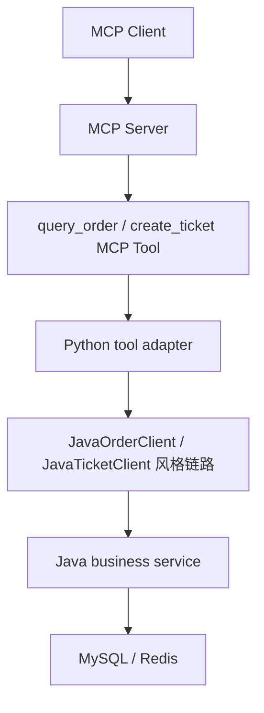
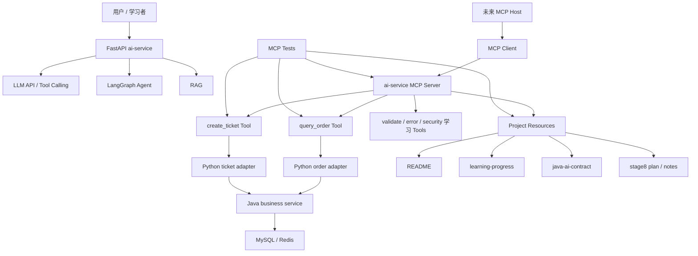

# 阶段 8 第 20 节：阶段 8 初版项目整理

## 本节定位

阶段 8 到第 19 节为止，已经不是只学概念了。

我们已经完成了三类事情：

```text
第一类：MCP 基础概念。
第二类：Python MCP Server / Client 最小实践。
第三类：把当前项目里的真实学习能力封装成 MCP Tools、Resources，并补上契约测试。
```

所以第 20 节不是继续急着加新工具。

本节的作用是：

```text
停下来整理一遍。
把已经学过的 MCP 知识、代码、测试、项目边界和后续方向连成一张图。
```

这很重要。

如果只是一节一节往前写，很容易出现一个问题：

```text
每节都看懂了。
但是问你“现在这个 MCP 项目到底做到什么程度”，你说不完整。
```

本节就是解决这个问题。

学完本节，你应该能用自己的话讲清楚：

```text
现在项目里的 MCP 是什么。
它有哪些工具。
它有哪些资源。
它怎么连接 Java business service。
它和 LangGraph Agent、Tool Calling、RAG 分别是什么关系。
它已经有了哪些安全边界和测试。
它还不是一个完整生产级 MCP Server 的原因是什么。
为什么第 21-24 节还要继续做工程结构、配置、可观测性和面试表达。
```

## 本节学习目标

本节目标不是背 API。

本节目标是建立阶段性全局理解。

具体要学会：

```text
1. 把阶段 8 第 1-19 节分成“概念层、协议层、代码层、项目接入层、测试层”。
2. 看懂当前 MCP 文件分别承担什么职责。
3. 说清当前 MCP Server 暴露了哪些 Tools 和 Resources。
4. 说清当前 MCP Tools 背后复用了哪些已有项目能力。
5. 说清当前 MCP 还没有做哪些生产工程能力。
6. 说清为什么“能跑 demo”和“工程化可维护”不是一回事。
7. 说清阶段 8 后 4 节为什么不是重复，而是工程化补齐。
8. 形成一套面试可讲的 MCP 初版项目表达。
```

## 本节不做什么

本节是纯整理知识节。

不做：

```text
不新增业务代码。
不新增 MCP Tool。
不新增 MCP Resource。
不新增手动测试文档。
不启动虚拟机。
不启动 Qdrant。
不启动 Milvus。
不启动 MySQL。
不启动 Redis。
不调用真实大模型。
不调用真实 embedding。
不做敏感信息扫描，除非之后你要求上传 GitHub。
```

本节只新增：

```text
阶段 8 第 20 节整理笔记。
README 索引更新。
learning-progress 进度更新。
```

## 基础知识铺垫

### 1. 为什么学到一半要做“阶段整理”

学习技术不是无限堆知识点。

真正能把技术学扎实，需要反复做三件事：

```text
输入：理解概念、看资料、读代码。
输出：写代码、写笔记、做练习。
整理：把零散知识重新组织成体系。
```

前 19 节主要是输入和输出。

第 20 节就是整理。

整理的价值是：

```text
把“我做过某个功能”变成“我知道这个功能处在系统哪一层”。
把“我知道某个 API”变成“我知道什么时候该用它，什么时候不该用它”。
把“代码能跑”变成“我能给别人讲明白这个设计为什么合理”。
```

这是从学习者走向工程师必须经历的一步。

### 2. 什么叫“初版项目整理”

“初版”不是“最终版”。

它表示：

```text
当前 MCP 基础能力已经有了一个可观察、可测试、可解释的形状。
```

但它还不是完整生产级 MCP Server。

初版项目整理要回答：

```text
已经有什么？
这些东西在哪里？
它们解决了什么问题？
它们还缺什么？
下一步为什么要继续补？
```

这比单纯写“阶段总结”更具体。

因为它要回到项目文件和真实能力。

### 3. 为什么不能只说“我学了 MCP”

“我学了 MCP”这句话太空。

别人无法判断你学到了什么程度。

更好的表达是：

```text
我理解 MCP 的 Host/Client/Server 架构。
我知道 MCP 和 Tool Calling 的区别。
我知道 Tools、Resources、Prompts 分别暴露什么。
我用 Python SDK 写过 MCP Server。
我用 in-memory MCP Client 做过调试。
我把订单查询和创建工单封装成 MCP Tools。
我把项目文档封装成 MCP Resources。
我补过参数校验、错误处理、安全边界和契约测试。
我知道它还缺工程化结构、配置管理和可观测性。
```

这才像真正做过。

### 4. MCP 学习可以分成五层

阶段 8 到现在，可以分成五层。

第一层：概念层。

```text
MCP 是什么。
为什么出现 MCP。
MCP 和普通 HTTP API、插件、Tool Calling、RAG 的区别。
```

第二层：协议层。

```text
Host。
Client。
Server。
JSON-RPC。
initialize。
tools/list。
tools/call。
resources/list。
resources/read。
prompts/list。
prompts/get。
transport。
生命周期。
```

第三层：代码层。

```text
Python MCPServer。
@mcp.tool()。
@mcp.resource()。
Client(mcp)。
structured_content。
is_error。
input_schema。
output_schema。
```

第四层：项目接入层。

```text
query_order MCP Tool。
create_ticket MCP Tool。
project document Resources。
复用 JavaOrderClient / JavaTicketClient 风格链路。
复用参数校验、错误码、白名单、幂等、确认边界。
```

第五层：测试和工程保障层。

```text
参数校验测试。
错误处理测试。
安全边界测试。
工具调用测试。
Resource 白名单测试。
契约测试。
```

如果你能按这五层讲，说明你已经不是零散记忆。

### 5. 当前 MCP 在项目中的位置

当前项目整体可以这样看：

```text
用户
-> FastAPI ai-service
-> LLM API / Tool Calling / LangGraph / RAG
-> Python 工具适配层
-> Java mock service 或 Java business service
```

MCP 加进来以后，不是替代所有东西。

它的位置是：

```text
AI 应用和工具/资源之间的标准连接层。
```

也就是说：

```text
MCP 不替代 FastAPI。
MCP 不替代 LangGraph。
MCP 不替代 RAG。
MCP 不替代 Java business service。
MCP 不替代 Tool Calling。
```

它解决的是：

```text
工具、资源、prompt 如何被标准发现、标准读取、标准调用。
```

### 6. 当前项目里的 MCP Host、Client、Server 怎么对应

在理论上：

```text
Host 管理多个 MCP Client。
Client 连接某一个 MCP Server。
Server 暴露 Tools、Resources、Prompts。
```

当前项目里可以这样对应：

```text
MCP Server：
projects/ai-service/app/mcp_servers/minimal_server.py

MCP Client：
projects/ai-service/app/mcp_clients/minimal_client.py
tests 里的 Client(mcp)

潜在 MCP Host：
未来的 ai-service Agent runtime。
未来的桌面 AI 客户端。
未来的 IDE AI 客户端。
```

注意：

```text
当前还没有把 LangGraph 主 Agent 正式改造成 MCP Host。
```

原因是阶段 8 目前先学基础能力和边界。

未来真接入时，需要谨慎处理：

```text
工具选择。
用户确认。
幂等。
权限。
错误映射。
trace_id。
测试。
```

### 7. 当前已经有 Tools，但不是随便暴露函数

MCP Tool 不是把 Python 函数随手开放给模型。

当前项目暴露工具时遵守了几条原则：

```text
工具名清晰。
参数 schema 明确。
输入要校验。
输出要白名单。
业务错误要结构化。
系统错误要安全包装。
写操作要用户确认。
写操作要幂等。
敏感字段不能返回给模型。
```

这非常关键。

因为 AI 工具不是普通后台按钮。

调用方可能是模型。

模型可能：

```text
误解用户意图。
生成不完整参数。
被 prompt injection 诱导。
重复调用工具。
把工具结果再组织成用户回答。
```

所以工具必须守住后端边界。

### 8. 当前已经有 Resources，但不是随便读文件

MCP Resource 也不能随便暴露文件系统。

当前项目暴露的是白名单资源：

```text
README.md
docs/learning-progress.md
docs/java-ai-api-contract.md
notes/stage8-00-mcp-learning-plan.md
notes/stage8-16-mcp-create-ticket-tool.md
```

这些资源都有固定 URI。

例如：

```text
learning://project/readme
learning://project/progress
learning://project/java-ai-contract
learning://project/stage8-plan
learning://project/mcp-create-ticket-note
```

为什么要白名单？

因为如果 MCP Server 可以按任意路径读文件，就可能读到：

```text
.env
API key
数据库密码
本机隐私文件
不该交给模型的内部资料
```

所以 Resource 的安全底线是：

```text
只暴露明确允许的资源。
不让路径逃逸仓库。
不让模型自己拼路径读任意文件。
```

### 9. 当前 Prompts 只学了基础，还没有接入代码

阶段 8 第 9 节学过 MCP Prompts 基础。

但当前代码还没有正式注册 Prompt。

这不是遗漏。

这是阶段安排。

原因是：

```text
Tools 和 Resources 更适合先落地。
Prompts 要和真实 Agent 的 prompt 版本、角色边界、RAG 上下文、工具结果总结结合起来。
```

如果太早把 Prompt 接进 MCP Server，容易变成：

```text
为了用 prompt 功能而用 prompt 功能。
```

后续如果要接 Prompts，更合理的方向是：

```text
customer_service_reply_prompt。
ticket_summary_prompt。
tool_result_summary_prompt。
rag_answer_prompt。
```

但这要结合现有 prompt 版本管理和 Agent 评测一起做。

### 10. “能跑 demo”和“工程化可维护”的区别

现在 MCP Server 已经能跑。

但能跑不等于工程化完成。

能跑 demo 关注：

```text
能注册工具。
能调用工具。
能读资源。
测试能通过。
```

工程化可维护还要关注：

```text
文件结构是否清晰。
工具模块是否容易扩展。
配置是否从环境变量读取。
不同环境能否切换。
日志有没有 trace_id。
工具调用耗时能否观察。
错误码能否统计。
新增工具有没有统一规范。
安全开关有没有集中管理。
```

这就是为什么第 21-24 节还要继续学。

不是因为第 1-20 节没用。

而是因为：

```text
第 1-20 节解决“懂和能做”。
第 21-24 节解决“做得更像工程项目”。
```

### 11. 当前项目 MCP 的成熟度

可以把当前 MCP 成熟度分成四档。

第一档：概念知道。

```text
知道 MCP 是什么，Host/Client/Server 是什么。
```

第二档：demo 能跑。

```text
能写最小 MCP Server，注册 echo/add，Client 能调。
```

第三档：接入真实项目能力。

```text
query_order、create_ticket、project resources 已接入。
```

第四档：工程化可维护。

```text
结构清晰、配置化、可观测性、部署方式、权限策略、文档和面试表达完整。
```

当前项目大概处于：

```text
第三档已经初步完成。
第四档正在准备进入。
```

这也是第 20 节的定位：

```text
承认已经有成果。
也明确还没结束。
```

## 本节主题系统讲解

### 1. 阶段 8 第 1-9 节：先建立 MCP 基础认知

第 1 节到第 9 节主要是概念和协议。

它们解决的问题是：

```text
不要把 MCP 当成“又一个 HTTP API”。
不要把 MCP 当成“Tool Calling 的新名字”。
不要把 Tool、Resource、Prompt 混在一起。
```

可以整理成：

| 节 | 主题 | 你应该掌握的核心 |
| --- | --- | --- |
| 1 | MCP 是什么 | MCP 是 AI 应用连接工具、资源、prompt 的标准协议 |
| 2 | MCP 和 Tool Calling | Tool Calling 是模型表达工具意图，MCP 是应用连接工具提供方 |
| 3 | MCP 架构 | Host 管 Client，Client 连 Server，Server 暴露能力 |
| 4 | MCP 通信基础 | JSON-RPC、method、params、result、error |
| 5 | MCP 生命周期 | initialize、operation、shutdown |
| 6 | MCP Transport | stdio 和 Streamable HTTP 是不同传输方式 |
| 7 | MCP Tools | 工具适合暴露可执行动作 |
| 8 | MCP Resources | 资源适合暴露可读取上下文 |
| 9 | MCP Prompts | prompt 适合暴露可复用提示模板 |

这 9 节的核心价值是：

```text
让你先知道 MCP 的世界观。
```

否则后面写代码会变成只会照抄。

### 2. 阶段 8 第 10-11 节：先把最小 Server / Client 跑起来

第 10 节和第 11 节开始进入 Python 实践。

产出是：

```text
projects/ai-service/app/mcp_servers/minimal_server.py
projects/ai-service/app/mcp_clients/minimal_client.py
projects/ai-service/scripts/mcp_client_smoke.py
```

学到的是：

```text
怎么创建 MCPServer。
怎么注册 @mcp.tool()。
怎么注册 @mcp.resource()。
怎么用 Client(mcp) 调试。
怎么观察 list_tools、call_tool、read_resource 的结果。
```

这一步很重要。

因为它把 MCP 从概念变成了可运行对象。

### 3. 阶段 8 第 12-14 节：补工具的基本安全素养

第 12 到第 14 节没有急着接真实业务。

而是先补：

```text
参数校验。
错误处理。
安全边界。
```

原因是：

```text
AI 工具不是随便把函数暴露出去。
```

第 12 节学会：

```text
用 Annotated + Field 描述 schema。
用 Literal 表达枚举。
用 Pydantic 做参数清洗和校验。
非法参数要安全返回。
```

第 13 节学会：

```text
业务错误和系统错误分开。
业务错误适合 ok=false。
系统错误适合 ToolError / is_error=true。
内部异常不能泄露给模型。
```

第 14 节学会：

```text
工具最小暴露。
读写分级。
写操作确认。
敏感字段过滤。
prompt injection 风险识别。
危险动作拒绝。
```

这三节是在给后面的真实工具打基础。

### 4. 阶段 8 第 15-16 节：把真实项目动作封装成 MCP Tools

第 15 节做了：

```text
query_order MCP Tool。
```

它是只读工具。

链路是：

```text
MCP Client
-> query_order MCP Tool
-> query_order_for_mcp()
-> 复用 QueryOrderArgs
-> 复用 fake_order_tool / JavaOrderClient 风格链路
-> 输出 QueryOrderResult 白名单字段
```

它重点体现：

```text
只读工具不需要用户确认。
但仍然需要参数校验、权限结果、错误码、输出白名单。
```

第 16 节做了：

```text
create_ticket MCP Tool。
```

它是写工具。

链路是：

```text
MCP Client
-> create_ticket MCP Tool
-> create_ticket_for_mcp()
-> 校验请求参数
-> 检查 user_confirmed
-> 用 confirmation_id 做幂等键
-> 复用 CreateTicketArgs / JavaTicketClient 风格 creator
-> 输出 CreatedTicket 白名单字段
```

它重点体现：

```text
写操作必须确认。
写操作必须幂等。
写操作不能把 requester_id、description、手机号等敏感信息随便回传给模型。
```

### 5. 阶段 8 第 17 节：把项目文档封装成 MCP Resources

第 17 节做了：

```text
project document Resources。
```

当前白名单资源包括：

```text
learning://project/readme
learning://project/progress
learning://project/java-ai-contract
learning://project/stage8-plan
learning://project/mcp-create-ticket-note
```

这一步的价值是：

```text
让 MCP 不只会执行动作，还能提供上下文。
```

Tools 和 Resources 的区别可以这样理解：

```text
Tool：你让服务器做一件事。
Resource：你向服务器读一份资料。
```

例如：

```text
query_order 是 Tool。
README 是 Resource。
```

### 6. 阶段 8 第 18 节：把 MCP 放回 Agent 总架构

第 18 节解决的是架构定位。

核心结论：

```text
MCP 是标准连接层。
Tool Calling 是模型工具意图层。
LangGraph 是 Agent 流程编排层。
RAG 是知识检索增强层。
Java business service 是真实业务系统层。
FastAPI ai-service 是当前 AI 应用入口。
```

这节很关键。

否则很容易误解成：

```text
用了 MCP 就不用 LangGraph。
用了 MCP 就不用 RAG。
用了 MCP 就不用 Java 后端。
用了 MCP 就不用 Tool Calling。
```

正确理解是：

```text
MCP 可以和这些层配合。
但它不替代这些层。
```

### 7. 阶段 8 第 19 节：把公共契约固定住

第 19 节新增：

```text
projects/ai-service/tests/test_mcp_contracts.py
```

它固定：

```text
工具名集合。
query_order input_schema。
create_ticket input_schema。
create_ticket 未确认写操作返回结构。
Resource URI。
Resource title。
Resource mime_type。
Resource read 最小内容形状。
```

这一步说明：

```text
我们不是只让 MCP 能跑。
我们还开始保护 MCP 对外承诺。
```

这对以后重构非常重要。

如果后续第 21 节整理工程结构时不小心改坏工具名或 schema，契约测试能发现。

### 8. 当前 MCP 代码文件地图

当前 MCP 相关主代码在：

```text
projects/ai-service/app/mcp_servers/
projects/ai-service/app/mcp_clients/
```

主要文件如下：

| 文件 | 作用 |
| --- | --- |
| `app/mcp_servers/minimal_server.py` | 当前 MCP Server 入口，集中注册 Tools 和 Resources |
| `app/mcp_servers/ticket_validation.py` | 参数校验示例，支撑 validate_ticket_draft |
| `app/mcp_servers/tool_error_handling.py` | 错误处理示例，支撑 simulate_tool_error_handling |
| `app/mcp_servers/tool_security.py` | 安全边界示例，支撑 inspect_tool_security_boundary |
| `app/mcp_servers/order_tool.py` | query_order MCP Tool adapter |
| `app/mcp_servers/ticket_tool.py` | create_ticket MCP Tool adapter |
| `app/mcp_servers/project_resources.py` | 项目文档 Resource 白名单和读取逻辑 |
| `app/mcp_clients/minimal_client.py` | MCP Client 调试快照工具 |

现在这个结构能学习、能跑、能测。

但还有一个明显问题：

```text
minimal_server.py 越来越像总装配文件。
工具、资源、未来 prompts、配置、日志如果继续堆进去，会变难维护。
```

这就是第 21 节要整理工程结构的原因。

### 9. 当前 MCP 测试文件地图

当前 MCP 测试主要在：

```text
projects/ai-service/tests/
```

主要文件如下：

| 文件 | 保护重点 |
| --- | --- |
| `test_minimal_mcp_server.py` | Server 能暴露工具、调用 add、读取 resource |
| `test_mcp_client_smoke.py` | Client 调试快照能整体跑通 |
| `test_mcp_tool_parameter_validation.py` | 参数 schema、枚举、必填和非法参数处理 |
| `test_mcp_tool_error_handling.py` | 业务错误、系统错误、ToolError 安全包装 |
| `test_mcp_tool_security.py` | 读写边界、确认、敏感字段过滤、危险动作拒绝 |
| `test_mcp_query_order_tool.py` | query_order 参数、白名单、业务错误、系统错误 |
| `test_mcp_create_ticket_tool.py` | create_ticket 确认、幂等、错误、安全输出 |
| `test_mcp_project_resources.py` | Resource 白名单、路径逃逸、read/list |
| `test_mcp_contracts.py` | MCP 公共契约稳定性 |

这说明当前 MCP 不是只有 demo。

它已经有测试保护。

### 10. 当前 MCP Server 暴露的 Tools

当前工具可以分成三类。

第一类：最小学习工具。

```text
echo
add
```

作用：

```text
证明 MCP Server 和 Client 能跑通。
```

第二类：安全学习工具。

```text
validate_ticket_draft
simulate_tool_error_handling
inspect_tool_security_boundary
```

作用：

```text
单独学习参数校验、错误处理、安全边界。
```

第三类：项目业务工具。

```text
query_order
create_ticket
```

作用：

```text
把当前 AI 客服项目里的订单查询和工单创建能力封装成 MCP Tools。
```

这三类工具都保留是合理的。

因为阶段 8 是学习阶段。

但未来如果要做生产化 MCP Server，需要区分：

```text
学习 demo 工具。
业务工具。
内部调试工具。
正式对外工具。
```

### 11. 当前 MCP Server 暴露的 Resources

当前资源全部是项目文档：

```text
learning://project/readme
learning://project/progress
learning://project/java-ai-contract
learning://project/stage8-plan
learning://project/mcp-create-ticket-note
```

这些资源的价值是：

```text
让 AI Client 可以通过 MCP 标准接口读取项目上下文。
```

例如未来一个 MCP Host 可以：

```text
先 read_resource("learning://project/progress")
知道当前学习进度。
再 read_resource("learning://project/java-ai-contract")
知道 Python 调 Java 的契约。
再调用 query_order 或 create_ticket。
```

这就是 MCP Resource 的意义：

```text
让上下文资料变成可发现、可读取、可授权管理的标准资源。
```

### 12. 当前 MCP 和 Java business service 的关系

当前 `query_order` 和 `create_ticket` 背后的设计思路是：

```text
MCP Tool 不直接替代 Java 后端。
MCP Tool 只是 AI 工具入口。
真实业务仍然应由 Java business service 承担。
```

可以画成：



这条链路体现了传统后端经验和 AI 工具生态的结合：

```text
Java 负责真实业务一致性。
Python 负责 AI 工具适配。
MCP 负责标准连接。
模型负责理解和表达意图。
Agent 负责流程编排。
```

### 13. 当前 MCP 和 LangGraph 的关系

当前 LangGraph 主链路还没有正式改成 MCP Client。

这是有意保守。

现在更合理的关系是：

```text
LangGraph 继续负责状态机和流程编排。
MCP 提供可标准调用的工具和资源。
未来某些 LangGraph 节点可以通过 MCP Client 调用 MCP Server。
```

也就是：

```text
LangGraph 节点
-> MCP Client
-> MCP Server Tool
-> Java business service
```

但不能简单粗暴替换。

原因是 LangGraph 里已经有很多重要边界：

```text
意图识别。
字段提取。
缺字段追问。
用户确认节点。
checkpoint。
thread_id。
状态恢复。
评测。
```

MCP 不负责这些。

所以未来接入时要做 adapter，而不是推倒重写。

### 14. 当前 MCP 和 RAG 的关系

MCP Resource 和 RAG 都和“资料”有关。

但它们不是一回事。

MCP Resource 更像：

```text
标准读取入口。
```

RAG 更像：

```text
大量知识的检索、排序、引用、上下文构造机制。
```

当前项目里：

```text
README、学习进度、契约文档适合直接 Resource。
大量客服知识库文档适合 RAG。
```

未来也可以组合：

```text
MCP Resource 提供文档源。
RAG 把文档切 chunk、embedding、入库、检索。
模型基于检索结果回答。
```

这说明：

```text
MCP 可以服务 RAG。
但 MCP 不等于 RAG。
```

### 15. 当前项目已经具备的 MCP 能力清单

到第 20 节为止，当前阶段已经具备：

```text
MCP 基础概念理解。
MCP Host/Client/Server 架构理解。
MCP JSON-RPC 通信基础理解。
MCP 生命周期理解。
MCP transport 基础理解。
MCP Tools 基础理解。
MCP Resources 基础理解。
MCP Prompts 基础理解。
Python MCP Server 最小实现。
Python MCP Client 调试。
MCP 参数校验。
MCP 错误处理。
MCP 安全边界。
订单查询 MCP Tool。
创建工单 MCP Tool。
项目文档 MCP Resources。
MCP 与现有 Agent 架构关系。
MCP 契约测试。
```

这已经是一个比较完整的 MCP 基础阶段。

但它还不是阶段 8 的终点。

### 16. 当前还欠缺什么

当前还欠缺四类能力。

第一类：工程结构。

现在 `minimal_server.py` 负责注册很多内容。

后续更合理的是：

```text
tools 分模块。
resources 分模块。
server factory。
registry。
配置入口。
测试更清楚。
```

第二类：配置和环境变量。

现在很多东西还是本地学习写法。

后续要整理：

```text
MCP server name。
Resource 根路径。
Java 服务地址。
internal token。
权限开关。
transport 选择。
```

第三类：可观测性。

现在 MCP 工具能被测试，但运行时观察还不够系统。

后续要考虑：

```text
工具调用日志。
trace_id。
耗时。
错误码。
是否 retryable。
安全拦截原因。
```

第四类：阶段总结和表达。

阶段 8 学完后，你要能回答：

```text
MCP 在你的项目里怎么落地？
你做了哪些工具？
怎么保证安全？
怎么测试？
和 LangGraph/RAG/Java 后端什么关系？
生产上还要补什么？
```

这就是第 21-24 节的价值。

### 17. 为什么第 21 节要做工程结构整理

现在的 MCP Server 仍然偏学习 demo。

比如：

```text
minimal_server.py
```

这个名字说明它最开始是最小示例。

但现在它已经注册了：

```text
echo。
add。
validate_ticket_draft。
simulate_tool_error_handling。
inspect_tool_security_boundary。
query_order。
create_ticket。
多个 project resources。
```

继续堆下去会有问题：

```text
文件越来越长。
注册逻辑和业务逻辑混在一起。
不容易区分 demo 工具和业务工具。
未来 prompts 加进来会更乱。
测试定位不够清晰。
```

所以第 21 节要做：

```text
MCP Server 工程结构整理。
```

这不是为了“好看”。

而是为了可维护。

### 18. 为什么第 22 节要做配置和环境变量

当前阶段里很多内容适合本地学习。

但实际项目里，配置不能散在代码里。

例如：

```text
Java business service base url。
internal token。
Resource 根目录。
允许暴露哪些 Resource。
是否启用危险工具。
MCP server name。
transport 类型。
```

这些都应该走配置。

原因是：

```text
开发环境、测试环境、生产环境不一样。
敏感信息不能写进代码。
权限策略需要可控。
```

所以第 22 节是把 MCP 从“本地能跑”推进到“环境可配置”。

### 19. 为什么第 23 节要做可观测性

AI 工具调用一旦进入真实项目，排查问题会很复杂。

例如用户说：

```text
为什么它没有帮我创建工单？
```

你要能查到：

```text
模型有没有请求工具。
请求了哪个工具。
参数是什么。
是否被参数校验拦截。
是否缺少用户确认。
是否命中幂等。
是否调用 Java 服务。
Java 返回什么错误码。
整个过程 trace_id 是多少。
耗时多少。
```

如果没有日志和 trace，这些只能猜。

所以第 23 节要做：

```text
MCP 可观测性。
```

### 20. 为什么第 24 节要做阶段总结和面试表达

学技术最终要能用，也要能讲。

尤其你未来要向别人证明：

```text
我不是只看过 MCP 介绍。
我真的知道它怎么落地到 AI Agent 项目里。
```

所以第 24 节会整理：

```text
一句话解释 MCP。
三分钟解释 MCP 架构。
项目里 MCP 的具体落点。
和 LangGraph/RAG/Java 后端的关系。
安全边界。
测试策略。
不足和后续改进。
面试追问。
```

第 20 节是初版整理。

第 24 节是完整阶段总结。

## 当前阶段 8 初版架构图

可以把当前阶段 8 初版能力画成：



这张图说明：

```text
MCP Server 当前先作为 ai-service 内部能力存在。
它已经暴露工具和资源。
它可以复用现有 Python -> Java 链路。
未来可以被 LangGraph 或其他 Host 通过 MCP Client 调用。
```

## 当前项目边界

当前已经做到：

```text
MCP 基础学习完整。
最小 Server / Client 可运行。
Tools / Resources 已接入项目。
关键安全边界已学习。
契约测试已建立。
```

当前还没有做到：

```text
没有把 MCP 作为独立远程服务部署。
没有做真实 Streamable HTTP MCP Server。
没有把 LangGraph 主链路正式迁移到 MCP Client。
没有做 MCP Prompts 代码接入。
没有完整配置化。
没有完整 trace_id 和工具耗时日志。
没有生产级权限模型。
没有企业级 MCP 网关。
```

这些不是失败。

这是阶段边界。

学习项目必须知道：

```text
当前做到哪里。
当前没做到哪里。
下一步为什么这样安排。
```

## 当前你可以怎样对外介绍

现在如果别人问你：

```text
你这个项目的 MCP 做到什么程度了？
```

你可以说：

```text
我在 Python ai-service 里做了一个 MCP Server 学习实现，先从 MCP Host/Client/Server、Tools、Resources、Prompts、生命周期和 transport 基础学起，然后用 Python SDK 实现了最小 Server 和 Client 调试。后面把订单查询封装成只读 MCP Tool，把创建工单封装成写操作 MCP Tool，并保留用户确认、幂等、参数校验、错误码和输出白名单边界；同时把 README、学习进度、Java-AI API 契约等项目文档封装成 MCP Resources。最后补了 MCP 契约测试，固定 tools/list、input_schema、写操作未确认返回结构和 resources/list/read 的公共契约。
```

如果别人追问：

```text
它现在生产可用吗？
```

你可以说：

```text
现在更准确地说是学习项目里的 MCP 基础能力原型，还不是完整生产级 MCP Server。它已经有工具、资源、安全边界和契约测试，但还需要继续补工程结构、配置化、可观测性、真实 transport、权限模型和正式 Agent 接入。
```

这个表达既不夸大，也不显得你没做东西。

## 本节没有新增代码的原因

本节没有新增业务代码。

这是刻意的。

因为整理节的目标不是“再堆一个功能”。

整理节的目标是：

```text
把已有能力讲清楚。
把边界讲清楚。
把后续路线讲清楚。
```

如果每一节都只新增代码，而不做体系整理，就容易变成：

```text
代码越写越多。
但脑子里没有清晰结构。
```

这不符合你的学习目标。

你要的是：

```text
不仅会用，还要知道它、理解它、能讲清楚它。
```

所以本节是必要的。

## 本节真正学会了什么

本节你真正学会的是：

```text
阶段 8 前 19 节不是零散内容。
它们组成了一条从 MCP 概念、协议、实践、项目接入到契约测试的完整路径。
```

你还应该知道：

```text
当前 MCP 已经能作为项目能力原型。
但还没有完成工程化。
接下来 21-24 节不是重复，而是把原型整理成更可维护、更可配置、更可观测、更好表达的项目能力。
```

## 练习题

### 练习 1：阶段 8 到第 20 节为止，可以分成哪五层？

参考答案：

```text
可以分成概念层、协议层、代码层、项目接入层、测试和工程保障层。概念层理解 MCP 是什么，协议层理解 Host/Client/Server、JSON-RPC、生命周期和 transport，代码层实现 Python MCP Server/Client，项目接入层封装 query_order/create_ticket 和项目文档 Resources，测试层补参数校验、错误处理、安全边界和契约测试。
```

### 练习 2：当前项目里的 MCP Server 主要文件是什么？

参考答案：

```text
主要入口是 projects/ai-service/app/mcp_servers/minimal_server.py。它注册当前学习用 MCP Tools 和 Resources，具体工具逻辑拆在 ticket_validation.py、tool_error_handling.py、tool_security.py、order_tool.py、ticket_tool.py、project_resources.py 等文件里。
```

### 练习 3：为什么当前阶段还不直接把 LangGraph 主链路全部改成 MCP Client？

参考答案：

```text
因为 LangGraph 负责状态、节点、条件跳转、用户确认、checkpoint、评测等流程编排能力，MCP 只是标准连接层。直接替换会扩大风险。更合理的做法是先把 MCP Tools/Resources 做稳，后续通过 adapter 逐步让某些 LangGraph 节点调用 MCP Client。
```

### 练习 4：为什么第 21-24 节还要继续学？

参考答案：

```text
因为第 1-20 节主要完成 MCP 概念、最小实践、工具资源接入和契约测试，已经能形成初版原型。但工程化还欠结构整理、配置环境变量、可观测性和完整面试表达，所以第 21-24 节用于把原型变得更可维护、更可配置、更好排查、更好讲清楚。
```

### 练习 5：当前 MCP Resource 为什么只暴露白名单文档？

参考答案：

```text
因为 Resource 是给 AI Client 读取上下文的入口，如果允许任意路径读取，可能泄露 .env、API key、数据库密码或本机隐私文件。白名单可以明确哪些资料允许暴露，并配合路径逃逸检查降低风险。
```

## 自测题

### 自测 1：当前项目 MCP 成熟度大概处在哪一档？

参考答案：

```text
当前已经超过单纯概念和 demo，进入“接入真实项目能力”的初版阶段。query_order、create_ticket 和项目文档 Resources 已经接入，并有测试保护。但还没到完整工程化可维护阶段，因为还需要补工程结构、配置化、可观测性和正式 Agent 接入。
```

### 自测 2：MCP 和 Java business service 的关系是什么？

参考答案：

```text
MCP 不替代 Java business service。MCP Tool 是 AI 应用调用业务能力的标准入口，真实订单、工单、权限、事务、MySQL、Redis 等业务一致性仍然应由 Java business service 负责。Python MCP Tool adapter 负责参数校验、权限边界、错误包装和白名单输出。
```

### 自测 3：当前暴露的业务型 MCP Tools 有哪些？

参考答案：

```text
当前业务型 MCP Tools 是 query_order 和 create_ticket。query_order 是只读工具，create_ticket 是写工具，写工具要求用户确认和 confirmation_id 幂等边界。
```

### 自测 4：当前暴露的项目文档 Resources 有哪些？

参考答案：

```text
包括 learning://project/readme、learning://project/progress、learning://project/java-ai-contract、learning://project/stage8-plan、learning://project/mcp-create-ticket-note。
```

### 自测 5：为什么说本节是学习必须的一节？

参考答案：

```text
因为它把前 19 节零散知识整理成完整体系，让学习者能说清楚当前项目做到什么、文件在哪里、能力怎么连接、边界是什么、下一步为什么继续工程化。没有这种整理，很容易只会跟着写代码，但不能独立讲明白 MCP 在项目中的价值。
```

## 面试表达

如果别人问：

```text
你 MCP 这部分具体做了什么？
```

可以回答：

```text
我先系统学习了 MCP 的 Host、Client、Server、Tools、Resources、Prompts、生命周期、transport 和 JSON-RPC 通信基础。然后在 Python ai-service 里用 MCP SDK 实现了一个本地 MCP Server 和 Client 调试链路，注册了基础工具、参数校验工具、错误处理工具、安全边界工具。之后把项目里的订单查询封装成 query_order MCP Tool，把创建工单封装成 create_ticket MCP Tool，并保留参数校验、用户确认、幂等、错误码、安全 ToolError 和输出白名单。还把 README、学习进度、Java-AI API 契约等文档暴露成 MCP Resources，并补了 MCP 契约测试固定工具名、input_schema、写操作未确认返回和 Resource URI/mime_type。
```

如果别人问：

```text
你怎么理解 MCP 在 Agent 项目里的位置？
```

可以回答：

```text
我把 MCP 理解成 AI 应用和外部工具/资源/prompt 之间的标准连接层。它不替代 Tool Calling、LangGraph、RAG 或 Java 后端。Tool Calling 解决模型表达工具调用意图，LangGraph 负责 Agent 状态和流程编排，RAG 负责知识检索增强，Java 后端负责真实业务一致性，MCP 负责把工具和资源按统一协议暴露给 AI Host 或 MCP Client。
```

如果别人问：

```text
你这个 MCP 项目还有什么不足？
```

可以回答：

```text
当前是学习项目里的 MCP 初版原型，已经完成基础工具、资源、安全边界和契约测试，但还不是完整生产级 MCP Server。后续还需要做 MCP Server 工程结构整理、配置和环境变量、可观测性、真实 transport、权限模型、正式 Agent 接入和更完整的运行文档。
```

## 本节小结

本节完成阶段 8 的初版项目整理。

你现在应该能把阶段 8 前 20 节讲成一条清晰路线：

```text
先理解 MCP。
再理解协议。
再写最小 Server / Client。
再补工具校验、错误和安全。
再接入订单查询、创建工单和项目文档。
再讲清它和 Agent、RAG、Java 后端的关系。
最后用契约测试保护公共形状。
```

下一节进入：

```text
阶段 8 第 21 节：MCP Server 工程结构整理
```

下一节会解决当前 `minimal_server.py` 越来越重的问题，把学习 demo 逐步整理成更像真实项目的 MCP Server 结构。
