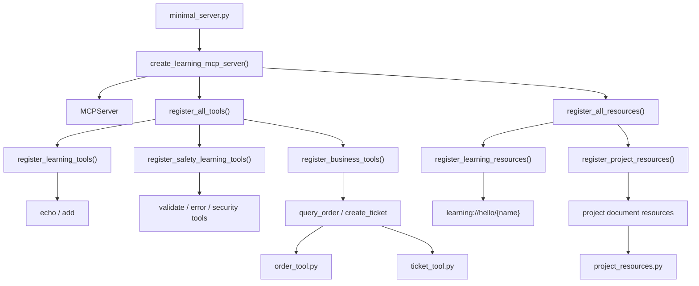

# 阶段 8 第 21 节：MCP Server 工程结构整理

## 本节定位

前面第 10 节我们写了一个最小 MCP Server。

当时这个文件叫：

```text
projects/ai-service/app/mcp_servers/minimal_server.py
```

一开始它很简单：

```text
创建 MCPServer。
注册 echo。
注册 add。
注册 hello resource。
```

这种写法适合入门。

但阶段 8 学到第 20 节时，这个文件已经承担了太多职责：

```text
创建 MCPServer。
注册学习用 tools。
注册参数校验 tool。
注册错误处理 tool。
注册安全边界 tool。
注册 query_order tool。
注册 create_ticket tool。
注册 hello resource。
注册多个 project resources。
导入很多业务 adapter。
导入很多类型和校验函数。
```

这就是本节要解决的问题：

```text
一个最小 demo 文件，开始变成“大装配文件”。
```

本节不是新增业务能力。

本节是做一次小步工程化重构：

```text
把 MCP Server 的创建、工具注册、资源注册拆成更清楚的结构。
```

目标不是炫技。

目标是：

```text
让项目继续学习第 22 节配置、第 23 节可观测性、第 24 节总结表达时，不被一个越来越大的 minimal_server.py 拖住。
```

## 本节学习目标

学完本节，你要能说清楚：

```text
1. 为什么 demo 文件会随着功能增加变成维护负担。
2. 什么是入口文件，什么是装配文件，什么是注册模块。
3. 为什么 MCP Server 也需要 server factory。
4. tool registration 和 tool adapter 有什么区别。
5. resource registration 和 resource reader 有什么区别。
6. 为什么要保留 minimal_server.py 作为兼容入口。
7. 为什么重构前后必须跑契约测试。
8. 本节新增的几个文件分别承担什么职责。
9. 这种重构和传统 Java/Spring 项目里的分层有什么相似点。
10. 以后新增 MCP Tool/Resource 应该放在哪里。
```

## 本节不做什么

本节不做外部环境验证。

不做：

```text
不启动 VMware Ubuntu。
不启动 Docker。
不启动 Qdrant。
不启动 Milvus。
不启动 MySQL。
不启动 Redis。
不调用真实大模型。
不调用真实 embedding。
不生成手动测试文档。
不做敏感信息扫描，除非之后你要求上传 GitHub。
```

本节会改代码。

但改的是：

```text
MCP Server 工程结构。
```

不是改业务逻辑。

所以验证重点是：

```text
MCP 对外契约是否不变。
MCP Client 是否仍然能 list_tools、call_tool、read_resource。
相关 MCP 测试是否通过。
```

## 基础知识铺垫

### 1. 什么是工程结构

工程结构不是“文件夹摆得好看”。

工程结构的本质是：

```text
把不同职责的代码放在合适的位置，让以后修改时容易找到、容易理解、容易测试、容易扩展。
```

如果一个文件很短，放一起没有问题。

但如果一个文件开始同时负责：

```text
创建对象。
注册工具。
注册资源。
写工具逻辑。
写资源读取逻辑。
处理业务错误。
处理安全规则。
处理配置。
处理日志。
```

它就会变得难维护。

难维护的表现是：

```text
想改一个工具，要读一大堆无关资源代码。
想新增一个 Resource，要担心碰到 Tool schema。
想加配置，要不知道放在入口文件还是工具文件。
想写测试，不知道测装配还是测业务逻辑。
```

工程结构就是解决这些问题。

### 2. 什么是 demo 结构

demo 结构的特点是：

```text
少文件。
少抽象。
能一眼看完。
快速证明某个 API 能跑。
```

比如最开始的 MCP Server：

```python
mcp = MCPServer("ai-service-learning-mcp")

@mcp.tool()
def echo(message: str) -> str:
    return message
```

这就是很好的 demo 结构。

它适合第一天学习。

因为你只需要看一个文件，就能理解：

```text
创建 server。
注册 tool。
运行 server。
```

但 demo 结构有上限。

当工具越来越多，资源越来越多，配置越来越多，测试越来越多时，它会变成：

```text
所有东西都往一个文件里堆。
```

这不是生产项目应该长期保持的结构。

### 3. 什么是项目结构

项目结构的特点是：

```text
按职责拆分。
按变化原因拆分。
让不同模块承担不同边界。
```

本节后的结构是：

```text
minimal_server.py              兼容入口。
server_factory.py              创建并装配 MCPServer。
tool_registration.py           注册所有 MCP Tools。
resource_registration.py       注册所有 MCP Resources。
order_tool.py                  query_order 的业务 adapter。
ticket_tool.py                 create_ticket 的业务 adapter。
project_resources.py           项目文档白名单和读取逻辑。
```

这比之前清楚。

因为现在可以区分：

```text
谁负责创建 server。
谁负责把函数注册成工具。
谁负责把函数注册成资源。
谁负责真实工具逻辑。
谁负责真实资源读取。
```

### 4. 什么是入口文件

入口文件就是别人进入这块功能的默认位置。

当前项目保留：

```text
projects/ai-service/app/mcp_servers/minimal_server.py
```

它现在只做两件事：

```python
from app.mcp_servers.server_factory import create_learning_mcp_server

mcp = create_learning_mcp_server()

if __name__ == "__main__":
    mcp.run()
```

也就是说：

```text
导出 mcp 给测试和脚本用。
允许 python minimal_server.py 时运行 server。
```

它不再负责具体注册每个工具和资源。

这样做的好处是：

```text
旧代码不用改 import。
新结构也能继续演进。
```

### 5. 什么是兼容入口

兼容入口的意思是：

```text
保留旧的对外导入路径，但内部实现可以换成新结构。
```

旧测试和脚本一直在用：

```python
from app.mcp_servers.minimal_server import mcp
```

如果本节直接删除 `minimal_server.py`，所有调用方都要改。

这会扩大重构影响。

所以我们保留它。

只是让它内部调用：

```python
create_learning_mcp_server()
```

这就是兼容入口。

它体现了一个重要工程原则：

```text
重构时尽量保持外部接口不变。
```

### 6. 什么是 server factory

factory 是工厂。

在代码里，它通常表示：

```text
负责创建并配置某个对象的函数或类。
```

本节新增：

```text
projects/ai-service/app/mcp_servers/server_factory.py
```

核心代码：

```python
MCP_SERVER_NAME = "ai-service-learning-mcp"

def create_learning_mcp_server(name: str = MCP_SERVER_NAME) -> MCPServer:
    server = MCPServer(name)
    register_all_tools(server)
    register_all_resources(server)
    return server
```

这就是 server factory。

它负责：

```text
创建 MCPServer。
注册所有 tools。
注册所有 resources。
返回装配好的 server。
```

它不负责：

```text
具体工具业务逻辑。
具体资源读取逻辑。
测试逻辑。
运行时日志。
```

这样以后第 22 节做配置时，就可以把：

```text
server name。
enabled tools。
enabled resources。
transport。
```

逐步放进 factory 或配置层。

### 7. 什么是 registration

registration 是注册。

MCP Server 不是自动知道有哪些工具和资源。

你必须告诉它：

```text
这个函数是 tool。
这个函数是 resource。
这个 URI 对应这个读取函数。
```

以前是在 `minimal_server.py` 里直接写：

```python
@mcp.tool()
def query_order(...):
    ...
```

现在改成：

```python
def register_business_tools(server: MCPServer) -> None:
    server.tool()(query_order)
    server.tool()(create_ticket)
```

意思是一样的：

```text
把 query_order 和 create_ticket 注册成 MCP Tools。
```

只是位置更清楚。

### 8. tool registration 和 tool adapter 的区别

这是本节特别重要的知识点。

`tool_registration.py` 负责：

```text
告诉 MCP Server 哪些函数是工具。
```

`order_tool.py` / `ticket_tool.py` 负责：

```text
工具背后的真实业务适配逻辑。
```

比如：

```python
def query_order(order_id: order_tool.OrderId) -> dict[str, Any]:
    return order_tool.query_order_for_mcp(order_id)
```

这里 `query_order()` 是 MCP Tool 暴露函数。

而 `order_tool.query_order_for_mcp()` 才是实际 adapter：

```text
校验 QueryOrderArgs。
调用订单查询链路。
处理业务错误。
处理系统错误。
输出白名单。
```

不要混淆：

```text
registration 是“挂到 MCP Server 上”。
adapter 是“把 MCP 调用转成项目内部业务调用”。
```

### 9. resource registration 和 resource reader 的区别

同理，`resource_registration.py` 负责：

```text
告诉 MCP Server 哪些 URI 是 Resource。
```

`project_resources.py` 负责：

```text
项目文档白名单。
定位仓库根目录。
检查路径不能逃逸。
读取 UTF-8 文档。
```

例如：

```python
def project_readme_resource() -> str:
    return read_project_resource("learning://project/readme")
```

这个函数只是 MCP Resource 的入口函数。

真正的安全读取逻辑在：

```text
read_project_resource()
get_project_resource_spec()
find_learning_repo_root()
```

这也是分层。

### 10. 为什么重构不能顺手改契约

本节是工程结构重构。

它的目标是：

```text
内部结构更清楚。
外部 MCP 契约不变。
```

所以不能顺手改：

```text
工具名。
参数名。
枚举值。
默认值。
Resource URI。
mime_type。
写操作未确认返回结构。
```

这些是调用方依赖的契约。

如果重构时顺手改了，就不再是单纯重构。

那叫：

```text
行为变化。
契约变化。
```

所以本节重构后必须跑：

```text
test_mcp_contracts.py
```

它能证明：

```text
外部 MCP Client 看到的公共契约没有变。
```

### 11. 重构和新增功能的区别

新增功能关注：

```text
系统多了什么能力。
```

重构关注：

```text
系统能力不变，但内部结构更清楚。
```

本节属于重构。

重构后用户不会看到：

```text
多了一个新工具。
多了一个新资源。
接口返回不一样。
```

用户应该看到：

```text
一切和以前一样能用。
```

开发者看到：

```text
以后新增 Tool/Resource 更容易。
```

### 12. 为什么这和你熟悉的 Java 分层有相似处

你有传统 Java 后端经验。

可以类比 Spring Boot 项目：

```text
Controller：接 HTTP 请求。
Service：处理业务逻辑。
Mapper：访问数据库。
Config：装配配置。
```

MCP Server 也可以类比：

```text
minimal_server.py：入口。
server_factory.py：装配。
tool_registration.py：注册 MCP Tools。
resource_registration.py：注册 MCP Resources。
order_tool.py / ticket_tool.py：工具 adapter。
project_resources.py：资源读取服务。
```

这不是完全一样。

但思想类似：

```text
不要让一个类或一个文件承担所有职责。
```

### 13. 什么时候不该拆

不是所有项目一开始都要拆很多文件。

如果只有：

```text
1 个工具。
1 个资源。
几十行代码。
```

单文件很合理。

过早拆分会带来：

```text
文件太多。
跳转太多。
理解成本变高。
```

本项目现在适合拆，是因为已经有：

```text
7 个 tools。
多个 resources。
多类测试。
后续还要做配置和可观测性。
```

拆分是被复杂度推动出来的。

不是为了抽象而抽象。

## 本节主题系统讲解

### 1. 重构前的问题

重构前，`minimal_server.py` 的结构大概是：

```text
imports 很多
创建 mcp
注册 echo
注册 add
注册 validate_ticket_draft
注册 simulate_tool_error_handling
注册 inspect_tool_security_boundary
注册 query_order
注册 create_ticket
注册 hello_resource
注册 project_readme_resource
注册 project_progress_resource
注册 java_ai_contract_resource
注册 stage8_plan_resource
注册 mcp_create_ticket_note_resource
if __name__ == "__main__": mcp.run()
```

它的问题不是“不能运行”。

它的问题是：

```text
职责太多。
学习 demo 和业务工具混在一起。
工具注册和资源注册混在一起。
注册逻辑和 adapter 逻辑距离太近。
未来配置和可观测性没有清楚插入点。
```

### 2. 重构后的结构

重构后变成：

```text
app/mcp_servers/
  minimal_server.py
  server_factory.py
  tool_registration.py
  resource_registration.py
  order_tool.py
  ticket_tool.py
  project_resources.py
  ticket_validation.py
  tool_error_handling.py
  tool_security.py
```

更具体地说：

```text
minimal_server.py
-> 只保留兼容入口。

server_factory.py
-> 创建 MCPServer。
-> 调用 register_all_tools。
-> 调用 register_all_resources。

tool_registration.py
-> 定义 MCP 暴露函数。
-> 分组注册 learning tools、safety tools、business tools。

resource_registration.py
-> 定义 MCP Resource 函数。
-> 分组注册 learning resources、project resources。

order_tool.py / ticket_tool.py
-> 保持业务 adapter。

project_resources.py
-> 保持 Resource 白名单和文件读取。
```

### 3. 新结构图



这张图说明：

```text
入口只负责进入。
factory 负责装配。
registration 负责挂载能力。
adapter/reader 负责真实逻辑。
```

### 4. `minimal_server.py` 现在为什么这么短

现在文件内容是：

```python
"""Compatibility entry point for the learning MCP server."""

from app.mcp_servers.server_factory import create_learning_mcp_server


mcp = create_learning_mcp_server()


if __name__ == "__main__":
    mcp.run()
```

逐句理解。

第一句：

```python
from app.mcp_servers.server_factory import create_learning_mcp_server
```

意思是：

```text
从 server_factory 拿到创建 MCP Server 的函数。
```

第二句：

```python
mcp = create_learning_mcp_server()
```

意思是：

```text
模块加载时创建一个已经注册好 tools/resources 的 MCP Server。
```

这保留了旧用法：

```python
from app.mcp_servers.minimal_server import mcp
```

第三句：

```python
if __name__ == "__main__":
    mcp.run()
```

意思是：

```text
如果直接运行这个文件，就启动 MCP Server。
如果只是被 import，就不要自动运行。
```

这和以前保持一致。

### 5. `server_factory.py` 讲解

文件：

```text
projects/ai-service/app/mcp_servers/server_factory.py
```

核心职责：

```text
创建并装配 MCP Server。
```

代码：

```python
MCP_SERVER_NAME = "ai-service-learning-mcp"

def create_learning_mcp_server(name: str = MCP_SERVER_NAME) -> MCPServer:
    server = MCPServer(name)
    register_all_tools(server)
    register_all_resources(server)
    return server
```

这里有三个关键点。

第一：

```text
MCP_SERVER_NAME 单独成为常量。
```

现在只是常量。

第 22 节做配置时，它可能变成：

```text
从 Settings 读取。
从 .env 读取。
不同环境不同名字。
```

第二：

```text
create_learning_mcp_server() 每次都会创建新的 MCPServer。
```

这对测试有用。

测试可以创建一个新的 server，不一定复用模块级全局 `mcp`。

第三：

```text
factory 只负责编排，不写具体工具逻辑。
```

这让它保持稳定。

以后新增工具时，只要改 registration。

### 6. `tool_registration.py` 讲解

文件：

```text
projects/ai-service/app/mcp_servers/tool_registration.py
```

它分三组注册工具。

第一组：

```python
def register_learning_tools(server: MCPServer) -> None:
    server.tool()(echo)
    server.tool()(add)
```

这是最小学习工具。

第二组：

```python
def register_safety_learning_tools(server: MCPServer) -> None:
    server.tool()(validate_ticket_draft)
    server.tool()(simulate_tool_error_handling)
    server.tool()(inspect_tool_security_boundary)
```

这是安全学习工具。

第三组：

```python
def register_business_tools(server: MCPServer) -> None:
    server.tool()(query_order)
    server.tool()(create_ticket)
```

这是项目业务工具。

最后：

```python
def register_all_tools(server: MCPServer) -> None:
    register_learning_tools(server)
    register_safety_learning_tools(server)
    register_business_tools(server)
```

这就是统一注册入口。

### 7. 为什么用 `server.tool()(function)` 这种写法

以前是装饰器写法：

```python
@mcp.tool()
def echo(message: str) -> str:
    return message
```

现在是注册函数写法：

```python
server.tool()(echo)
```

两者本质一样。

区别是：

```text
装饰器写法适合在创建 server 的同一个文件里直接注册。
注册函数写法适合把函数定义和 server 装配拆开。
```

为什么不继续用装饰器？

因为 `server` 是 factory 创建出来的。

如果在模块顶层写：

```python
@server.tool()
```

这个 `server` 必须提前存在。

那就又回到单文件或全局状态。

所以这里改成：

```text
先定义普通函数。
再把普通函数注册到某个 server 上。
```

这就是工程化装配思路。

### 8. `resource_registration.py` 讲解

文件：

```text
projects/ai-service/app/mcp_servers/resource_registration.py
```

它分两组资源。

第一组：

```python
def register_learning_resources(server: MCPServer) -> None:
    server.resource("learning://hello/{name}")(hello_resource)
```

这是最小学习 Resource Template。

第二组：

```python
def register_project_resources(server: MCPServer) -> None:
    server.resource("learning://project/readme", ...)(project_readme_resource)
    ...
```

这是项目文档资源。

最后：

```python
def register_all_resources(server: MCPServer) -> None:
    register_learning_resources(server)
    register_project_resources(server)
```

这让资源注册有了统一入口。

### 9. 为什么没有把所有函数都移到新文件

本节没有动：

```text
order_tool.py
ticket_tool.py
project_resources.py
ticket_validation.py
tool_error_handling.py
tool_security.py
```

原因是：

```text
这些文件已经有清楚职责。
```

例如 `ticket_tool.py` 已经专门处理：

```text
create_ticket 的请求模型。
用户确认。
幂等。
JavaTicketClient 风格 creator。
错误包装。
输出白名单。
```

它不需要在本节被拆。

本节只处理最明显的问题：

```text
minimal_server.py 太重。
```

这就是小步重构。

### 10. 为什么要新增 factory 测试

本节在 `test_minimal_mcp_server.py` 中新增：

```python
test_mcp_server_factory_creates_registered_server()
```

它测试：

```text
create_learning_mcp_server() 创建出来的新 server 也包含完整工具和资源。
```

这不是重复测试。

它保护的是新结构的核心：

```text
factory 是否真的完成装配。
```

旧测试保护：

```text
minimal_server.mcp 能用。
```

新测试保护：

```text
factory 创建的新 server 能用。
```

这两个边界不同。

### 11. 为什么契约测试能保护这次重构

重构后最怕的是：

```text
工具漏注册。
工具名变了。
schema 变了。
resource URI 变了。
写操作安全返回变了。
```

第 19 节新增的 `test_mcp_contracts.py` 正好保护这些。

它能确认：

```text
query_order 还在。
create_ticket 还在。
create_ticket 的 user_confirmed 默认还是 false。
confirmation_id pattern 没变。
Resource URI 没变。
Resource mime_type 没变。
```

所以本节重构前后，契约测试是最重要的验证之一。

### 12. 这次重构后的新增文件清单

新增：

```text
projects/ai-service/app/mcp_servers/server_factory.py
projects/ai-service/app/mcp_servers/tool_registration.py
projects/ai-service/app/mcp_servers/resource_registration.py
```

修改：

```text
projects/ai-service/app/mcp_servers/minimal_server.py
projects/ai-service/tests/test_minimal_mcp_server.py
README.md
docs/learning-progress.md
```

新增笔记：

```text
notes/stage8-21-mcp-server-engineering-structure.md
```

### 13. 以后新增 Tool 应该怎么做

以后新增一个 MCP Tool，不应该再直接堆进 `minimal_server.py`。

推荐流程：

```text
1. 如果是业务 adapter，先在独立文件里写真实工具逻辑。
2. 在 tool_registration.py 中定义 MCP 暴露函数。
3. 在合适的 register_*_tools() 函数里注册。
4. 补工具单元测试。
5. 补 MCP Client 调用测试。
6. 如果它是公共工具，更新契约测试。
7. 更新学习笔记和进度。
```

例如未来新增：

```text
cancel_ticket
```

不要写成：

```text
minimal_server.py 继续变长。
```

而应该写成：

```text
ticket_cancel_tool.py
tool_registration.py 注册 cancel_ticket
test_mcp_cancel_ticket_tool.py
test_mcp_contracts.py 更新公共契约
```

### 14. 以后新增 Resource 应该怎么做

以后新增 Resource，也不要直接堆到 `minimal_server.py`。

推荐流程：

```text
1. 在 project_resources.py 增加白名单 spec。
2. 在 resource_registration.py 增加 Resource 函数和注册。
3. 补 Resource 白名单测试。
4. 补 resources/list 或契约测试。
5. 更新学习文档。
```

如果未来资源不只是项目文档，可能还要拆出：

```text
business_resources.py
policy_resources.py
schema_resources.py
```

但现在还不需要。

### 15. 当前结构还不是最终结构

本节做的是小步整理。

不是最终架构。

当前仍然可以继续优化：

```text
把 learning demo tools 和 business tools 分成不同文件。
把 Resource 元数据和函数绑定做成更统一的数据结构。
把 enabled tools 做成配置。
把 server name 做成配置。
把注册过程加日志。
把 tool 调用加 trace_id。
```

这些留给后续第 22、23 节。

本节只做到：

```text
先把入口、factory、tools registration、resources registration 分开。
```

这是合适的小步。

## 当前结构对比

### 重构前

```text
minimal_server.py
  创建 MCPServer
  注册所有 tools
  注册所有 resources
  包含大量 imports
  直接成为所有 MCP 能力的大装配文件
```

### 重构后

```text
minimal_server.py
  兼容入口

server_factory.py
  创建 MCPServer
  调用注册函数完成装配

tool_registration.py
  注册 tools

resource_registration.py
  注册 resources

order_tool.py / ticket_tool.py / project_resources.py
  具体业务 adapter 和资源读取逻辑
```

### 核心收益

```text
minimal_server.py 变短。
创建和注册职责分离。
工具和资源职责分离。
factory 可单独测试。
未来配置和可观测性有插入点。
契约测试能保护重构不改外部行为。
```

## 本节代码讲解

### 1. 为什么 `minimal_server.py` 不再直接 import 一堆工具

以前它需要 import：

```text
order_tool
ticket_tool
read_project_resource
TicketCategory
TicketDescription
TicketPriority
TicketTitle
validate_ticket_draft_arguments
ToolErrorScenario
simulate_tool_error_response
SecurityScenario
build_tool_security_decision
MCPServer
```

这些 import 说明它知道太多细节。

现在它只 import：

```python
create_learning_mcp_server
```

这说明入口文件不再关心：

```text
工具怎么注册。
资源怎么注册。
业务 adapter 在哪里。
```

它只关心：

```text
我要一个装配好的 MCP Server。
```

这是抽象层级变清楚了。

### 2. 为什么 `create_learning_mcp_server()` 返回新对象

这个函数每次调用都创建：

```python
server = MCPServer(name)
```

它没有直接返回全局单例。

好处是：

```text
测试可以创建干净的新 server。
未来不同配置可以创建不同 server。
未来可以在不同 transport 下复用同一装配逻辑。
```

`minimal_server.py` 里仍然保留：

```python
mcp = create_learning_mcp_server()
```

这是为了兼容旧入口。

### 3. 为什么工具函数仍然保留原名

比如：

```python
def query_order(...)
def create_ticket(...)
```

名字没有改。

因为 MCP Tool 默认会使用函数名作为工具名。

如果改成：

```python
def mcp_query_order(...)
```

就可能导致工具名变成 `mcp_query_order`。

这会破坏外部契约。

所以重构时要特别注意：

```text
函数迁移可以。
工具名不要变。
```

### 4. 为什么 Resource 函数名也保留

比如：

```python
def project_readme_resource() -> str:
```

虽然契约测试主要固定 URI、title、mime_type。

但保留函数名仍然有价值：

```text
调试快照更容易看。
日志未来更容易读。
减少无意义变化。
```

重构时能不改的公共可见信息，就不改。

### 5. 为什么本节没有做更复杂的 registry 类

有些项目会写：

```python
class ToolRegistry:
    ...
```

或者：

```python
TOOLS = [
    ToolSpec(...),
]
```

本节没有这样做。

原因是：

```text
当前复杂度还不需要。
```

现在函数式 registration 已经足够：

```text
简单。
可读。
容易测试。
不引入额外抽象。
```

如果以后工具越来越多，再考虑 ToolSpec / Registry。

这体现一个原则：

```text
抽象要解决真实复杂度，不要为了显得高级而提前引入。
```

## 常见误区

### 误区 1：文件拆得越多越工程化

不对。

工程化不是文件越多越好。

如果只有一个工具，拆五个文件就是过度设计。

本节拆分是因为：

```text
minimal_server.py 已经聚合了 tools、resources、业务 adapter、学习 demo、注册逻辑。
```

复杂度已经出现，所以拆分合理。

### 误区 2：重构可以顺手改接口

不对。

重构的目标是内部结构变化，外部行为不变。

如果顺手改了工具名、参数名、返回字段，那就是契约变化。

契约变化要单独设计、单独说明、单独测试。

### 误区 3：有了 factory 就一定更复杂

不一定。

如果 factory 只是把装配入口集中起来，它反而让结构更清楚。

当前 `server_factory.py` 很短：

```text
创建 server。
注册 tools。
注册 resources。
返回 server。
```

这是合理复杂度。

### 误区 4：registration 文件就是业务逻辑文件

不对。

registration 文件负责：

```text
把函数挂到 MCP Server 上。
```

业务逻辑仍然在 adapter 文件里。

例如：

```text
tool_registration.py 暴露 create_ticket。
ticket_tool.py 处理 create_ticket 的确认、幂等、错误和白名单。
```

### 误区 5：测试通过就说明结构一定完美

不对。

测试通过只能说明：

```text
当前约定的行为没有坏。
```

结构是否足够好，还要看：

```text
未来是否容易新增工具。
未来是否容易配置。
未来是否容易排查。
新人是否容易理解。
```

本节只是把结构推进了一步，不是最终完美。

## 和后续课程的关系

### 和第 22 节的关系

第 22 节要学：

```text
MCP 配置和环境变量。
```

本节先有了：

```text
server_factory.py。
```

后续配置可以更自然地进入：

```python
create_learning_mcp_server(settings)
```

或者：

```text
从 Settings 读取 server name、Java URL、enabled resources。
```

### 和第 23 节的关系

第 23 节要学：

```text
MCP 可观测性。
```

本节先把注册和装配拆开。

后续可以在更清楚的位置加入：

```text
工具调用日志。
注册日志。
耗时统计。
trace_id。
错误码统计。
```

如果所有东西还在 `minimal_server.py`，加可观测性会更乱。

### 和第 24 节的关系

第 24 节要做：

```text
MCP 阶段总结和面试表达。
```

本节给你提供了一个更像项目的表达：

```text
我不是只写了一个单文件 MCP demo。
我做了 server factory、tool registration、resource registration，并用契约测试保护重构不改变外部 MCP 契约。
```

这比“我会写 @mcp.tool”更有工程含量。

## 练习题

### 练习 1：为什么本节要保留 `minimal_server.py`？

参考答案：

```text
因为已有测试和脚本使用 from app.mcp_servers.minimal_server import mcp。如果直接删除或改入口，会扩大重构影响。保留 minimal_server.py 作为兼容入口，可以让旧调用方不变，同时内部改成通过 create_learning_mcp_server() 创建装配好的 server。
```

### 练习 2：`server_factory.py` 的职责是什么？

参考答案：

```text
它负责创建 MCPServer，并调用 register_all_tools() 和 register_all_resources() 完成装配，最后返回一个已经注册好工具和资源的 server。它不负责具体工具业务逻辑，也不负责具体资源读取逻辑。
```

### 练习 3：`tool_registration.py` 和 `ticket_tool.py` 有什么区别？

参考答案：

```text
tool_registration.py 负责把 create_ticket 这样的函数注册成 MCP Tool。ticket_tool.py 负责 create_ticket 背后的真实业务 adapter，包括参数校验、用户确认、幂等、JavaTicketClient 风格调用、错误处理和输出白名单。
```

### 练习 4：为什么重构后要跑 `test_mcp_contracts.py`？

参考答案：

```text
因为本节是内部结构重构，目标是外部 MCP 契约不变。test_mcp_contracts.py 固定了工具名、input_schema、写操作未确认返回结构、Resource URI 和 mime_type，可以检查重构有没有误改对外契约。
```

### 练习 5：以后新增一个业务 MCP Tool，推荐放在哪里？

参考答案：

```text
推荐先在独立 adapter 文件中写真实工具逻辑，再在 tool_registration.py 中定义 MCP 暴露函数并注册到合适的 register_*_tools() 函数里，同时补工具测试、MCP Client 调用测试和必要的契约测试。不应该继续直接堆进 minimal_server.py。
```

## 自测题

### 自测 1：本节重构有没有新增 MCP 对外能力？

参考答案：

```text
没有。本节是结构重构，不新增工具、不新增资源、不改变工具名、不改变参数 schema、不改变返回契约。它的目标是让内部结构更清楚。
```

### 自测 2：为什么说 `minimal_server.py` 现在是兼容入口？

参考答案：

```text
因为它保留了旧的导入方式 from app.mcp_servers.minimal_server import mcp，但内部不再直接注册所有工具和资源，而是调用 server_factory.create_learning_mcp_server() 得到装配好的 MCP Server。
```

### 自测 3：为什么工具函数名字不能随便改？

参考答案：

```text
因为 MCP Tool 默认会使用函数名作为工具名。比如 query_order 如果改成 mcp_query_order，外部 MCP Client 看到的工具名可能变化，从而破坏 tools/list 契约和模型工具选择逻辑。
```

### 自测 4：本节为什么没有引入复杂的 ToolRegistry 类？

参考答案：

```text
因为当前复杂度还不需要。函数式 register_all_tools()、register_business_tools() 已经能解决 minimal_server.py 过重的问题。提前引入复杂 Registry 类会增加学习和维护成本，属于过度抽象。
```

### 自测 5：这次重构为第 22、23 节打了什么基础？

参考答案：

```text
server_factory.py 为配置化提供插入点，tool_registration.py 和 resource_registration.py 为启用/禁用工具资源提供位置，清晰的装配层也方便后续加入日志、trace_id、工具耗时、错误码统计等可观测性能力。
```

## 面试表达

如果别人问：

```text
你 MCP Server 是不是只写了一个 demo 文件？
```

可以回答：

```text
一开始是最小 demo，但随着工具和资源变多，我做了工程结构整理。现在 minimal_server.py 只是兼容入口，server_factory.py 负责创建并装配 MCPServer，tool_registration.py 负责按学习工具、安全工具、业务工具分组注册 Tools，resource_registration.py 负责注册 Resources，具体业务 adapter 仍然在 order_tool.py、ticket_tool.py 和 project_resources.py 里。这样新增工具、配置化和可观测性都有更清楚的扩展点。
```

如果别人问：

```text
你怎么保证 MCP Server 重构没改坏外部调用方？
```

可以回答：

```text
我用 MCP 契约测试保护重构。重构后仍然通过 Client(mcp).list_tools() 检查工具名集合，通过 input_schema 检查 query_order 和 create_ticket 的参数契约，通过 call_tool 检查写操作未确认返回结构，通过 resources/list 和 resources/read 检查资源 URI、mime_type 和最小读取结果。这样可以确认内部结构变化没有破坏外部 MCP 契约。
```

如果别人问：

```text
为什么要有 server factory？
```

可以回答：

```text
server factory 把 MCPServer 的创建和装配集中起来，避免入口文件直接注册所有工具和资源。它让测试可以创建新的 server，也为后续配置化、不同环境、不同 transport 和可观测性提供了插入点。
```

## 本节小结

本节完成了阶段 8 的第一次 MCP Server 工程结构整理。

核心变化是：

```text
minimal_server.py 从大装配文件变成兼容入口。
server_factory.py 负责创建和装配 MCPServer。
tool_registration.py 负责注册 MCP Tools。
resource_registration.py 负责注册 MCP Resources。
契约测试保护重构不改变外部 MCP 契约。
```

你要记住的不是文件名本身。

你要记住的是工程思想：

```text
demo 可以单文件。
项目增长后要按职责拆分。
重构要小步走。
重构要保持外部契约不变。
契约测试是重构的安全网。
```

下一节进入：

```text
阶段 8 第 22 节：MCP 配置和环境变量
```

下一节会在本节结构基础上继续补：

```text
server name 配置。
Resource 根路径配置。
Java 服务地址和 token 配置边界。
哪些配置能公开，哪些配置绝不能暴露给模型。
```
