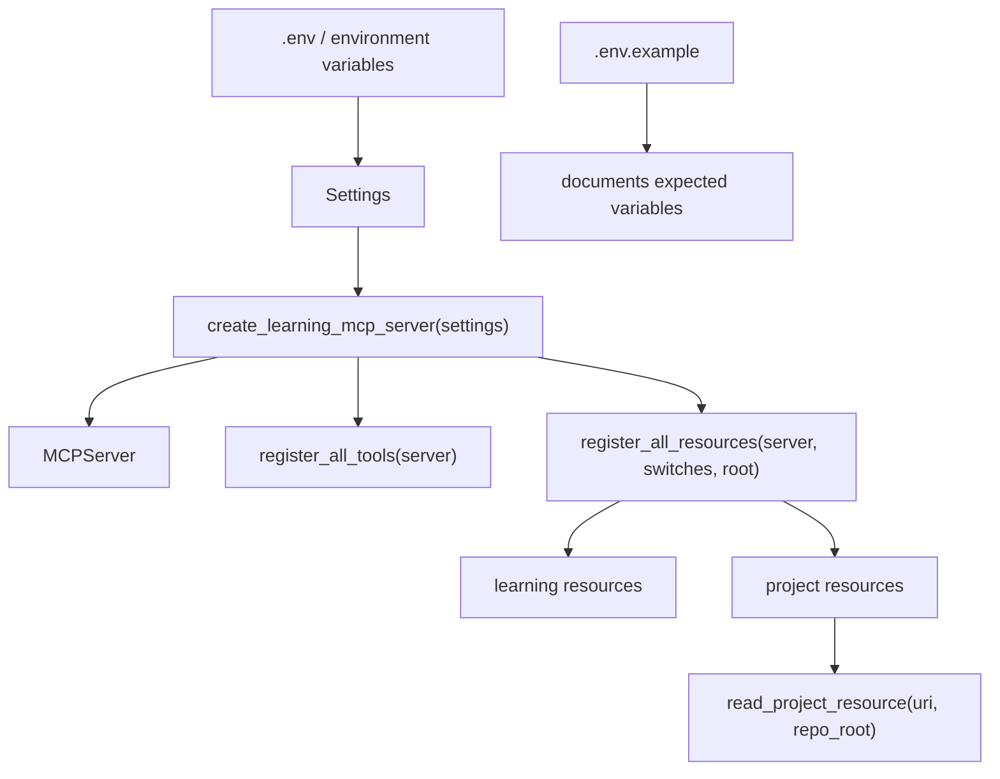

# 阶段 8 第 22 节：MCP 配置和环境变量

## 本节定位

第 21 节我们把 MCP Server 拆成了更清楚的工程结构：

```text
minimal_server.py              兼容入口
server_factory.py              创建并装配 MCPServer
tool_registration.py           注册 MCP Tools
resource_registration.py       注册 MCP Resources
```

有了这个结构后，第 22 节就可以继续做工程化：

```text
把 MCP Server 的运行参数配置化。
```

为什么现在才做配置？

因为如果还停留在单文件 demo：

```text
MCPServer("ai-service-learning-mcp")
@mcp.resource(...)
```

配置会很难放。

现在有了 `server_factory.py`，配置就有了明确入口。

本节要解决的问题是：

```text
哪些 MCP 信息可以写在代码里？
哪些 MCP 信息应该放进 Settings？
哪些 MCP 信息可以写进 .env.example？
哪些 MCP 信息绝对不能暴露给模型？
```

本节不是为了“配置而配置”。

本节真正要学的是：

```text
AI 工具项目里，配置既影响运行方式，也影响安全边界。
```

## 本节学习目标

学完本节，你要能说清楚：

```text
1. 为什么 MCP Server 需要配置。
2. .env 和 .env.example 分别是什么。
3. 为什么真实 .env 不应该上传 GitHub。
4. MCP server name 为什么适合配置化。
5. 为什么 Resource 是否启用适合配置化。
6. 为什么 Resource 根路径可以配置，但不能暴露给模型。
7. Java service URL、internal token、API key 这类配置为什么不能做成 MCP Resource。
8. Settings 如何读取环境变量。
9. server_factory 如何使用 Settings 创建 MCPServer。
10. 测试里如何验证默认配置和自定义配置。
```

## 本节不做什么

本节不做真实外部服务调用。

不做：

```text
不启动 VMware Ubuntu。
不启动 Docker。
不启动 Qdrant。
不启动 Milvus。
不启动 MySQL。
不启动 Redis。
不调用真实大模型。
不调用真实 embedding。
不生成手动测试文档。
不做敏感信息扫描，除非之后你要求上传 GitHub。
```

本节会改代码，但只围绕：

```text
Settings。
.env.example。
MCP Server factory。
MCP Resource 注册开关。
配置相关测试。
```

## 基础知识铺垫

### 1. 什么是配置

配置就是：

```text
不应该写死在代码里，但运行时又必须知道的参数。
```

例如：

```text
服务名称。
端口。
数据库地址。
上游服务地址。
API key。
超时时间。
是否启用某个功能。
日志级别。
```

这些东西有一个共同点：

```text
不同环境可能不一样。
```

比如：

```text
本地开发用 http://127.0.0.1:8001。
测试环境用 http://java-business-service:18004。
生产环境用内部域名。
```

如果把这些写死进代码，每换一个环境就要改代码。

这不合理。

正确做法是：

```text
代码写默认值和读取规则。
环境变量提供具体值。
```

### 2. 什么是环境变量

环境变量是操作系统或进程启动时提供给程序的键值对。

形式类似：

```text
MCP_SERVER_NAME="ai-service-learning-mcp"
MCP_ENABLE_PROJECT_RESOURCES=true
```

Python 程序启动后可以读取这些值。

在本项目里，不直接手写 `os.getenv()` 到处读。

我们用：

```text
Pydantic Settings
```

也就是：

```text
app/core/config.py 里的 Settings 类。
```

它统一负责：

```text
读取 .env。
读取环境变量。
类型转换。
默认值。
基础校验。
敏感字段 repr=False。
```

### 3. 什么是 `.env`

`.env` 是本机真实配置文件。

它可能包含：

```text
真实 API key。
真实 base_url。
真实数据库密码。
真实 token。
本机路径。
```

所以它通常不能上传 GitHub。

原因是：

```text
.env 可能包含敏感信息。
```

本项目里你之前也问过 `.env` 在哪里。

它的位置是：

```text
projects/ai-service/.env
```

如果存在，它是本机私有配置。

### 4. 什么是 `.env.example`

`.env.example` 是示例配置文件。

它的作用是：

```text
告诉别人这个项目需要哪些环境变量。
告诉别人每个变量大概应该怎么写。
给出安全的默认示例。
```

它应该上传 GitHub。

但它里面不能放真实 secret。

例如可以写：

```text
LLM_API_KEY=""
MCP_SERVER_NAME="ai-service-learning-mcp"
```

不能写：

```text
LLM_API_KEY="真实 key"
```

一句话：

```text
.env 是本机真实值。
.env.example 是给别人看的模板。
```

### 5. 什么配置可以公开

一般可以公开的配置：

```text
服务名称。
默认超时时间。
功能开关名称。
本地开发示例地址。
向量维度示例。
集合名称示例。
```

例如：

```text
MCP_SERVER_NAME="ai-service-learning-mcp"
MCP_ENABLE_PROJECT_RESOURCES=true
```

这些通常不算敏感。

它们可以出现在：

```text
.env.example。
学习笔记。
README。
测试。
```

### 6. 什么配置不能公开

不能公开的配置：

```text
API key。
internal token。
数据库密码。
云服务密钥。
真实用户隐私。
真实业务系统内网地址。
```

这些不能出现在：

```text
GitHub。
MCP Resource。
模型上下文。
日志。
错误信息。
```

注意这里特别强调：

```text
不能出现在 MCP Resource。
```

因为 MCP Resource 是给 AI Client 读取上下文的。

如果你把 `.env` 暴露成 Resource，模型就可能读到 secret。

所以本节只是让 MCP 运行时读取配置。

不是让 MCP 把配置暴露出去。

### 7. 配置和 Resource 是两回事

这是本节最容易混淆的点。

配置：

```text
程序运行时使用。
```

Resource：

```text
给 MCP Client 或模型读取的上下文资料。
```

例如：

```text
MCP_PROJECT_RESOURCE_ROOT
```

这是配置。

它告诉程序：

```text
从哪个仓库根目录读取项目文档。
```

但这个路径本身不应该作为 Resource 暴露给模型。

因为模型不需要知道你的本机路径。

更不能通过这个路径读取任意文件。

### 8. 为什么 MCP Server name 适合配置化

MCP Server name 是 MCP Server 的身份标识。

当前默认是：

```text
ai-service-learning-mcp
```

本地学习时这个名字没问题。

但不同场景可能想用不同名字：

```text
ai-service-learning-mcp-local
ai-service-learning-mcp-test
customer-service-mcp
```

所以它适合配置化。

本节新增：

```text
MCP_SERVER_NAME
```

默认值仍然是：

```text
ai-service-learning-mcp
```

这保证旧行为不变。

### 9. 为什么 Resource 开关适合配置化

当前 MCP Server 有两类 Resources：

```text
学习资源：learning://hello/{name}
项目文档资源：learning://project/readme 等。
```

学习资源适合 demo。

项目文档资源适合本学习项目。

但未来不同运行环境可能不希望暴露项目文档。

例如：

```text
测试某个纯工具时，不需要 Resources。
某个环境只想暴露 Tools。
某个环境不想让 AI Client 读取项目文档。
```

所以本节新增：

```text
MCP_ENABLE_LEARNING_RESOURCES
MCP_ENABLE_PROJECT_RESOURCES
```

默认都是：

```text
true
```

这样不破坏第 17-21 节已有行为。

### 10. 为什么 Resource 根路径适合配置化

当前项目文档 Resource 默认会自动向上查找仓库根目录。

也就是：

```text
找到有 README.md 和 projects/ai-service 的目录。
```

这对本地学习很方便。

但未来可能出现：

```text
测试时用临时目录。
部署时挂载只读文档目录。
CI 中用不同 workspace。
```

所以本节新增：

```text
MCP_PROJECT_RESOURCE_ROOT
```

默认空字符串：

```text
MCP_PROJECT_RESOURCE_ROOT=""
```

表示：

```text
自动探测仓库根目录。
```

如果显式设置，就从指定目录读取白名单文档。

### 11. 为什么 Java 地址和 token 不在本节大改

阶段 7 已经有：

```text
JAVA_MOCK_SERVICE_BASE_URL
JAVA_MOCK_SERVICE_TIMEOUT_SECONDS
```

真实 Java business service 相关边界也在前面学过。

本节不大改 Java client，是因为：

```text
本节目标是 MCP 配置入口。
不是重新设计 Java 调用链路。
```

但是你要知道：

```text
Java service base_url、internal token、timeout 都属于运行时配置。
它们可以被工具 adapter 使用。
但不应该暴露成 MCP Resource。
```

后续如果把 MCP 工具正式切到真实 Java business service，也应该继续沿用 Settings，而不是把地址和 token 写死。

### 12. 配置默认值为什么要谨慎

配置默认值不是随便写。

默认值应该满足：

```text
本地学习能跑。
测试稳定。
不会默认暴露危险能力。
不会默认调用真实收费服务。
```

本节默认：

```text
MCP_SERVER_NAME="ai-service-learning-mcp"
MCP_ENABLE_LEARNING_RESOURCES=true
MCP_ENABLE_PROJECT_RESOURCES=true
MCP_PROJECT_RESOURCE_ROOT=None
```

这样保持原行为。

但如果未来新增危险写工具，默认开关就不能随便 true。

例如：

```text
MCP_ENABLE_DANGEROUS_WRITE_TOOLS=false
```

这类默认应该保守。

### 13. 配置测试为什么重要

配置经常被忽视。

但实际项目里很多线上问题都来自配置：

```text
环境变量名字写错。
bool 没有正确转换。
URL 末尾多了斜杠。
空字符串被当成真实 key。
路径指向错误目录。
某个功能开关默认值不对。
```

所以配置必须测试。

本节补了：

```text
默认 MCP 配置测试。
环境变量读取测试。
.env 文件读取测试。
MCP server name 非空校验。
factory 使用 MCP Settings 的测试。
禁用 Resources 后 list_resources 为空的测试。
```

这些测试不是为了凑数量。

它们保护的是：

```text
配置真的能影响 MCP Server 装配。
```

## 本节主题系统讲解

### 1. 本节新增了哪些配置

本节在 `Settings` 中新增：

```python
mcp_server_name: str = Field(
    default="ai-service-learning-mcp",
    min_length=1,
    max_length=100,
)
mcp_enable_learning_resources: bool = Field(default=True)
mcp_enable_project_resources: bool = Field(default=True)
mcp_project_resource_root: str | None = Field(default=None)
```

对应 `.env.example`：

```text
MCP_SERVER_NAME="ai-service-learning-mcp"
MCP_ENABLE_LEARNING_RESOURCES=true
MCP_ENABLE_PROJECT_RESOURCES=true
MCP_PROJECT_RESOURCE_ROOT=""
```

这四个配置分别解决：

| 配置 | 作用 | 是否敏感 |
| --- | --- | --- |
| `MCP_SERVER_NAME` | MCP Server 名称 | 否 |
| `MCP_ENABLE_LEARNING_RESOURCES` | 是否启用 hello 这种学习资源 | 否 |
| `MCP_ENABLE_PROJECT_RESOURCES` | 是否暴露项目文档资源 | 否，但会影响安全边界 |
| `MCP_PROJECT_RESOURCE_ROOT` | 项目文档资源根目录 | 通常不算 secret，但不应暴露给模型 |

### 2. `resolved_mcp_server_name`

新增属性：

```python
@property
def resolved_mcp_server_name(self) -> str:
    server_name = self.mcp_server_name.strip()
    return server_name or "ai-service-learning-mcp"
```

它的作用是：

```text
去掉首尾空格。
如果是纯空白，则回退到默认 server name。
```

为什么不直接用 `mcp_server_name`？

因为环境变量很容易写成：

```text
MCP_SERVER_NAME=" local-learning-mcp "
```

如果不 strip，Server 名字会带空格。

这不是我们想要的。

### 3. `resolved_mcp_project_resource_root`

新增属性：

```python
@property
def resolved_mcp_project_resource_root(self) -> Path | None:
    if not self.mcp_project_resource_root or not self.mcp_project_resource_root.strip():
        return None
    return Path(self.mcp_project_resource_root.strip()).expanduser().resolve()
```

它的作用是：

```text
如果没配置，返回 None。
如果配置了路径，转换成 Path。
支持 ~。
解析成绝对路径。
```

为什么返回 `Path | None`？

因为：

```text
None 表示继续使用自动探测仓库根目录。
Path 表示使用用户显式指定的根目录。
```

这比用空字符串在业务代码里到处判断更清楚。

### 4. `server_factory.py` 如何使用配置

现在 `create_learning_mcp_server()` 变成：

```python
def create_learning_mcp_server(
    settings: Settings | None = None,
    *,
    name: str | None = None,
) -> MCPServer:
    resolved_settings = settings or get_settings()
    server = MCPServer(name or resolved_settings.resolved_mcp_server_name)
    register_all_tools(server)
    register_all_resources(
        server,
        include_learning_resources=resolved_settings.mcp_enable_learning_resources,
        include_project_resources=resolved_settings.mcp_enable_project_resources,
        project_resource_root=resolved_settings.resolved_mcp_project_resource_root,
    )
    return server
```

逐句理解。

第一句：

```python
resolved_settings = settings or get_settings()
```

意思是：

```text
如果调用方显式传 Settings，就用传入的。
如果没传，就读取默认 Settings。
```

这对测试很重要。

测试可以传：

```python
Settings(_env_file=None)
```

避免受本机 `.env` 影响。

第二句：

```python
server = MCPServer(name or resolved_settings.resolved_mcp_server_name)
```

意思是：

```text
如果函数参数显式传 name，就优先用 name。
否则用配置里的 MCP server name。
```

第三句：

```python
register_all_resources(...)
```

把配置开关传给资源注册层。

这样 factory 不需要知道具体有哪些 Resource。

它只负责：

```text
把配置交给注册层。
```

### 5. 为什么 factory 接收 `settings`

如果 factory 直接在内部永远调用：

```python
get_settings()
```

测试会不方便。

因为 `get_settings()` 默认会读本机 `.env`。

而本机 `.env` 可能每个人不一样。

所以更好的写法是：

```text
生产运行：不传 settings，让它读真实配置。
测试运行：显式传 Settings(_env_file=None) 或测试用 Settings。
```

这就是依赖注入的思想。

你可以类比 Java：

```text
不要在方法里到处 new 配置。
应该让配置从外部注入。
```

### 6. Resource 注册如何支持开关

现在 `register_all_resources()` 变成：

```python
def register_all_resources(
    server: MCPServer,
    *,
    include_learning_resources: bool = True,
    include_project_resources: bool = True,
    project_resource_root: Path | None = None,
) -> None:
    if include_learning_resources:
        register_learning_resources(server)
    if include_project_resources:
        register_project_resources(
            server,
            project_resource_root=project_resource_root,
        )
```

这个函数把资源分成两组：

```text
learning resources。
project resources。
```

开关控制的是：

```text
是否注册。
```

如果不注册，MCP Client 的 `resources/list` 就看不到这些 Resource。

这比注册以后再在读取时拒绝更干净。

因为：

```text
不想暴露，就不要出现在 list_resources 里。
```

### 7. Resource 根路径如何传下去

本节修改：

```python
read_project_resource(uri: str, *, repo_root: Path | None = None)
```

以前它只能自动探测仓库根目录。

现在可以：

```text
repo_root=None：自动探测。
repo_root=Path(...)：使用配置传入的根目录。
```

注册时通过：

```python
build_project_resource_reader(
    "learning://project/readme",
    function_name="project_readme_resource",
    project_resource_root=project_resource_root,
)
```

生成一个闭包。

这个闭包记住：

```text
我要读取哪个 URI。
我要用哪个 root。
```

### 8. 什么是闭包

闭包是一个函数，它记住了创建它时所在作用域里的变量。

本节的例子：

```python
def build_project_resource_reader(uri: str, *, project_resource_root: Path | None):
    def read_resource() -> str:
        return read_project_resource(uri, repo_root=project_resource_root)

    return read_resource
```

`read_resource()` 里面用到了：

```text
uri
project_resource_root
```

这两个变量来自外层函数。

即使外层函数已经执行完，内层函数仍然记得它们。

这就是闭包。

为什么这里用闭包？

因为 MCP Resource 函数本身不能随便多暴露一个 `project_resource_root` 参数。

如果写成：

```python
def project_readme_resource(project_resource_root: Path | None = None):
    ...
```

MCP SDK 可能会把它理解成 Resource 函数参数。

所以更好的做法是：

```text
注册时用闭包把配置藏在函数内部。
对 MCP Client 暴露的 Resource URI 不变。
```

### 9. 为什么设置 `__name__`

闭包函数默认名字叫：

```text
read_resource
```

如果所有项目资源都用这个名字，调试快照里可能看到多个同名 Resource。

为了保持原来更清晰的名字，本节设置：

```python
read_resource.__name__ = function_name
```

这样：

```text
learning://project/readme 对应 project_readme_resource。
learning://project/progress 对应 project_progress_resource。
```

这个细节不是业务功能。

但它体现一个工程习惯：

```text
重构时尽量保持可观察信息稳定。
```

### 10. 为什么 `.env.example` 要写注释

本节新增：

```text
# Optional. Leave blank to auto-detect the learning repository root.
# Do not point this at a directory containing secrets such as .env files.
MCP_PROJECT_RESOURCE_ROOT=""
```

这不是多余。

因为 `MCP_PROJECT_RESOURCE_ROOT` 是一个容易误用的配置。

用户可能以为：

```text
我随便指向一个目录就行。
```

但如果这个目录包含 `.env` 或私密文件，就有风险。

虽然项目资源仍然走白名单相对路径，但配置根目录本身也应该谨慎。

所以示例文件要提醒：

```text
不要指向包含敏感文件的目录。
```

### 11. 本节没有暴露配置 Resource

本节没有新增：

```text
learning://project/config
learning://project/env
```

原因是：

```text
配置不是默认给模型看的资料。
```

特别是 `.env`。

绝对不能作为 MCP Resource 暴露。

如果未来真的需要暴露“非敏感配置摘要”，也应该单独做：

```text
白名单字段。
脱敏。
只读。
不包含 key/token/password。
测试保证敏感字段不出现。
```

### 12. 本节测试讲解

本节修改了 `test_config.py`。

新增检查：

```text
默认 mcp_server_name。
默认 resource 开关。
默认 resource root。
环境变量读取 MCP 配置。
.env 文件读取 MCP 配置。
mcp_server_name 不能为空。
```

本节还修改了 `test_minimal_mcp_server.py`。

新增测试：

```text
test_mcp_server_factory_uses_mcp_settings()
```

它验证：

```text
自定义 mcp_server_name 能设置到 MCPServer.name。
关闭 learning resources 后没有 hello template。
关闭 project resources 后 resources/list 为空。
Tools 不受资源开关影响，query_order 仍然存在。
```

为什么 tools 仍然存在？

因为本节只配置 Resource 开关。

Tool 开关属于更高风险设计，后面如果做，需要按读写工具、安全等级、环境来设计。

## 本节代码变更

本节修改：

```text
projects/ai-service/app/core/config.py
projects/ai-service/.env.example
projects/ai-service/app/mcp_servers/server_factory.py
projects/ai-service/app/mcp_servers/resource_registration.py
projects/ai-service/app/mcp_servers/project_resources.py
projects/ai-service/tests/test_config.py
projects/ai-service/tests/test_minimal_mcp_server.py
projects/ai-service/tests/test_mcp_contracts.py
```

本节新增笔记：

```text
notes/stage8-22-mcp-config-and-env.md
```

### 代码关系图



这张图说明：

```text
.env.example 只是说明。
.env / 环境变量提供值。
Settings 负责读取和校验。
server_factory 使用 Settings 装配 MCPServer。
resource_registration 根据配置决定注册哪些 Resource。
project_resources 根据配置 root 读取白名单文件。
```

## 常见误区

### 误区 1：配置就是写进 `.env.example`

不对。

`.env.example` 只是示例。

真正让代码读到配置，需要在：

```text
Settings 类里定义字段。
代码里使用 Settings。
测试里覆盖配置读取。
```

### 误区 2：`.env.example` 可以写真实 key

不对。

`.env.example` 会上传 GitHub。

里面只能写空值或假示例。

真实 key 只能在本机 `.env` 或安全的部署密钥系统里。

### 误区 3：MCP Resource 可以暴露配置

通常不应该。

Resource 是给 AI Client 读取的上下文。

配置是程序运行参数。

尤其是 API key、token、数据库密码、internal token，绝对不能通过 MCP Resource 暴露。

### 误区 4：功能开关越多越好

不对。

功能开关太多，会让系统组合复杂度上升。

本节只做了两个 Resource 开关：

```text
MCP_ENABLE_LEARNING_RESOURCES
MCP_ENABLE_PROJECT_RESOURCES
```

因为它们确实有明确用途。

Tool 开关暂时没有做，是因为读写工具分级更复杂，需要单独设计。

### 误区 5：配置化就是所有东西都能改

不对。

配置化也要有边界。

例如：

```text
允许配置 Resource 根目录。
但仍然只允许读取白名单 URI 对应的相对文件。
```

不能因为 root 可配置，就允许模型读任意路径。

## 和前后课程的关系

### 和第 21 节的关系

第 21 节先拆出：

```text
server_factory.py
resource_registration.py
```

第 22 节才能自然把配置传进去。

如果没有第 21 节，配置很可能又堆回 `minimal_server.py`。

### 和第 23 节的关系

第 23 节要做可观测性。

配置会继续发挥作用。

例如未来可能新增：

```text
MCP_LOG_TOOL_CALLS=true
MCP_TRACE_ENABLED=true
MCP_SLOW_TOOL_THRESHOLD_MS=1000
```

这些都应该通过 Settings 管理。

### 和真实生产项目的关系

真实生产项目里，配置通常不只来自 `.env`。

还可能来自：

```text
Kubernetes Secret。
Docker Compose env。
CI/CD secret。
云平台配置中心。
Vault。
```

但本地学习阶段用 `.env` 和 `Settings` 就够了。

重要的是先建立习惯：

```text
不要把运行环境写死进代码。
不要把 secret 上传。
不要把配置暴露给模型。
```

## 练习题

### 练习 1：`.env` 和 `.env.example` 有什么区别？

参考答案：

```text
.env 是本机真实配置，可能包含真实 API key、token、路径和服务地址，通常不应该上传 GitHub。.env.example 是示例配置，应该上传 GitHub，用来告诉别人需要哪些环境变量，但里面只能放空值或安全示例，不能放真实 secret。
```

### 练习 2：为什么 `MCP_PROJECT_RESOURCE_ROOT` 不能直接暴露给模型？

参考答案：

```text
因为它是运行时配置，可能包含本机路径或部署路径。模型不需要知道这些路径。Resource 应该暴露白名单资料，而不是暴露程序如何找到这些资料的内部路径。
```

### 练习 3：为什么关闭 `MCP_ENABLE_PROJECT_RESOURCES` 后，最好让资源不出现在 `resources/list`？

参考答案：

```text
如果不想暴露某类 Resource，最干净的做法是注册阶段就不注册它。这样 MCP Client 在 resources/list 里看不到这些 URI，也不会误以为可以读取它们。比读取时再拒绝更清晰。
```

### 练习 4：为什么 `create_learning_mcp_server()` 要支持传入 `Settings`？

参考答案：

```text
这样测试可以传 Settings(_env_file=None) 或自定义 Settings，避免受本机 .env 影响。生产运行时不传 settings，则使用 get_settings() 读取真实配置。这是依赖注入思路，能让代码更可测试。
```

### 练习 5：为什么本节不把 Tool 开关也一起做了？

参考答案：

```text
Tool 开关涉及读写工具分级、安全策略、环境差异和模型工具选择变化，比 Resource 开关风险更高。本节先做低风险的 Resource 开关和 server name 配置，保持小步工程化，避免一次改太多。
```

## 自测题

### 自测 1：本节新增的 MCP 配置有哪些？

参考答案：

```text
MCP_SERVER_NAME、MCP_ENABLE_LEARNING_RESOURCES、MCP_ENABLE_PROJECT_RESOURCES、MCP_PROJECT_RESOURCE_ROOT。
```

### 自测 2：`MCP_SERVER_NAME` 的默认值是什么？

参考答案：

```text
ai-service-learning-mcp。
```

### 自测 3：`MCP_PROJECT_RESOURCE_ROOT=""` 表示什么？

参考答案：

```text
表示不显式指定项目资源根目录，继续由代码自动探测学习仓库根目录。
```

### 自测 4：本节配置化有没有改变默认 MCP 对外契约？

参考答案：

```text
没有。默认配置仍然启用学习资源和项目文档资源，工具名、Resource URI、title、mime_type 和写操作契约保持不变，并由 MCP 契约测试验证。
```

### 自测 5：为什么真实 API key 不能进入 MCP Resource？

参考答案：

```text
因为 MCP Resource 是给 AI Client 和模型读取的上下文。如果 API key 进入 Resource，模型或外部客户端就可能读到敏感凭证，造成泄露风险。
```

## 面试表达

如果别人问：

```text
你 MCP Server 的配置怎么做？
```

可以回答：

```text
我把 MCP Server 的运行配置接入了项目统一 Settings，包括 MCP_SERVER_NAME、是否启用学习资源、是否启用项目文档资源、项目文档资源根目录。server_factory 创建 MCPServer 时读取 Settings，并把 Resource 开关和 root 传给 resource_registration。默认配置保持原有工具和资源契约不变，测试里会验证默认配置、自定义配置和禁用 Resource 后的 list_resources 行为。
```

如果别人问：

```text
你怎么避免 MCP 暴露敏感配置？
```

可以回答：

```text
我把配置和 Resource 分开处理。配置用于程序运行，比如 server name、资源开关、资源根目录、上游服务地址和 token；Resource 只暴露白名单文档。真实 .env、API key、internal token、数据库密码不会作为 MCP Resource 暴露，也不会写进 .env.example。后续如果需要暴露配置摘要，也必须做字段白名单和脱敏测试。
```

如果别人问：

```text
为什么要让 factory 支持传入 Settings？
```

可以回答：

```text
这样生产运行可以用 get_settings() 读取真实环境，测试时可以注入 Settings(_env_file=None) 或自定义 Settings，避免测试依赖本机 .env。这个设计让 MCP Server 装配过程更可测试，也方便后续按环境启用或禁用资源、配置 server name 和可观测性开关。
```

## 本节小结

本节完成了 MCP 配置和环境变量的第一步工程化。

核心变化是：

```text
Settings 新增 MCP 配置字段。
.env.example 新增 MCP 配置示例。
server_factory 使用 Settings 创建 MCPServer。
resource_registration 根据配置决定是否注册 Resources。
project_resources 支持配置化 repo_root。
测试覆盖默认配置、自定义配置和 Resource 开关。
```

你要记住的重点是：

```text
配置是给程序运行用的。
Resource 是给 AI Client 读取上下文用的。
secret 不能上传 GitHub，也不能暴露给模型。
```

下一节进入：

```text
阶段 8 第 23 节：MCP 可观测性
```

下一节会继续在当前结构上补：

```text
工具调用日志。
trace_id。
工具调用耗时。
错误码统计意识。
如何排查一次 MCP 工具调用。
```
