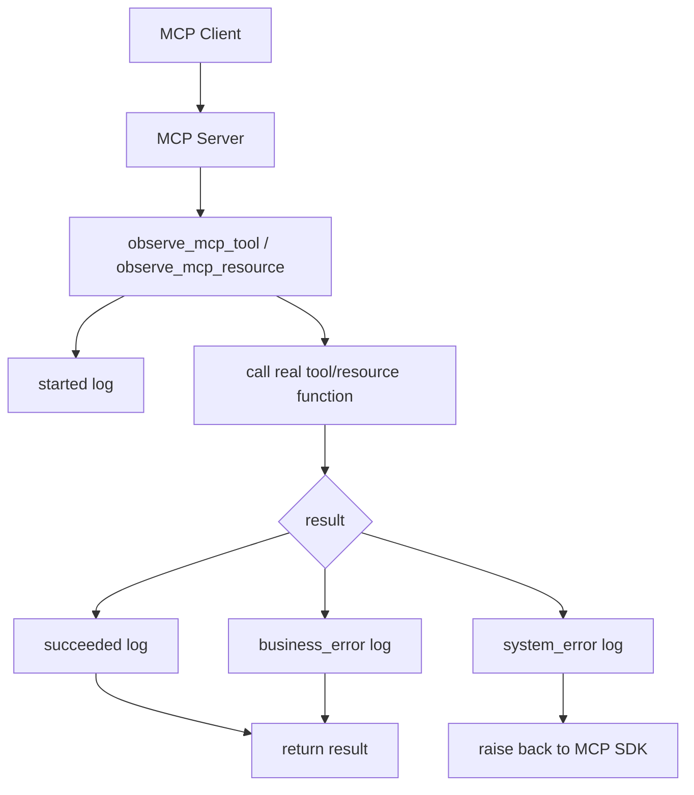

# 阶段 8 第 23 节：MCP 可观测性

## 本节定位

前面两节已经把 MCP Server 从 demo 继续往工程化推进：

```text
第 21 节：MCP Server 工程结构整理。
第 22 节：MCP 配置和环境变量。
```

现在我们继续补第三个工程化能力：

```text
MCP 可观测性。
```

可观测性要解决的问题是：

```text
系统出问题时，我能不能看明白发生了什么？
```

放到 MCP 里，就是：

```text
模型有没有请求工具？
MCP Client 有没有调用工具？
调用的是哪个 tool？
这个 tool 是读操作还是写操作？
这次调用成功了吗？
如果失败，是业务失败还是系统失败？
错误码是什么？
耗时多少？
trace_id 是什么？
有没有读 Resource？
读的是哪个 Resource？
日志里有没有泄露用户输入、工具参数、工具返回正文、API key、token？
```

本节不是为了“多打几行日志”。

本节真正要学的是：

```text
AI 工具调用链路必须能排查，但排查信息不能变成新的泄露风险。
```

## 本节学习目标

学完本节，你要能说清楚：

```text
1. 什么是可观测性。
2. 日志、trace_id、elapsed_ms 分别解决什么问题。
3. MCP Tool 调用应该记录哪些安全字段。
4. MCP Resource 读取应该记录哪些安全字段。
5. 为什么不能记录工具参数原文和工具返回正文。
6. 业务失败和系统失败在日志里怎么区分。
7. 为什么可观测性适合放在 registration 层统一包装。
8. `observe_mcp_tool()` 和 `observe_mcp_resource()` 做了什么。
9. 如何用测试验证日志有用且不泄露敏感信息。
10. 面试时怎么讲 MCP 可观测性。
```

## 本节不做什么

本节不做真实服务联调。

不做：

```text
不启动 VMware Ubuntu。
不启动 Docker。
不启动 Qdrant。
不启动 Milvus。
不启动 MySQL。
不启动 Redis。
不调用真实大模型。
不调用真实 embedding。
不生成手动测试文档。
不做敏感信息扫描，除非之后你要求上传 GitHub。
```

本节会改代码，但范围只在：

```text
MCP 工具调用日志。
MCP Resource 读取日志。
可观测性测试。
学习笔记和索引更新。
```

## 基础知识铺垫

### 1. 什么是可观测性

可观测性不是一个单独技术。

它是一组能力：

```text
日志 logs。
指标 metrics。
追踪 traces。
错误事件 errors。
```

它们共同回答：

```text
系统运行时发生了什么？
为什么变慢？
为什么失败？
失败发生在哪一步？
影响范围有多大？
```

本节先做最基础、最直接的一层：

```text
日志 + trace_id + elapsed_ms。
```

这对当前学习阶段足够。

### 2. 日志是什么

日志就是程序运行时记录下来的事件。

例如：

```text
mcp_tool_call_started trace_id=xxx tool_name=query_order action_type=read
mcp_tool_call_finished trace_id=xxx tool_name=query_order status=succeeded elapsed_ms=12.35
```

日志的价值是：

```text
事后排查。
定位失败。
看调用顺序。
看耗时。
看错误码。
```

没有日志时，只能猜。

有日志时，可以根据事实排查。

### 3. trace_id 是什么

trace_id 是一次请求或一次流程的追踪编号。

它的作用是：

```text
把同一次用户请求经过的多个模块日志串起来。
```

比如一次用户请求可能经过：

```text
FastAPI
-> LangGraph
-> MCP Tool
-> Python adapter
-> Java business service
-> MySQL / Redis
```

每一层都会产生日志。

如果没有 trace_id，你很难知道哪些日志属于同一次请求。

有 trace_id 后，可以搜索：

```text
trace_id=abc123
```

把整条链路串起来。

### 4. elapsed_ms 是什么

`elapsed_ms` 表示耗时，单位是毫秒。

例如：

```text
elapsed_ms=42.13
```

它回答：

```text
这一步花了多久？
```

这对排查性能问题很重要。

比如用户说：

```text
AI 客服回复很慢。
```

你要知道慢在哪里：

```text
模型调用慢？
RAG 检索慢？
MCP Tool 慢？
Java 服务慢？
向量数据库慢？
```

没有耗时字段，就只能猜。

### 5. MCP 为什么特别需要可观测性

MCP 处在 AI 应用和外部工具之间。

这层一旦出问题，用户看到的可能只是：

```text
AI 没有回答。
AI 说暂时不可用。
AI 没有创建工单。
AI 反复追问。
```

但真实原因可能是：

```text
模型没有选择工具。
模型选择了错误工具。
MCP Tool 参数校验失败。
写操作缺少用户确认。
MCP Tool 调 Java 超时。
Java 返回业务错误。
MCP Resource 读取失败。
工具返回被 Pydantic 校验拦截。
```

这些都需要日志帮助排查。

### 6. 业务失败和系统失败

本阶段前面已经多次强调：

```text
业务失败和系统失败不是一回事。
```

业务失败：

```text
订单不存在。
用户无权限。
缺少用户确认。
已经存在相似工单。
参数不符合业务规则。
```

这类失败通常是系统正常工作后给出的业务结果。

系统失败：

```text
上游服务超时。
网络错误。
内部异常。
返回结构不可信。
数据库连接失败。
```

这类失败说明系统某个环节出了技术问题。

日志里要区分：

```text
status=business_error
status=system_error
status=succeeded
```

这样后续统计和排查才清楚。

### 7. MCP Tool 日志应该记录什么

安全的 MCP Tool 日志应该记录：

```text
trace_id。
tool_name。
action_type。
status。
error_code。
error_type。
elapsed_ms。
```

例如：

```text
mcp_tool_call_finished trace_id=abc tool_name=create_ticket action_type=write status=business_error error_code=TOOL_CONFIRMATION_REQUIRED elapsed_ms=1.25
```

这些字段足够回答：

```text
调用了哪个工具？
是读还是写？
结果是什么？
错误码是什么？
耗时多少？
属于哪条链路？
```

### 8. MCP Tool 日志不应该记录什么

不要记录：

```text
完整工具参数。
完整工具返回。
用户原始消息。
手机号。
身份证。
地址。
订单内部备注。
API key。
token。
数据库密码。
模型完整输出。
```

原因是：

```text
日志通常会被长期保存。
日志可能被更多人查看。
日志可能进入集中日志平台。
```

如果日志里有敏感信息，泄露面会扩大。

所以本节测试会明确检查：

```text
create_ticket 的标题和 requester_id 不出现在 MCP 日志里。
Resource 正文不出现在 MCP 日志里。
```

### 9. MCP Resource 日志应该记录什么

Resource 日志应该记录：

```text
trace_id。
resource_uri。
mime_type。
status。
error_type。
elapsed_ms。
```

例如：

```text
mcp_resource_read_finished trace_id=abc resource_uri=learning://project/stage8-plan mime_type=text/markdown status=succeeded elapsed_ms=3.42
```

这能回答：

```text
读了哪个资源？
资源类型是什么？
读成功了吗？
耗时多久？
属于哪条 trace？
```

### 10. MCP Resource 日志不应该记录什么

不要记录：

```text
Resource 正文。
完整 README。
完整学习进度。
完整契约文档。
完整本地路径。
.env 内容。
```

即使 Resource 本身是允许读的，也不代表要把正文写进日志。

日志只需要记录：

```text
读了哪个 URI。
是否成功。
耗时多少。
```

不需要记录：

```text
读出来的全文。
```

### 11. 为什么可观测性放在 registration 层

本节把日志包装放在：

```text
tool_registration.py
resource_registration.py
```

而不是每个业务 adapter 里。

原因是：

```text
registration 层正好是 MCP 对外调用入口。
```

所有 MCP Tool 都从这里注册。

所以在这里统一包装，可以保证：

```text
每个 MCP Tool 都有统一 started/finished/failed 日志。
每个 Resource 都有统一 read started/read finished/read failed 日志。
不需要在每个 adapter 里重复写一遍日志模板。
```

业务 adapter 仍然可以有自己的业务日志。

但 MCP 层日志应该统一。

### 12. 为什么不用复杂 tracing 框架

项目前面已经学过更复杂的 tracing 和 OTel 概念。

但本节没有引入新的 tracing 框架。

原因是：

```text
当前目标是学习 MCP 可观测性基础。
日志 + trace_id + elapsed_ms 已经能解决本节核心问题。
```

引入复杂框架会分散注意力。

后续如果进入更高级工程化，可以再接：

```text
OpenTelemetry spans。
metrics。
集中日志平台。
分布式 tracing。
```

本节先把基础打稳。

## 本节主题系统讲解

### 1. 本节新增文件

本节新增：

```text
projects/ai-service/app/mcp_servers/observability.py
```

它提供两个函数：

```text
observe_mcp_tool()
observe_mcp_resource()
```

它们的作用是：

```text
在 MCP Tool / Resource 函数外面包一层安全日志。
```

### 2. `observe_mcp_tool()` 做什么

它接收：

```python
tool_name: str
action_type: str
```

例如：

```python
observe_mcp_tool(tool_name="query_order", action_type="read")(query_order)
```

它会记录三类事件。

开始：

```text
mcp_tool_call_started
```

成功或业务失败结束：

```text
mcp_tool_call_finished
```

系统异常：

```text
mcp_tool_call_failed
```

### 3. Tool status 怎么判断

本节 helper 里有一个判断：

```python
def _classify_tool_result(result: object) -> tuple[str, str | None]:
    if isinstance(result, dict) and result.get("ok") is False:
        error_code = result.get("error_code")
        return "business_error", str(error_code) if error_code else None
    return "succeeded", None
```

意思是：

```text
如果工具返回 dict，并且 ok=false，就认为是业务失败。
否则认为成功。
```

为什么这样判断？

因为我们前面设计 MCP Tool 时，业务错误就是：

```text
structured_content.ok=false
structured_content.error_code=...
```

系统错误则通常会抛异常，最后由 MCP SDK 变成 `is_error=true`。

所以 wrapper 可以区分：

```text
业务失败：函数正常返回 ok=false。
系统失败：函数抛异常。
```

### 4. 为什么包装器用 `@wraps`

代码里用了：

```python
@wraps(function)
```

这是非常关键的细节。

原因是 MCP SDK 需要根据函数签名生成 input schema。

如果不用 `@wraps`，包装器函数可能看起来像：

```python
def wrapper(*args, **kwargs):
    ...
```

这样 MCP SDK 可能无法正确识别：

```text
order_id。
requester_id。
title。
confirmation_id。
```

用了 `@wraps`，Python 会保留原函数的元信息。

第 19 节契约测试也能证明：

```text
包装后 query_order 和 create_ticket 的 input_schema 没有坏。
```

### 5. `observe_mcp_resource()` 做什么

它接收：

```python
resource_uri: str
mime_type: str
```

例如：

```python
observe_mcp_resource(
    resource_uri="learning://project/stage8-plan",
    mime_type="text/markdown",
)(stage8_plan_resource)
```

它记录：

```text
mcp_resource_read_started
mcp_resource_read_finished
mcp_resource_read_failed
```

日志里只包含：

```text
trace_id。
resource_uri。
mime_type。
status。
error_type。
elapsed_ms。
```

不会记录 Resource 正文。

### 6. Tool registration 如何接入

以前注册：

```python
server.tool()(add)
```

现在注册：

```python
server.tool()(observe_mcp_tool(tool_name="add", action_type="demo")(add))
```

也就是说：

```text
先把 add 包一层日志。
再注册成 MCP Tool。
```

业务工具也是：

```python
server.tool()(observe_mcp_tool(tool_name="query_order", action_type="read")(query_order))
server.tool()(observe_mcp_tool(tool_name="create_ticket", action_type="write")(create_ticket))
```

这让日志字段里明确区分：

```text
read。
write。
demo。
validation。
diagnostic。
```

### 7. Resource registration 如何接入

以前：

```python
server.resource("learning://project/stage8-plan", ...)(stage8_plan_resource)
```

现在：

```python
server.resource("learning://project/stage8-plan", ...)(
    observe_mcp_resource(
        resource_uri="learning://project/stage8-plan",
        mime_type="text/markdown",
    )(stage8_plan_resource)
)
```

意思是：

```text
Resource 读取函数也包一层日志。
```

这样每次 `read_resource()` 都能看到开始和结束日志。

### 8. 本节新增测试

本节新增：

```text
projects/ai-service/tests/test_mcp_observability.py
```

它覆盖四个场景。

第一：

```text
工具成功调用日志。
```

调用：

```text
add
```

验证日志有：

```text
mcp_tool_call_started。
mcp_tool_call_finished。
tool_name=add。
action_type=demo。
status=succeeded。
elapsed_ms。
trace_id。
```

同时验证没有记录：

```text
a=7。
b=5。
```

第二：

```text
工具业务失败日志。
```

调用：

```text
create_ticket，user_confirmed=false。
```

验证日志有：

```text
tool_name=create_ticket。
action_type=write。
status=business_error。
error_code=TOOL_CONFIRMATION_REQUIRED。
```

同时验证没有记录：

```text
订单标题。
requester_id。
```

第三：

```text
工具系统失败日志。
```

调用：

```text
simulate_tool_error_handling，scenario=upstream_timeout。
```

验证日志有：

```text
mcp_tool_call_failed。
status=system_error。
error_type=ToolError。
```

同时验证没有记录：

```text
database_password。
java-business-service。
```

第四：

```text
Resource 读取日志。
```

读取：

```text
learning://project/stage8-plan。
```

验证日志有：

```text
resource_uri。
mime_type。
status=succeeded。
elapsed_ms。
trace_id。
```

同时验证没有记录：

```text
Resource 正文。
```

### 9. 为什么测试用 `caplog`

`caplog` 是 pytest 捕获日志的工具。

它可以让测试检查：

```text
程序有没有打出某条日志。
日志里有没有某个字段。
日志里有没有不该出现的敏感内容。
```

这很适合本节。

因为本节的核心不是返回值，而是：

```text
日志是否有用且安全。
```

### 10. trace_id 如何进入日志

测试里用：

```python
trace_token = set_trace_id("trace-mcp-tool-001")
...
reset_trace_id(trace_token)
```

这使用了项目已有的：

```text
app/core/trace.py
```

MCP observability helper 里调用：

```python
get_trace_id()
```

然后把 trace_id 放进日志。

这让 MCP 日志可以和 FastAPI、LangGraph、Java client 日志串起来。

### 11. 为什么不记录参数

以 `create_ticket` 为例，参数里可能有：

```text
requester_id。
title。
description。
related_order_id。
confirmation_id。
```

这里有些字段可能敏感。

比如 description 可能包含：

```text
手机号。
地址。
身份证。
用户隐私。
```

所以本节日志不记录参数。

如果未来确实要排查参数问题，更合理的是记录：

```text
参数字段是否存在。
字段数量。
校验错误码。
脱敏后的字段摘要。
```

而不是直接记录完整参数。

### 12. 为什么不记录结果

Tool 返回结果也可能敏感。

例如订单查询结果可能包含：

```text
订单状态。
物流信息。
内部备注。
用户信息。
```

虽然我们已经做了输出白名单，但日志仍然不应该默认写完整结果。

原因是：

```text
日志留存时间长。
日志访问人员可能更多。
日志平台可能和业务数据库权限不同。
```

所以日志只记录：

```text
status。
error_code。
elapsed_ms。
```

不记录：

```text
result。
ticket。
content。
```

### 13. 当前可观测性还欠缺什么

本节只是第一步。

还没有做：

```text
OpenTelemetry span。
metrics 指标。
工具调用次数统计。
错误码聚合报表。
慢调用阈值告警。
MCP Client 侧日志。
跨进程 trace propagation。
真实远程 MCP transport 观测。
```

这些以后可以继续补。

但当前学习阶段已经有了关键基础：

```text
started。
finished。
failed。
trace_id。
tool_name / resource_uri。
status。
error_code / error_type。
elapsed_ms。
敏感内容不进日志。
```

## 本节代码变更

本节新增：

```text
projects/ai-service/app/mcp_servers/observability.py
projects/ai-service/tests/test_mcp_observability.py
```

本节修改：

```text
projects/ai-service/app/mcp_servers/tool_registration.py
projects/ai-service/app/mcp_servers/resource_registration.py
README.md
docs/learning-progress.md
```

没有修改：

```text
真实 .env。
Java service。
RAG。
LangGraph 主链路。
真实模型调用。
```

## 可观测性流程图



这张图说明：

```text
可观测性 wrapper 不改变业务结果。
它只在调用前后记录安全日志。
```

## 常见误区

### 误区 1：日志越详细越好

不对。

日志要有用，但不能泄露。

AI 工具日志尤其不能记录：

```text
用户原文。
完整 prompt。
完整模型输出。
完整工具参数。
完整工具结果。
API key。
token。
```

### 误区 2：业务失败就是系统错误

不对。

未确认写操作、订单不存在、权限不足，通常是业务失败。

系统错误是：

```text
超时。
网络错误。
内部异常。
不可解析返回。
```

日志里要区分。

### 误区 3：有 trace_id 就不用 elapsed_ms

不对。

trace_id 用来串链路。

elapsed_ms 用来看耗时。

它们解决不同问题。

### 误区 4：Resource 内容允许读，就可以写进日志

不对。

允许读给 MCP Client，不代表要写入日志。

日志是另一套存储和访问面。

默认不要记录 Resource 正文。

### 误区 5：可观测性只能靠复杂平台

不对。

复杂平台有价值，但基础日志也很重要。

本节先用简单日志建立正确字段和安全边界。

## 和前后课程的关系

### 和第 21 节的关系

第 21 节把注册层拆出来。

所以本节可以在：

```text
tool_registration.py
resource_registration.py
```

统一加观测包装。

如果所有东西还在 `minimal_server.py`，这节会更乱。

### 和第 22 节的关系

第 22 节把配置接进了 factory。

后续如果要让日志开关、慢调用阈值、环境名配置化，就可以继续放到 Settings。

例如未来可能有：

```text
MCP_LOG_TOOL_CALLS=true
MCP_SLOW_CALL_THRESHOLD_MS=1000
```

### 和第 24 节的关系

第 24 节要做阶段总结和面试表达。

本节让你可以讲：

```text
我不只是把工具暴露成 MCP Tool，还补了工具调用可观测性，记录 trace_id、tool_name、action_type、status、error_code、elapsed_ms，并用测试保证日志不包含用户参数和 Resource 正文。
```

这比只说“我加了日志”更专业。

## 练习题

### 练习 1：MCP Tool 日志应该记录哪些字段？

参考答案：

```text
应该记录 trace_id、tool_name、action_type、status、error_code、error_type、elapsed_ms 等字段。这些能帮助排查调用的是哪个工具、读写类型、结果状态、错误类型和耗时。
```

### 练习 2：为什么不能记录完整工具参数？

参考答案：

```text
因为工具参数可能包含用户隐私、手机号、地址、订单号、描述原文、confirmation_id 等敏感信息。日志通常会长期保存并进入集中日志平台，泄露风险比普通响应更大。
```

### 练习 3：业务失败和系统失败在日志里怎么区分？

参考答案：

```text
业务失败通常是工具正常返回 ok=false，并带 error_code，例如 TOOL_CONFIRMATION_REQUIRED；系统失败通常是函数抛异常或 ToolError，例如上游超时、内部异常、结果不可信。日志里分别记录 status=business_error 和 status=system_error。
```

### 练习 4：为什么 Resource 读取日志不记录正文？

参考答案：

```text
因为 Resource 正文可能很长，也可能包含不适合进入日志的业务资料。日志只需要记录 resource_uri、mime_type、status、elapsed_ms 和 trace_id，就足够排查读取行为。
```

### 练习 5：为什么可观测性包装放在 registration 层？

参考答案：

```text
因为 registration 层是 MCP Tool 和 Resource 对外暴露的统一入口。在这里包装可以让所有工具和资源拥有一致日志格式，不需要在每个 adapter 里重复手写同样的 started/finished/failed 日志。
```

## 自测题

### 自测 1：本节新增的 MCP 可观测性文件是什么？

参考答案：

```text
projects/ai-service/app/mcp_servers/observability.py。
```

### 自测 2：`observe_mcp_tool()` 为什么要用 `@wraps`？

参考答案：

```text
因为 MCP SDK 依赖函数签名生成 input schema。@wraps 可以保留原函数的名称、文档和签名信息，避免包装后 schema 变成 *args/**kwargs，从而破坏工具契约。
```

### 自测 3：`create_ticket` 未确认时日志状态是什么？

参考答案：

```text
status=business_error，error_code=TOOL_CONFIRMATION_REQUIRED。因为这是业务安全规则拦截，不是系统异常。
```

### 自测 4：MCP Resource 读取日志里应该出现 Resource 正文吗？

参考答案：

```text
不应该。日志只记录 resource_uri、mime_type、status、elapsed_ms、trace_id 等元信息，不记录正文内容。
```

### 自测 5：本节有没有改变 MCP 对外契约？

参考答案：

```text
没有。工具名、参数 schema、Resource URI、mime_type 和返回结构都保持不变，并通过 MCP 契约测试验证。
```

## 面试表达

如果别人问：

```text
你 MCP 工具调用怎么排查问题？
```

可以回答：

```text
我在 MCP Tool 和 Resource 的注册层加了统一可观测性包装。每次工具调用会记录 started、finished 或 failed 事件，字段包括 trace_id、tool_name、action_type、status、error_code、error_type 和 elapsed_ms。Resource 读取也会记录 resource_uri、mime_type、status 和耗时。这样可以按 trace_id 串起一次请求，并区分成功、业务失败和系统失败。
```

如果别人问：

```text
你怎么避免日志泄露敏感信息？
```

可以回答：

```text
MCP 日志只记录元信息，不记录完整工具参数、工具返回正文、Resource 正文、用户原文、API key、token 或数据库密码。测试里会验证 create_ticket 的标题和 requester_id 不进入日志，Resource 正文也不进入日志。
```

如果别人问：

```text
业务错误和系统错误在 MCP 日志里怎么体现？
```

可以回答：

```text
业务错误是工具正常返回 ok=false，例如未确认写操作会记录 status=business_error 和 error_code=TOOL_CONFIRMATION_REQUIRED。系统错误是工具抛异常或 ToolError，会记录 status=system_error 和 error_type，但不记录内部异常详情。
```

## 本节小结

本节给 MCP Server 补了第一层可观测性。

核心变化：

```text
新增 observe_mcp_tool()。
新增 observe_mcp_resource()。
Tool 调用记录 started/finished/failed。
Resource 读取记录 started/finished/failed。
日志包含 trace_id、工具名、资源 URI、状态、错误码、耗时。
日志不包含工具参数、返回正文、Resource 正文和 secret。
新增测试验证日志有用且安全。
```

你要记住：

```text
可观测性不是无脑多打日志。
可观测性是用安全、稳定、可查询的字段，把系统运行事实记录下来。
```

下一节进入：

```text
阶段 8 第 24 节：MCP 阶段总结和面试表达
```

下一节会把整个阶段 8 收束成最终总结，帮你把 MCP 和 Agent、RAG、Java 后端、Tool Calling、安全、测试、配置、可观测性完整讲清楚。
