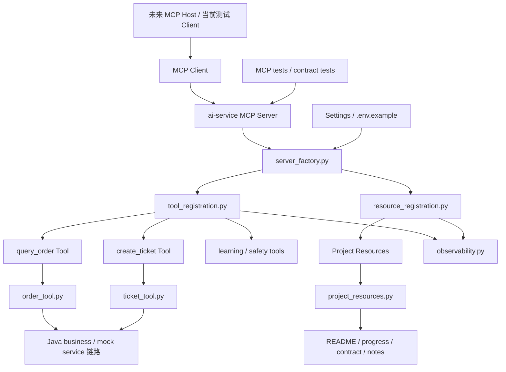

# 阶段 8 第 24 节：MCP 阶段总结和面试表达

## 本节定位

这是阶段 8 的最后一节。

阶段 8 的主题是：

```text
MCP 与 AI 工具生态基础
```

从第 1 节到第 23 节，我们不是只学了一个新名词。

我们完整走过了：

```text
MCP 是什么。
MCP 为什么出现。
MCP 和 Tool Calling、RAG、LangGraph、Java 后端是什么关系。
MCP Host、Client、Server 怎么分工。
MCP Tools、Resources、Prompts 分别适合暴露什么。
MCP 通信、生命周期、transport 的基本概念。
如何用 Python 写最小 MCP Server。
如何用 MCP Client 调试。
如何给工具做参数校验、错误处理、安全边界。
如何把订单查询和创建工单封装成 MCP Tools。
如何把项目文档封装成 MCP Resources。
如何做 MCP 契约测试。
如何整理 MCP Server 工程结构。
如何做 MCP 配置和环境变量。
如何给 MCP Tool / Resource 补日志、trace_id、耗时和安全可观测性。
```

第 24 节要做的事是：

```text
把这些知识整理成你能长期复盘、能项目讲解、能面试回答的表达体系。
```

你学习技术的目标不是“我看过”。

你的目标是：

```text
我知道它是什么。
我知道它解决什么问题。
我知道它在项目里怎么落地。
我知道它和其他技术怎么配合。
我知道它的边界和风险。
我能给别人讲清楚。
```

本节就是把阶段 8 收束到这个标准。

## 本节学习目标

学完本节，你要能说清楚：

```text
1. MCP 用一句话怎么解释。
2. MCP 和 Tool Calling 的区别。
3. MCP 和 LangGraph 的关系。
4. MCP 和 RAG 的关系。
5. MCP 和 Java business service 的关系。
6. 当前项目里 MCP 具体落地在哪些文件。
7. 当前 MCP Server 暴露了哪些 Tools 和 Resources。
8. 当前 MCP 的安全边界有哪些。
9. 当前 MCP 的测试、配置、可观测性怎么做。
10. 当前 MCP 还不是完整生产级的原因。
11. 面试被问 MCP 时怎么回答。
12. 阶段 8 完成后，下一阶段可以怎么选。
```

## 本节不做什么

本节是纯总结和表达节。

不做：

```text
不新增 MCP Tool。
不新增 MCP Resource。
不新增业务代码。
不启动虚拟机。
不启动 Docker。
不启动 Qdrant。
不启动 Milvus。
不启动 MySQL。
不启动 Redis。
不调用真实大模型。
不调用真实 embedding。
不生成手动测试文档。
不做敏感信息扫描，除非之后你要求上传 GitHub。
```

本节只做：

```text
新增阶段 8 第 24 节总结笔记。
更新 README。
更新 learning-progress。
```

## 基础知识铺垫

### 1. 为什么最后一节要总结

学习一个阶段后，如果不总结，会有一个问题：

```text
每节都懂，但整体说不出来。
```

这在面试或工作交流里很吃亏。

别人不会按你的学习顺序问：

```text
第 1 节你学了什么？
第 2 节你学了什么？
```

别人会问：

```text
MCP 是什么？
你项目里怎么用的？
它和 Tool Calling 有什么区别？
你怎么保证安全？
你怎么测试？
你怎么排查问题？
现在有哪些不足？
```

所以最后一节要把学习顺序转换成表达顺序。

学习顺序是：

```text
从基础概念到代码落地。
```

表达顺序是：

```text
先讲问题，再讲方案，再讲项目落地，再讲边界和验证。
```

### 2. 什么叫真正学会 MCP

不是会写：

```python
@mcp.tool()
```

就算学会 MCP。

真正学会 MCP，至少要知道：

```text
MCP 要解决什么连接问题。
Host、Client、Server 分别是谁。
Tool、Resource、Prompt 分别适合什么。
Tool Calling 和 MCP 不是一回事。
MCP Server 不是业务后端。
MCP 不替代 RAG。
MCP 不替代 LangGraph。
MCP Tool 仍然要做参数校验、权限、确认、幂等、错误处理。
MCP Resource 仍然要做白名单和路径安全。
MCP 对外契约要测试。
MCP 运行时要配置化和可观测。
```

阶段 8 结束后，你现在应该已经具备这些基础。

### 3. MCP 的一句话解释

可以这样说：

```text
MCP 是一种让 AI 应用用统一协议连接外部工具、资源和 prompt 的标准。
```

再稍微展开一点：

```text
它让 AI Host 可以通过 MCP Client 连接 MCP Server，发现和调用 Server 暴露的 Tools、Resources 和 Prompts，而不是每个工具都单独写一套私有接入方式。
```

这句话里有几个关键词：

```text
AI 应用。
统一协议。
工具。
资源。
prompt。
Host。
Client。
Server。
```

你讲 MCP 时，要围绕这些词展开。

### 4. MCP 解决的核心问题

没有 MCP 时，AI 应用接工具可能是这样：

```text
接数据库写一套。
接文件系统写一套。
接 GitHub 写一套。
接企业内部 API 写一套。
接知识文档写一套。
接 prompt 模板再写一套。
```

每个工具的发现、参数、调用、错误、资源读取方式都不一样。

MCP 想解决：

```text
AI 应用和工具/资源提供方之间的标准连接问题。
```

这类似：

```text
USB-C 让不同设备可以通过统一接口连接。
MCP 让 AI 应用可以通过统一协议连接工具和上下文。
```

但注意：

```text
MCP 只是连接标准，不保证工具本身安全可靠。
```

工具内部的权限、事务、幂等、错误码仍然要自己做好。

### 5. MCP 和普通 HTTP API 的区别

普通 HTTP API 是通用 Web 接口。

例如：

```text
GET /orders/A1001
POST /tickets
```

MCP 是面向 AI 工具生态的协议。

它会标准化：

```text
工具怎么被发现。
工具参数 schema 怎么暴露。
工具怎么调用。
工具结果怎么表达。
资源怎么列出。
资源怎么读取。
prompt 模板怎么提供。
```

两者可以配合：

```text
MCP Tool
-> Python adapter
-> HTTP 调 Java business service
```

所以：

```text
MCP 不等于 HTTP API。
MCP 可以包装 HTTP API。
```

### 6. MCP 和 Tool Calling 的区别

这是阶段 8 最重要的问题之一。

Tool Calling 解决：

```text
模型如何表达“我要调用哪个工具，以及参数是什么”。
```

MCP 解决：

```text
AI 应用如何用统一协议发现、读取和调用外部工具、资源、prompt。
```

真实链路可以是：

```text
用户问题
-> 模型通过 Tool Calling 选择 query_order
-> ai-service 通过 MCP Client 调用 MCP Server 的 query_order
-> MCP Tool 调 Python adapter
-> Python adapter 调 Java business service
-> 工具结果回给模型总结
```

一句话：

```text
Tool Calling 是模型侧工具意图表达。
MCP 是应用侧工具生态连接协议。
```

### 7. MCP 和 LangGraph 的关系

LangGraph 解决：

```text
Agent 流程编排。
```

它负责：

```text
State。
Node。
Edge。
条件跳转。
checkpoint。
thread_id。
人工确认。
流程恢复。
```

MCP 不负责这些。

MCP 负责：

```text
把工具、资源、prompt 按统一协议暴露出来。
```

它们可以配合：

```text
LangGraph 节点
-> MCP Client
-> MCP Server
-> Tool / Resource
```

所以：

```text
MCP 不替代 LangGraph。
MCP 可以成为 LangGraph 节点调用外部能力的一种标准方式。
```

### 8. MCP 和 RAG 的关系

RAG 解决：

```text
大量知识文档的检索增强。
```

它关注：

```text
文档加载。
chunk。
embedding。
向量库。
检索。
rerank。
引用来源。
无资料拒答。
```

MCP Resource 解决：

```text
上下文资源的标准读取入口。
```

例如：

```text
learning://project/readme
learning://project/java-ai-contract
```

少量明确文档可以直接作为 Resource。

大量分散知识库更适合 RAG。

它们可以配合：

```text
MCP Resource 提供文档入口。
RAG 把文档入库、检索、筛选后交给模型。
```

所以：

```text
MCP 不替代 RAG。
MCP 可以成为 RAG 文档来源或上下文读取方式之一。
```

### 9. MCP 和 Java business service 的关系

Java business service 负责：

```text
真实业务数据。
订单。
工单。
权限。
事务。
MySQL。
Redis。
幂等。
限流。
业务错误码。
```

MCP Server 负责：

```text
把这些业务能力包装成 AI 可发现、可调用的工具入口。
```

当前项目中：

```text
query_order MCP Tool
-> Python order adapter
-> JavaOrderClient 风格链路
-> Java business service / mock 链路

create_ticket MCP Tool
-> Python ticket adapter
-> JavaTicketClient 风格链路
-> Java business service / mock 链路
```

所以：

```text
MCP 不替代 Java 后端。
MCP 是 AI 应用连接 Java 后端能力的标准入口之一。
```

### 10. MCP 安全边界

MCP Tool 是给 AI 调用的工具。

所以安全边界必须明确。

当前阶段强调了这些安全原则：

```text
工具最小暴露。
输入参数必须校验。
输出字段必须白名单。
读写工具要分级。
写操作必须用户确认。
写操作必须幂等。
业务错误和系统错误要区分。
系统错误不能泄露内部细节。
Resource 必须白名单。
Resource 路径不能逃逸仓库。
配置和 secret 不能暴露成 Resource。
日志不能记录用户原文、参数正文、返回正文和 key/token。
```

这些比“能调用工具”更重要。

因为 AI 工具一旦失控，风险会很大。

## 本节主题系统讲解

### 1. 阶段 8 的完整学习地图

阶段 8 可以分成六大块。

第一块：MCP 基础认知。

```text
第 1 节：MCP 是什么。
第 2 节：MCP 和 Tool Calling 的区别。
第 3 节：MCP 架构。
```

第二块：MCP 协议基础。

```text
第 4 节：通信基础。
第 5 节：生命周期。
第 6 节：Transport。
```

第三块：MCP 能力类型。

```text
第 7 节：Tools。
第 8 节：Resources。
第 9 节：Prompts。
```

第四块：Python 实践。

```text
第 10 节：最小 MCP Server。
第 11 节：MCP Client 调试。
```

第五块：工具安全和项目接入。

```text
第 12 节：工具参数校验。
第 13 节：错误处理。
第 14 节：安全边界。
第 15 节：订单查询 MCP Tool。
第 16 节：创建工单 MCP Tool。
第 17 节：项目文档 Resources。
第 18 节：MCP 和现有 Agent 的关系。
第 19 节：MCP 测试和契约测试。
```

第六块：工程化整理。

```text
第 20 节：初版项目整理。
第 21 节：Server 工程结构整理。
第 22 节：配置和环境变量。
第 23 节：可观测性。
第 24 节：阶段总结和面试表达。
```

这六块组成完整阶段。

### 2. 当前 MCP 代码落点

当前 MCP 代码主要在：

```text
projects/ai-service/app/mcp_servers/
projects/ai-service/app/mcp_clients/
```

核心文件：

| 文件 | 职责 |
| --- | --- |
| `minimal_server.py` | 兼容入口，导出 `mcp` |
| `server_factory.py` | 创建并装配 MCPServer |
| `tool_registration.py` | 注册 MCP Tools |
| `resource_registration.py` | 注册 MCP Resources |
| `observability.py` | MCP Tool / Resource 统一日志包装 |
| `ticket_validation.py` | 参数校验学习工具 |
| `tool_error_handling.py` | 错误处理学习工具 |
| `tool_security.py` | 安全边界学习工具 |
| `order_tool.py` | query_order MCP adapter |
| `ticket_tool.py` | create_ticket MCP adapter |
| `project_resources.py` | 项目文档 Resource 白名单和读取 |
| `minimal_client.py` | MCP Client 调试快照 |

这说明当前 MCP 已经不只是单文件 demo。

它已经有：

```text
入口。
装配。
注册。
业务 adapter。
资源读取。
配置。
可观测性。
测试。
```

### 3. 当前 MCP Tools

当前 MCP Server 暴露的 Tools：

```text
echo
add
validate_ticket_draft
simulate_tool_error_handling
inspect_tool_security_boundary
query_order
create_ticket
```

可以分成三类。

学习 demo 工具：

```text
echo
add
```

安全学习工具：

```text
validate_ticket_draft
simulate_tool_error_handling
inspect_tool_security_boundary
```

业务工具：

```text
query_order
create_ticket
```

面试时重点讲业务工具。

但学习工具可以说明你不是直接上业务，而是先拆开学了：

```text
参数校验。
错误处理。
安全边界。
```

### 4. 当前 MCP Resources

当前项目文档 Resources：

```text
learning://project/readme
learning://project/progress
learning://project/java-ai-contract
learning://project/stage8-plan
learning://project/mcp-create-ticket-note
```

还有学习 Resource Template：

```text
learning://hello/{name}
```

这些 Resource 体现：

```text
MCP 不只会执行工具。
也能以标准方式暴露上下文资料。
```

但它们有边界：

```text
只读白名单文档。
不读任意路径。
不暴露 .env。
不暴露 key/token。
```

### 5. 当前 MCP 测试体系

当前 MCP 测试包括：

```text
test_minimal_mcp_server.py
test_mcp_client_smoke.py
test_mcp_tool_parameter_validation.py
test_mcp_tool_error_handling.py
test_mcp_tool_security.py
test_mcp_query_order_tool.py
test_mcp_create_ticket_tool.py
test_mcp_project_resources.py
test_mcp_contracts.py
test_mcp_observability.py
```

它们覆盖：

```text
Server 能暴露工具和资源。
Client 能调试。
参数 schema 稳定。
业务错误和系统错误分开。
安全边界有效。
query_order 输出白名单。
create_ticket 用户确认和幂等。
Resource 白名单和路径安全。
公共 MCP 契约稳定。
日志有用且不泄露敏感信息。
```

这比“手动跑一下 MCP Server”扎实很多。

### 6. 当前 MCP 配置体系

阶段 8 已经把 MCP 配置接入 `Settings`。

当前配置：

```text
MCP_SERVER_NAME
MCP_ENABLE_LEARNING_RESOURCES
MCP_ENABLE_PROJECT_RESOURCES
MCP_PROJECT_RESOURCE_ROOT
```

这些配置解决：

```text
server name 可配置。
学习资源可启用/禁用。
项目文档资源可启用/禁用。
项目文档根目录可配置。
```

同时保留安全边界：

```text
配置是程序运行参数。
Resource 是给模型读取的上下文。
secret 不能暴露成 Resource。
```

### 7. 当前 MCP 可观测性

阶段 8 已经给 MCP Tool / Resource 加了统一日志包装。

Tool 日志记录：

```text
trace_id。
tool_name。
action_type。
status。
error_code。
error_type。
elapsed_ms。
```

Resource 日志记录：

```text
trace_id。
resource_uri。
mime_type。
status。
error_type。
elapsed_ms。
```

日志不记录：

```text
工具参数正文。
工具返回正文。
用户原文。
Resource 正文。
API key。
token。
数据库密码。
```

这说明：

```text
MCP 可排查，但不把日志变成敏感信息泄露点。
```

### 8. 当前项目 MCP 架构图



这张图就是阶段 8 的实际落地。

### 9. 当前 MCP 已经做到什么

已经做到：

```text
理解 MCP 核心概念。
能解释 Host/Client/Server。
能解释 Tools/Resources/Prompts。
能写 Python MCP Server。
能用 MCP Client 调试。
能把业务能力封装成 MCP Tool。
能把文档封装成 MCP Resource。
能做参数校验。
能做错误处理。
能做安全边界。
能做写操作确认和幂等。
能做输出白名单。
能做 Resource 白名单和路径逃逸防护。
能做契约测试。
能做工程结构整理。
能做配置化。
能做基础可观测性。
```

这是一个扎实的 MCP 基础阶段。

### 10. 当前 MCP 还没做到什么

还没有做到：

```text
没有独立部署成远程 MCP Server。
没有正式做 Streamable HTTP 远程 transport。
没有把 LangGraph 主 Agent 正式改成 MCP Client 调用。
没有把 MCP Prompts 代码接入现有 prompt 版本体系。
没有做企业级权限模型。
没有做 OAuth / 用户授权。
没有做多租户 MCP Server。
没有做 MCP 网关。
没有做完整 OpenTelemetry spans。
没有做大规模工具市场。
```

这些不是阶段 8 的失败。

这是阶段边界。

你可以这样表达：

```text
当前是学习项目中的 MCP 基础能力和工程化雏形，不是完整生产级 MCP 平台。
```

### 11. 面试回答：MCP 是什么

问题：

```text
MCP 是什么？
```

回答：

```text
MCP 是一种让 AI 应用以统一协议连接外部工具、资源和 prompt 的标准。它把 AI Host、MCP Client、MCP Server 分开，Server 可以暴露 Tools、Resources 和 Prompts，Host 通过 Client 发现和调用这些能力。它解决的是 AI 应用连接工具生态的标准化问题，不是替代模型、Agent 或业务后端。
```

### 12. 面试回答：MCP 和 Tool Calling

问题：

```text
MCP 和 Tool Calling 有什么区别？
```

回答：

```text
Tool Calling 是模型 API 的能力，解决模型如何表达“我要调用哪个工具和参数”。MCP 是应用和工具提供方之间的标准协议，解决工具、资源、prompt 如何被发现、读取和调用。真实项目里可以是模型先通过 Tool Calling 决定要调用 query_order，然后应用通过 MCP Client 调 MCP Server 的 query_order Tool。
```

### 13. 面试回答：项目里怎么落地 MCP

问题：

```text
你项目里 MCP 怎么落地的？
```

回答：

```text
我在 Python ai-service 里实现了一个学习用 MCP Server。它通过 server_factory 创建 MCPServer，通过 tool_registration 注册 echo、add、参数校验、错误处理、安全边界、query_order、create_ticket 等 Tools，通过 resource_registration 暴露 README、学习进度、Java-AI 契约、阶段计划和笔记等 Resources。query_order 和 create_ticket 背后复用已有 Python adapter 和 Java business/mock service 链路，并保留参数校验、错误码、输出白名单、写操作确认和幂等。
```

### 14. 面试回答：MCP 安全怎么做

问题：

```text
MCP Tool 怎么保证安全？
```

回答：

```text
我把 MCP Tool 当成 AI 可以触发的受控入口，而不是简单暴露函数。工具参数用 Pydantic 和 schema 校验；输出只返回白名单字段；业务错误返回 ok=false 和稳定 error_code；系统错误通过安全 ToolError 包装，不泄露内部 URL、数据库字段或堆栈；写操作 create_ticket 必须 user_confirmed=true，并用 confirmation_id 作为幂等键；Resource 只允许读取白名单 URI，防止路径逃逸，也不会暴露 .env 或 key/token。
```

### 15. 面试回答：MCP 怎么测试

问题：

```text
MCP 怎么测试？
```

回答：

```text
我分层测试 MCP。纯函数测试覆盖工具 adapter 的参数校验、业务错误、系统错误和输出白名单；in-memory MCP Client 测试覆盖 list_tools、call_tool、list_resources、read_resource；契约测试固定工具名、input_schema、写操作未确认返回结构、Resource URI、title、mime_type；可观测性测试用 caplog 验证日志包含 trace_id、tool_name、status、elapsed_ms，同时不记录工具参数、用户正文和 Resource 正文。
```

### 16. 面试回答：MCP 和 Java 后端

问题：

```text
用了 MCP 后 Java 后端还重要吗？
```

回答：

```text
重要。MCP Server 不是业务系统，它只是 AI 应用连接业务能力的标准入口。订单、工单、权限、事务、MySQL、Redis、幂等和限流这些真实业务能力仍然由 Java business service 负责。Python MCP Tool adapter 负责把 AI 工具调用转换成受控的业务调用，并处理参数校验、错误映射、安全输出和 trace_id。
```

### 17. 面试回答：MCP 和 RAG

问题：

```text
MCP Resource 和 RAG 有什么区别？
```

回答：

```text
MCP Resource 是标准资源读取入口，适合暴露少量明确上下文，比如 README、API 契约、学习进度。RAG 是大量知识的检索增强流程，包含文档切分、embedding、向量检索、排序、引用和无上下文拒答。MCP Resource 可以作为 RAG 文档来源之一，但 MCP 不替代 RAG。
```

### 18. 面试回答：MCP 可观测性

问题：

```text
MCP 出问题怎么排查？
```

回答：

```text
我在 MCP Tool 和 Resource 注册层加了统一可观测性包装。每次工具调用记录 started、finished 或 failed 事件，包含 trace_id、tool_name、action_type、status、error_code/error_type 和 elapsed_ms。Resource 读取记录 resource_uri、mime_type、status 和耗时。这样可以按 trace_id 串起一次请求，同时不会把工具参数、用户原文、Resource 正文、API key 或 token 写进日志。
```

### 19. 阶段 8 后你的能力位置

阶段 8 学完后，你在 MCP 上达到的是：

```text
不是只知道 MCP 名词。
不是只会跑 hello demo。
而是能在一个 Java + Python + AI 项目里解释和实现 MCP 基础能力。
```

你现在可以说：

```text
我理解 MCP 基础协议和架构。
我能用 Python SDK 写 MCP Server/Client。
我能把项目工具和文档封装成 MCP Tools/Resources。
我能处理参数校验、错误、安全、契约测试、配置和日志。
我知道它和 Tool Calling、LangGraph、RAG、Java 后端的边界。
```

### 20. 下一阶段可以学什么

阶段 8 结束后，下一阶段有几条合理方向。

方向一：RAG 进阶。

```text
混合检索。
Rerank。
Query rewrite。
多路召回。
召回评测。
知识库增量更新。
权限过滤强化。
```

方向二：LangGraph / Agent 深入。

```text
更复杂状态持久化。
Agent 状态压缩。
长任务。
Human-in-the-loop 强化。
多步骤工具恢复。
MCP-backed Agent adapter。
```

方向三：AI 评测和 Tracing 强化。

```text
自动化评估。
回归评测平台。
LLM-as-judge。
Bad case 管理。
成本、延迟、质量指标。
Tracing 报表。
```

方向四：MCP 继续深入。

```text
真实 stdio / Streamable HTTP transport。
远程 MCP Server。
MCP Prompts 代码接入。
权限和授权。
MCP Client 接 LangGraph 主链路。
```

如果目标是尽快进入更有岗位价值的新技术，我建议下一阶段优先：

```text
RAG 进阶：混合检索与 Rerank
```

原因是：

```text
RAG 是企业 AI 应用高频能力。
你已经有 Qdrant/Milvus、文档入库、基础检索和问答。
继续补 hybrid retrieval 和 rerank，会明显提升项目质量和面试竞争力。
```

最终下一阶段怎么定，可以等你问“接下来学什么”时再确认。

## 阶段 8 最终项目边界

当前项目可以准确描述为：

```text
阶段 8 完成后，项目已经具备 MCP 基础能力和工程化雏形。
```

不能夸大成：

```text
完整企业级 MCP 平台。
生产级 MCP 网关。
大规模工具市场。
```

准确表达：

```text
这是一个 AI 应用工程学习项目中的 MCP Server 原型，已经完成基础 Tools、Resources、参数校验、错误处理、安全边界、契约测试、配置和可观测性，后续可继续扩展真实远程 transport、MCP Prompts、正式 LangGraph 接入和企业权限模型。
```

## 练习题

### 练习 1：用一句话解释 MCP。

参考答案：

```text
MCP 是一种让 AI 应用用统一协议连接外部工具、资源和 prompt 的标准。
```

### 练习 2：MCP 和 Tool Calling 最大区别是什么？

参考答案：

```text
Tool Calling 是模型侧能力，解决模型如何表达工具调用意图和参数；MCP 是应用侧连接协议，解决 AI 应用如何标准发现、读取和调用外部工具、资源、prompt。
```

### 练习 3：当前项目里两个最重要的业务 MCP Tools 是什么？

参考答案：

```text
query_order 和 create_ticket。query_order 是只读订单查询工具，create_ticket 是写操作工单创建工具，写操作必须用户确认并使用 confirmation_id 做幂等。
```

### 练习 4：为什么 MCP Resource 不能随便暴露 `.env`？

参考答案：

```text
因为 MCP Resource 会被 AI Client 或模型读取，.env 可能包含 API key、token、数据库密码、本机路径等敏感信息，一旦暴露就会造成凭证泄露风险。
```

### 练习 5：阶段 8 后为什么还不能说是完整生产级 MCP Server？

参考答案：

```text
因为当前还没有独立远程部署、真实 Streamable HTTP transport、完整授权模型、企业级权限、多租户、正式 LangGraph 主链路 MCP Client 接入、完整 OTel tracing 和生产监控。当前更准确地说是学习项目中的 MCP 基础能力和工程化雏形。
```

## 自测题

### 自测 1：MCP 是否替代 LangGraph？

参考答案：

```text
不替代。LangGraph 负责 Agent 状态和流程编排，MCP 负责工具、资源和 prompt 的标准连接。LangGraph 节点未来可以通过 MCP Client 调用 MCP Server。
```

### 自测 2：MCP 是否替代 Java business service？

参考答案：

```text
不替代。Java business service 仍然负责真实业务、权限、事务、MySQL、Redis、幂等和限流。MCP Tool 只是 AI 应用连接这些业务能力的标准入口。
```

### 自测 3：当前 MCP 契约测试保护什么？

参考答案：

```text
保护工具名、input_schema、写操作未确认返回结构、Resource URI、Resource name、title、mime_type 和 Resource read 的最小稳定形状，防止内部重构破坏外部 MCP Client 依赖的契约。
```

### 自测 4：MCP 可观测性日志为什么不记录工具参数？

参考答案：

```text
因为工具参数可能包含用户隐私、订单信息、手机号、地址、confirmation_id 等敏感内容。日志会长期保存并可能进入集中日志平台，所以只记录 tool_name、action_type、status、error_code、elapsed_ms 等元信息。
```

### 自测 5：阶段 8 后优先补什么方向比较合理？

参考答案：

```text
如果目标是提升企业 AI 应用岗位竞争力，优先补 RAG 进阶比较合理，例如混合检索、Rerank、Query rewrite、多路召回和召回评测。也可以按需求选择 LangGraph 深入、评测追踪强化或 MCP 远程 transport 深入。
```

## 背诵版面试短稿

### 30 秒版本

```text
MCP 是 AI 应用连接外部工具、资源和 prompt 的标准协议。我在项目里用 Python SDK 做了一个 MCP Server，暴露了 query_order、create_ticket 等 Tools，也把 README、学习进度、Java-AI 契约等文档暴露成 Resources。这个 MCP Server 保留了参数校验、错误处理、写操作确认、幂等、输出白名单、Resource 白名单、契约测试、配置和日志可观测性。它不替代 Tool Calling、LangGraph、RAG 或 Java 后端，而是作为 AI 应用连接这些能力的标准层。
```

### 1 分钟版本

```text
阶段 8 我系统学习并落地了 MCP。先学习了 MCP 的 Host、Client、Server、Tools、Resources、Prompts、通信、生命周期和 transport，再用 Python SDK 写了最小 MCP Server 和 Client 调试。后面把项目里的订单查询封装成 query_order MCP Tool，把创建工单封装成 create_ticket MCP Tool，并保留用户确认、confirmation_id 幂等、参数校验、错误码和输出白名单。同时把项目 README、学习进度、Java-AI API 契约等暴露成白名单 Resources。工程化方面，我补了 MCP 契约测试、server factory、tool/resource registration、环境变量配置和 MCP Tool/Resource 调用日志。当前它是学习项目中的 MCP 基础能力和工程化雏形，后续可以继续扩展远程 transport、MCP Prompts 和正式 LangGraph 接入。
```

### 3 分钟版本

```text
我对 MCP 的理解是，它解决 AI 应用和外部工具、资源、prompt 之间的标准连接问题。Tool Calling 解决的是模型如何表达工具调用意图，MCP 解决的是应用如何标准发现和调用工具提供方。LangGraph 负责 Agent 流程和状态编排，RAG 负责知识检索增强，Java 后端负责真实业务一致性，MCP 是这些能力之间的标准连接层。

在我的 Java + Python + AI 学习项目里，MCP 落在 Python ai-service 中。我用 MCP Python SDK 做了一个 learning MCP Server，通过 server_factory 创建和装配，通过 tool_registration 注册 Tools，通过 resource_registration 注册 Resources。业务工具包括 query_order 和 create_ticket，前者是只读工具，后者是写工具。create_ticket 必须经过 user_confirmed，并使用 confirmation_id 做幂等键，避免模型直接创建工单或重复写入。工具返回只保留白名单字段，业务错误用 ok=false 和稳定 error_code 表达，系统错误用安全 ToolError 包装，避免泄露内部 URL、数据库字段或堆栈。

Resources 方面，我只暴露白名单项目文档，比如 README、学习进度、Java-AI API 契约、阶段计划和笔记，不允许任意路径读取，也不会暴露 .env、API key 或 token。工程化方面，我补了 MCP 契约测试，固定 tools/list、input_schema、写操作未确认返回结构、resources/list 和 resources/read 的关键形状；又补了配置化，让 server name、Resource 开关和 Resource root 进入 Settings；最后加了可观测性，记录 trace_id、tool_name、action_type、status、error_code、elapsed_ms，但不记录工具参数、用户正文或 Resource 正文。

所以这个阶段不是只跑了一个 MCP hello demo，而是在现有 AI Agent 项目里做了 MCP 基础能力、业务工具接入、安全边界、测试、配置和可观测性的完整雏形。
```

## 本节小结

阶段 8 正式完成。

你现在应该能把 MCP 讲成一条完整主线：

```text
MCP 是 AI 应用连接工具、资源和 prompt 的统一协议。
它不替代 Tool Calling、LangGraph、RAG 或 Java 后端。
它可以把当前项目里的订单查询、创建工单、项目文档封装成标准 Tools 和 Resources。
真正落地 MCP 时必须补参数校验、错误处理、安全边界、写操作确认、幂等、Resource 白名单、契约测试、配置和可观测性。
```

阶段 8 后，本项目新增了一块清楚的能力：

```text
MCP 与 AI 工具生态基础。
```

下一步进入新阶段前，建议先上传 GitHub，保存阶段 8 后半段成果。
